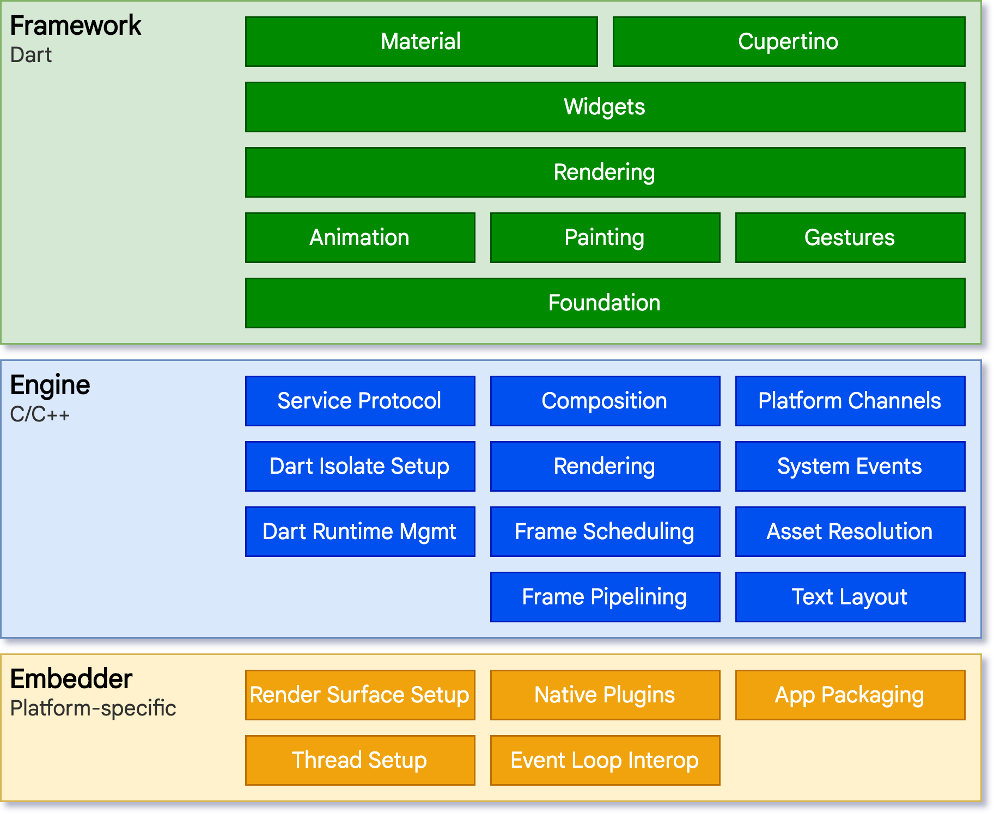

Flutter 从上到下可以分为三层：框架层、引擎层和嵌入层

### 1. 框架层

Flutter Framework，这是一个纯 Dart 实现的 SDK，它实现了一套基础库，自底向上：

- Foundation 和 Animation、Painting、Gestures 在 Google 的一些视频中被合并为一个 dart UI 层，对应的是 Flutter 中的 `dart:ui` 包，它是 Flutter Engine 暴露的底层 UI 库，提供动画、手势及绘制能力。
- Rendering 层，这是一个抽象的布局层，它依赖于 Dart UI 层，渲染层会构建一棵由可渲染对象组成的**渲染树**，当动态更新这些对象时，渲染树会找出变化的部分，然后更新渲染。渲染层可以说是 Flutter 框架层中最核心的部分，它除了确定每个渲染对象的位置、大小之外还要进行坐标变换、绘制（调用底层 `dart:ui` ）。
- Widgets 层是 Flutter 提供的一套基础组件库，在基础组件库之上，Flutter 还提供了 Material 和 Cupertino 两种视觉风格的组件库，它们分别实现了 Material 和 iOS 设计规范。

Flutter 框架相对较小，因为一些开发者可能会使用到的更高层级的功能已经被拆分到不同的软件包中，使用 Dart 和 Flutter 的核心库实现，其中包括平台插件，例如 [camera (opens new window)](https://pub.flutter-io.cn/packages/camera) 和 [webview (opens new window)](https://pub.flutter-io.cn/packages/webview_flutter)，以及和平台无关的功能，例如 [animations (opens new window)](https://pub.flutter-io.cn/packages/animations)。

###  2. 引擎层

Engine 是 Flutter 的核心，主要是 C++ 实现，其中包括了 Skia 引擎、Dart 运行时（Dart runtime）、文字排版引擎等。在代码调用 `dart:ui` 库时，调用最终会走到引擎层，然后实现真正的绘制和显示。

### 3. 嵌入层

Embedder，Flutter 最终渲染、交互是要依赖其所在平台的操作系统 API，嵌入层主要是将 Flutter 引擎 ”安装“ 到特定平台上。嵌入层采用对应平台的语言编写，例如 Android 使用的是 Java 和 C++， iOS 和 macOS 使用的是 Objective-C 和 Objective-C++，Windows 和 Linux 使用的是 C++。 Flutter 代码可以通过嵌入层，以模块方式集成到现有的应用中，也可以作为应用的主体。Flutter 本身包含了各个常见平台的嵌入层，假如以后 Flutter 要支持新的平台，则需要针对该新的平台编写一个嵌入层。