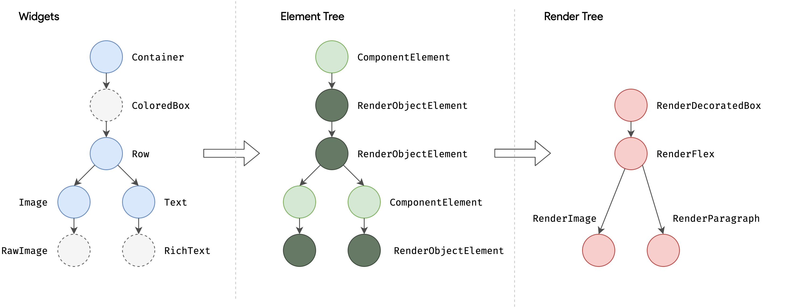
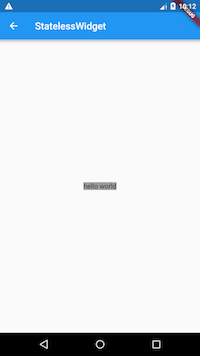
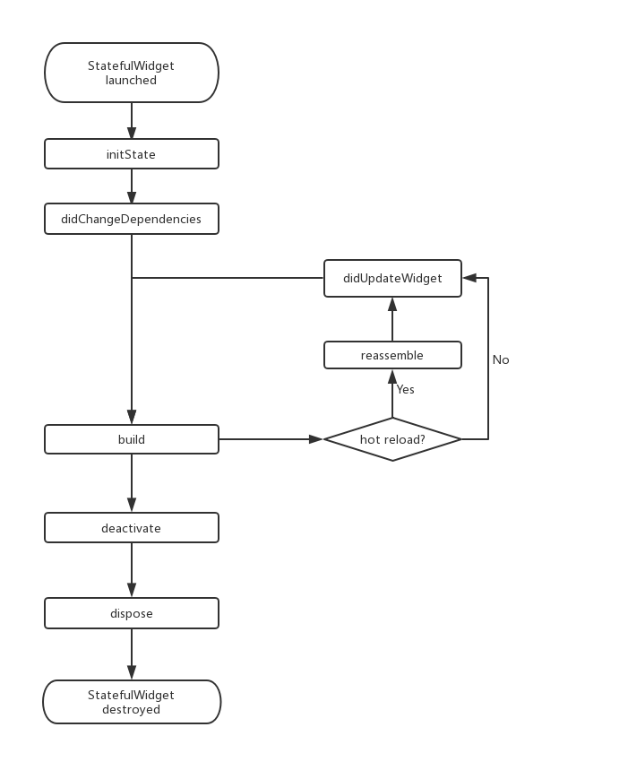
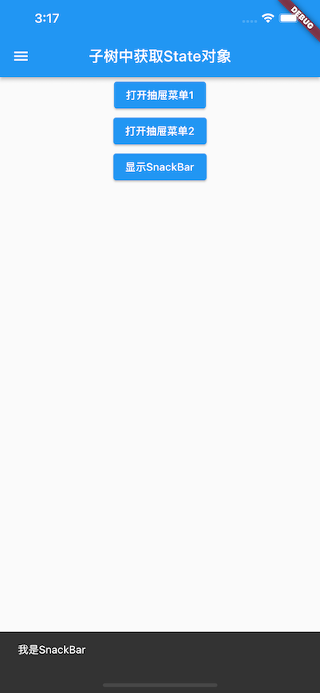
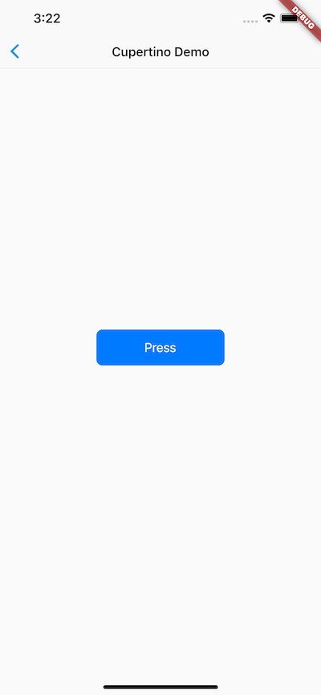

在 Flutter 中，几乎所有对象都是 `Widget`。它不仅表示 UI 元素，也可以是功能性组件（如手势检测的 `GestureDetector`、主题传递的 `Theme`）。Flutter 通过 **Widget 嵌套** 来构建 UI 和处理事件。

> 一个 `Widget` 可以对应多个 `Element`。

## Widget 接口
Widget 类声明：
```dart
@immutable
abstract class Widget extends DiagnosticableTree {
  const Widget({ this.key });
  final Key? key;

  @protected
  @factory
  Element createElement();

  @override
  String toStringShort() {
    final String type = objectRuntimeType(this, 'Widget');
    return key == null ? type : '$type-$key';
  }

  @override
  void debugFillProperties(DiagnosticPropertiesBuilder properties) {
    super.debugFillProperties(properties);
    properties.defaultDiagnosticsTreeStyle = DiagnosticsTreeStyle.dense;
  }

  @override
  @nonVirtual
  bool operator ==(Object other) => super == other;

  @override
  @nonVirtual
  int get hashCode => super.hashCode;

  static bool canUpdate(Widget oldWidget, Widget newWidget) {
    return oldWidget.runtimeType == newWidget.runtimeType
        && oldWidget.key == newWidget.key;
  }
  ...
}
```

- `@immutable`：`Widget` 不可变，属性必须是 `final`。因为属性变化时会重建整棵 Widget 树（新实例替换旧实例），所以允许属性可变没有意义
- `DiagnosticableTree`：诊断树，主要作用是提供调试信息。
- `Key`:  Flutter 用来**唯一标识 Widget** 的标记，用于在 `build` 时决定是否复用旧 Widget 还是重建（见 `canUpdate()`）。
- `createElement()`：构建 UI 树时隐式调用，生成对应的 `Element` 对象。
- `debugFillProperties(...)`：主要是设置诊断树的一些特性。
- `canUpdate(...)`：静态方法。当 `runtimeType` 和 `key` 都相等时返回 `true`，表示用新 Widget 更新旧 `Element` 的配置；否则创建新 `Element`


> 自定义组件通常继承 `StatelessWidget` 或 `StatefulWidget`，而非直接继承 `Widget`。


## Flutter 三棵树

Flutter 框架的渲染流程：

```
Widget 树 → Element 树 → RenderObject 树 → Layer 树 → 上屏显示
```

- **Widget 树**：描述 UI 配置（不可变）
- **Element 树**：Widget 与 RenderObject 的粘合剂（中间代理）
- **RenderObject 树**：真正执行布局和渲染
- **Layer 树**：最终合成上屏

示例：

```dart
Container(
  color: Colors.blue,
  child: Row(
    children: [
      Image.network('https://www.example.com/1.png'),
      const Text('A'),
    ],
  ),
);
```

> `Container` 设置背景色时，内部会创建 `ColoredBox`；`Image` 内部使用 `RawImage`；`Text` 内部使用 `RichText`。



**注意：**
1. Widget 与 Element **一一对应**，但不一定有对应的 `RenderObject`（如 `StatelessWidget`、`StatefulWidget` 没有）。
2. RenderObject 树上屏前还会生成 Layer 树。


## StatelessWidget

用于**不需要维护状态**的场景，通过 `build` 方法嵌套其他 Widget 构建 UI。

```dart
class Echo extends StatelessWidget {
  const Echo({
    Key? key,
    required this.text,
    this.backgroundColor = Colors.grey,
  }) : super(key: key);

  final String text;
  final Color backgroundColor;

  @override
  Widget build(BuildContext context) {
    return Center(
      child: Container(
        color: backgroundColor,
        child: Text(text),
      ),
    );
  }
}

// 使用
Widget build(BuildContext context) {
  return Echo(text: "hello world");
}
```



> **构造函数惯例：** 使用命名参数，必需参数加 `required`；第一个参数通常是 `Key`；`child`/`children` 放最后；属性声明为 `final`。

### Context

`build` 方法的 `context` 参数表示当前 Widget 在 Widget 树中的上下文，实质上为位置句柄（handle），可用于**向上遍历**查找父级 Widget。

```dart
class ContextRoute extends StatelessWidget {
  @override
  Widget build(BuildContext context) {
    return Scaffold(
      appBar: AppBar(title: Text("Context 测试")),
      body: Builder(builder: (context) {
        // 向上查找最近的父级 Scaffold
        Scaffold scaffold =
            context.findAncestorWidgetOfExactType<Scaffold>()!;
        // 返回 AppBar的title， 此处实际上是Text("Context测试")
        return (scaffold.appBar as AppBar).title!;
      }),
    );
  }
}
```


## StatefulWidget

用于**需要维护可变状态**的场景，比 `StatelessWidget` 多了 `createState()` 方法。

```dart
abstract class StatefulWidget extends Widget {
  const StatefulWidget({ Key key }) : super(key: key);

  @override
  StatefulElement createElement() => StatefulElement(this);

  @protected
  State createState();
}
```

- `StatefulElement` 可能多次调用 `createState()` 来创建 `State` 对象
- 当同一个 `StatefulWidget` 插入到树的多个位置时，每个位置都会创建独立的 `State` 实例（`StatefulElement` 与 `State` 一一对应）


## State

`State` 表示与 `StatefulWidget` 对应的可变状态。

**两个常用属性：**

| 属性 | 说明 |
|---|---|
| `widget` | 关联的 Widget 实例，重建时可能会指向新实例（但 `State` 对象不变） |
| `context` | 对应的 `BuildContext`，与 `StatelessWidget` 的用法一致 |

调用 `setState()` 通知状态变化 → 框架重新调用 `build()` → 更新 UI。

### State 生命周期

计数器示例：

```dart
class CounterWidget extends StatefulWidget {
  const CounterWidget({Key? key, this.initValue = 0});
  final int initValue;

  @override
  _CounterWidgetState createState() => _CounterWidgetState();
}

class _CounterWidgetState extends State<CounterWidget> {
  int _counter = 0;

  @override
  void initState() {
    super.initState();
    //初始化状态
    _counter = widget.initValue;
    print("initState");
  }

  @override
  Widget build(BuildContext context) {
    print("build");
    return Scaffold(
      body: Center(
        child: TextButton(
          child: Text('$_counter'),
          //点击后计数器自增
          onPressed: () => setState(
            () => ++_counter,
          ),
        ),
      ),
    );
  }

  @override
  void didUpdateWidget(CounterWidget oldWidget) {
    super.didUpdateWidget(oldWidget);
    print("didUpdateWidget");
  }

  @override
  void deactivate() {
    super.deactivate();
    print("deactivate");
  }

  @override
  void dispose() {
    super.dispose();
    print("dispose");
  }

  @override
  void reassemble() {
    super.reassemble();
    print("reassemble");
  }

  @override
  void didChangeDependencies() {
    super.didChangeDependencies();
    print("didChangeDependencies");
  }
}
```

**生命周期回调一览：**

| 回调 | 调用时机 | 说明 |
|---|---|---|
| `initState()` | Widget 首次插入树时 | 只调用一次，用于初始化状态、订阅事件等 |
| `didChangeDependencies()` | 依赖变化时（如 `InheritedWidget` 变化、语言/主题切换） | 首次创建挂载时也会调用 |
| `build()` | 需要构建/重建 UI 时 | 在 `initState`、`didUpdateWidget`、`setState`、`didChangeDependencies` 之后调用 |
| `reassemble()` | 热重载时 | 仅 Debug 模式，Release 不会调用 |
| `didUpdateWidget()` | 父 Widget 重建，且 `canUpdate()` 返回 `true` 时 | 即新旧 Widget 的 `runtimeType` 和 `key` 都相等 |
| `deactivate()` | State 从树中被移除时 | 可能被重新插入（如通过 `GlobalKey` 移动位置） |
| `dispose()` | State 被永久移除时 | 释放资源（如取消订阅、关闭流等） |

**生命周期流程图：**



**调用顺序验证：**

```
首次打开：    initState → didChangeDependencies → build
热重载：      reassemble → didUpdateWidget → build
移除 Widget： reassemble → deactivate → dispose
```

> 重写带 `@mustCallSuper` 标注的方法时，必须调用 `super.xxx()`。

## 获取 State 对象

`StatefulWidget` 的具体逻辑都在其 `State` 中

### 方式一：通过 Context

使用 `context.findAncestorStateOfType<T>()` 向上查找指定类型的 `State`：

```dart
// 通用方式
ScaffoldState state =
    context.findAncestorStateOfType<ScaffoldState>()!;
state.openDrawer();

// 推荐方式：通过 of 静态方法
ScaffoldState state = Scaffold.of(context);
state.openDrawer();

// 显示 SnackBar
ScaffoldMessenger.of(context).showSnackBar(
  SnackBar(content: Text("我是 SnackBar")),
);
```

> **约定：** 如果 `State` 希望被外部访问，应提供 `of` 静态方法；如果是私有的，则不提供。



### 方式二：通过 GlobalKey

```dart
// 1. 定义 GlobalKey（保持全局唯一，用静态变量存储）
static GlobalKey<ScaffoldState> _globalKey = GlobalKey();

// 2. 设置 key
Scaffold(key: _globalKey, ...)

// 3. 通过 GlobalKey 获取 State
_globalKey.currentState!.openDrawer();
```

通过 `GlobalKey` 还可获取：
- `globalKey.currentWidget` → Widget 对象
- `globalKey.currentElement` → Element 对象
- `globalKey.currentState` → State 对象

> **注意：** `GlobalKey` 开销较大，应尽量用 `of` 方法等替代。同一 `GlobalKey` 在整个 Widget 树中必须唯一。

---

## 通过 RenderObject 自定义 Widget

`StatelessWidget` 和 `StatefulWidget` 本质是**组合**其他组件，本身没有 `RenderObject`。底层基础组件（如 `Text`、`Column`、`Align`）是通过自定义 `RenderObject` 实现的。

```dart
class CustomWidget extends LeafRenderObjectWidget {
  @override
  RenderObject createRenderObject(BuildContext context) {
    return RenderCustomObject();
  }

  @override
  void updateRenderObject(
      BuildContext context, RenderCustomObject renderObject) {
    super.updateRenderObject(context, renderObject);
  }
}

class RenderCustomObject extends RenderBox {
  @override
  void performLayout() {
    // 布局逻辑
  }

  @override
  void paint(PaintingContext context, Offset offset) {
    // 绘制逻辑
  }
}
```

根据子组件数量选择继承类：

| 基类 | 子组件数量 |
|---|---|
| `LeafRenderObjectWidget` | 无子组件 |
| `SingleChildRenderObjectWidget` | 单个子组件 |
| `MultiChildRenderObjectWidget` | 多个子组件 |

---

## Flutter SDK 内置组件库
Flutter 提供了一套 Material 风格（ Android 默认的视觉风格）和一套 Cupertino 风格（iOS 视觉风格）的组件库

### 基础组件

```dart
import 'package:flutter/widgets.dart';
```

| 组件 | 说明 |
|---|---|
| `Text` | 带格式的文本 |
| `Row` / `Column` | 水平/垂直方向弹性布局（基于 Flexbox 模型） |
| `Stack` | 层叠布局（类似 Android `FrameLayout`），配合 `Positioned` 定位（基于绝对定位模型） |
| `Container` | 矩形容器，支持 `BoxDecoration`（背景、边框、阴影）、边距、填充、约束、矩阵变换 |


### Material 组件

遵循 Material Design 规范，以 `MaterialApp` 为根组件。常用组件：`Scaffold`、`AppBar`、`TextButton` 等。

```dart
import 'package:flutter/material.dart';
```

### Cupertino 组件

iOS 风格组件。部分 Material 组件（如 `MaterialPageRoute`）会根据平台自动切换动画风格。

```dart
import 'package:flutter/cupertino.dart';
```

示例：

```dart
class CupertinoTestRoute extends StatelessWidget {
  const CupertinoTestRoute({Key? key}) : super(key: key);

  @override
  Widget build(BuildContext context) {
    return CupertinoPageScaffold(
      navigationBar: const CupertinoNavigationBar(
        middle: Text("Cupertino Demo"),
      ),
      child: Center(
        child: CupertinoButton(
          color: CupertinoColors.activeBlue,
          child: const Text("Press"),
          onPressed: () {},
        ),
      ),
    );
  }
}
```


