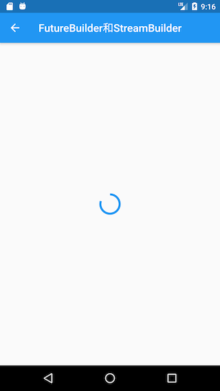
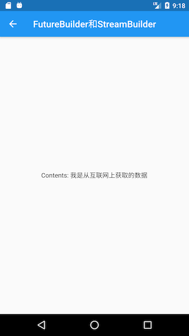

异步 UI 更新（FutureBuilder、StreamBuilder）

## FutureBuilder

`FutureBuilder` 会依赖一个 `Future`，它会根据所依赖的 `Future` 的状态来动态构建自身。

`FutureBuilder` 构造函数：

```dart
FutureBuilder({
  this.future,
  this.initialData,
  required this.builder,
})
```

- `future`：通常是一个异步耗时任务。

- `initialData`：初始数据，用户设置默认数据。

- `builder`：Widget 构建器；该构建器会在 `Future` 执行的不同阶段被多次调用，构建器签名：

  ```dart
  Function (BuildContext context, AsyncSnapshot snapshot) 
  ```

  `snapshot` 会包含当前异步任务的状态信息及结果信息，比如可以通过 `snapshot.connectionState` 获取异步任务的状态信息、`snapshot.hasError` 判断异步任务是否有错误等

  另外，`FutureBuilder` 的 `builder` 函数签名和 `StreamBuilder` 的 `builder` 是相同的。

### 示例

实现一个路由，当该路由打开时从网上获取数据，获取数据时弹一个加载框；获取结束时，如果成功则显示获取到的数据，如果失败则显示错误。

模拟过程，隔 3 秒后返回一个字符串：

```dart
Future<String> mockNetworkData() async {
  return Future.delayed(Duration(seconds: 2), () => "从互联网上获取的数据");
}
```

`FutureBuilder` 使用：

```dart
...
Widget build(BuildContext context) {
  return Center(
    child: FutureBuilder<String>(
      future: mockNetworkData(),
      builder: (BuildContext context, AsyncSnapshot snapshot) {
        // 请求已结束
        if (snapshot.connectionState == ConnectionState.done) {
          if (snapshot.hasError) {
            // 请求失败，显示错误
            return Text("Error: ${snapshot.error}");
          } else {
            // 请求成功，显示数据
            return Text("Contents: ${snapshot.data}");
          }
        } else {
          // 请求未结束，显示loading
          return CircularProgressIndicator();
        }
      },
    ),
  );
}
```

运行结果如图所示：

|  |  |
| --------------------------------------------- | ---------------------------------------------- |


> 注意：示例的代码中，每次组件重新 build 都会重新发起请求，因为每次的 future 都是新的，实践中通常会有一些缓存策略，常见的处理方式是在 future 成功后将 future 缓存，这样下次 build 时，就不会再重新发起异步任务。

上面代码中，在 `builder` 中根据当前异步任务状态 `ConnectionState` 来返回不同的 widget。

`ConnectionState` 是一个枚举类，定义：

```dart
enum ConnectionState {
  /// 当前没有异步任务，比如[FutureBuilder]的[future]为null时
  none,

  /// 异步任务处于等待状态
  waiting,

  /// Stream处于激活状态（流上已经有数据传递了），对于FutureBuilder没有该状态。
  active,

  /// 异步任务已经终止.
  done,
}
```

注意，`ConnectionState.active` 只在 `StreamBuilder` 中才会出现。

## StreamBuilder

在 Dart 中 `Stream` 用于接收异步事件数据，和 `Future` 不同的是，它可以接收多个异步操作的结果，常用于会多次读取数据的异步任务场景，如网络内容下载、文件读写等。

`StreamBuilder` 正是用于配合 `Stream` 来展示流上事件（数据）变化的 UI 组件。

`StreamBuilder` 的构造函数：

```dart
StreamBuilder({
  this.initialData,
  Stream<T> stream,
  required this.builder,
}) 
```

### 示例

创建一个计时器：每隔 1 秒，计数加 1。

使用 `Stream` 来实现每隔一秒生成一个数字:

```dart
Stream<int> counter() {
  return Stream.periodic(Duration(seconds: 1), (i) {
    return i;
  });
}
```

`StreamBuilder` 使用：

```dart
 Widget build(BuildContext context) {
    return StreamBuilder<int>(
      stream: counter(), //
      //initialData: ,// a Stream<int> or null
      builder: (BuildContext context, AsyncSnapshot<int> snapshot) {
        if (snapshot.hasError)
          return Text('Error: ${snapshot.error}');
        switch (snapshot.connectionState) {
          case ConnectionState.none:
            return Text('没有Stream');
          case ConnectionState.waiting:
            return Text('等待数据...');
          case ConnectionState.active:
            return Text('active: ${snapshot.data}');
          case ConnectionState.done:
            return Text('Stream 已关闭');
        }
        return null; // unreachable
      },
    );
 }
```