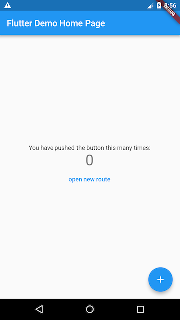
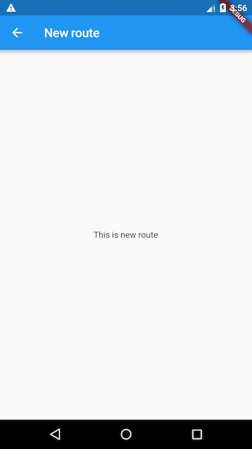

在Flutter中， 路由（Route）通常指页面（Page），Route 在 Android中 通常指一个 Activity，在 iOS 中指一个 ViewController。

路由管理，就是管理页面之间如何跳转，通常也可被称为导航管理（Navigator）。

导航管理会维护一个路由栈，路由入栈（push）操作对应打开一个新页面，路由出栈（pop）操作对应页面关闭操作。

示例：

```dart
// 创建一个新路由
class NewRoute extends StatelessWidget {
  const NewRoute({super.key});

  @override
  Widget build(BuildContext context) {
    return Scaffold(
      appBar: AppBar(
        title: Text("New route"),
      ),
      body: Center(
        child: Text("This is new route"),
      ),
    );
  }
}

class MyHomePage extends StatefulWidget {
  ...
}

class _MyHomePageState extends State<MyHomePage> {
  ...

  @override
  Widget build(BuildContext context) {
    return Scaffold(
      appBar: AppBar(
        backgroundColor: Theme.of(context).colorScheme.inversePrimary,
        title: Text(widget.title),
      ),
      body: Center(
        child: Column(
          mainAxisAlignment: MainAxisAlignment.center,
          children: <Widget>[
            const Text(
              'You have pushed the button this many times:',
            ),
            Text(
              '$_counter',
              style: Theme.of(context).textTheme.headlineMedium,
            ),
            // 添加一个按钮（TextButton）
            TextButton(
              child: Text("open new route"),
              onPressed: () {
                //导航到新路由
                Navigator.push(
                  context,
                  MaterialPageRoute(builder: (context) {
                    return NewRoute();
                  }),
                );
              },
            ),
          ],
        ),
      ),
      floatingActionButton: FloatingActionButton(
        onPressed: _incrementCounter,
        tooltip: 'Increment',
        child: const Icon(Icons.add),
      ), // This trailing comma makes auto-formatting nicer for build methods.
    );
  }
}
```

添加了一个打开新路由的按钮，点击该按钮后就会打开新的 route 页面。

| 之前                                        | 之后                         |
| ----------------------------------------- | -------------------------- |
|  |  |

## 路由核心

### `Navigator` 路由管理器

`Navigator` 通过一个栈来管理活动路由集合。

```dart
// 入栈（打开新页面），返回一个Future对象，以接收新路由出栈时的数据
Future Navigator.push(context, route);

// 出栈（返回上一页），result 为页面关闭时返回给上一个页面的数据。
Navigator.pop(context, [result]);
```

`Navigator.push(BuildContext context, Route route)`等价于`Navigator.of(context).push(Route route)`

### `MaterialPageRoute`  带 Material 动画的路由载体

`MaterialPageRoute` 是 Material 组件库提供的组件，它可以针对不同平台，实现与平台页面切换动画风格一致的路由切换动画：

- 对于 Android，当打开新页面时，新页面会从屏幕底部滑动到屏幕顶部；当关闭页面时，当前页面会从屏幕顶部滑动到屏幕底部后消失，同时上一个页面会显示到屏幕上。
- 对于 iOS，当打开页面时，新页面会从屏幕右侧边缘一直滑动到屏幕左边，直到新页面全部显示到屏幕上，而上一个页面则会从当前屏幕滑动到屏幕左侧而消失；当关闭页面时，正好相反，当前页面会从屏幕右侧滑出，同时上一个页面会从屏幕左侧滑入。

```dart
MaterialPageRoute({
  WidgetBuilder builder, // 构建路由页面的具体内容
  RouteSettings settings, // 路由的配置信息，如路由名称、是否初始路由（首页）。
  bool maintainState = true, // 当入栈新路由时，原来的路由默认会被保存在内存中，如果想在路由没用的时候释放所占用的资源，可以设置为 false。
  bool fullscreenDialog = false, // 表示新的路由页面是否是一个全屏的模态对话框，在 iOS 中，如果fullscreenDialog为true，新页面将会从屏幕底部滑入（而不是水平方向）。
})
```

## 基础路由（匿名路由）

最直接的页面跳转方式，即时实例化一个页面对象并压入栈中。

### 跳转与回退

- 入栈 (Push)：打开新页面。

  ```dart
  // MaterialPageRoute 是一个包装器，自带了 iOS/Android 的标准切换动画。
  Navigator.push(context, MaterialPageRoute(builder: (context) {
    return NewRoute(); // NewRoute() 就是你要跳去的页面所在的 Widget 类
  }));
  ```

- 出栈 (Pop)：关闭当前页面，返回上一个页面。

  ```dart
  Navigator.pop(context);
  ```

### 路由传参

- **传递参数给新页面**：直接在目标页面的构造函数里传参即可。

- 从新页面返回数据给上一页： Flutter 的 `Navigator.push` 会返回一个 `Future`

```dart
// 页面 A (异步等待返回结果)
var result = await Navigator.push(context, ...); 

// 页面 B (在 pop 的第二参数中填入要返回的值)
Navigator.pop(context, "这是返回给页面A的数据"); 
```

## 命名路由 (Named Routes)

命名路由就是维护一张**路由表（路由注册表）**。命名路由的核心其实就是一个哈希表（Hash Map）。

```
Map<String, WidgetBuilder> routes;
```

### 注册路由表

在 `MaterialApp` 里集中配置

```dart
MaterialApp(
  initialRoute: '/', // 初始页面
  // 注册路由表
  routes: {
    '/':        (context) => HomePage(),
    '/login':   (context) => LoginPage(),
    '/detail':  (context) => DetailPage(),
    '/settings':(context) => SettingsPage(),
  },
);
```

### 命名路由跳转

通过路由名称打开新路由，可以使用`Navigator` 的`pushNamed`方法：

```dart
Future pushNamed(BuildContext context, String routeName, {Object arguments})
```

`Navigator` 除了`pushNamed`方法，还有`pushReplacementNamed`等其他管理命名路由的方法。

```dart
// 基本跳转
Navigator.pushNamed(context, '/login');

// 带参数跳转（通过 arguments 传递）
Navigator.pushNamed(
  context,
  '/detail',
  arguments: {"id": 101, "name": "Flutter路由"},
);
```

### 命名路由参数传递

```dart
// 通过 arguments 传递
Navigator.of(context).pushNamed(
  '/detail',
  arguments: {"id": 101, "name": "Flutter路由"},
);

// 通过 RouteSetting 获取路由参数
class DetailPage extends StatelessWidget {
  @override
  Widget build(BuildContext context) {
    // 获取参数（类型是 Object?，需要强转）
    final args = ModalRoute.of(context)!.settings.arguments 
                 as Map<String, dynamic>;
  
    return Scaffold(
      body: Text("ID: ${args['id']}, Name: ${args['name']}"),
    );
  }
}
```

## 路由生成钩子 (`onGenerateRoute`)

相当于 **中间件/拦截器**，在路由跳转时统一处理逻辑（比如：未登录就拦截跳转到登录页）。

**机制**：Flutter 首先找 `routes` 路由表；如果找不到，就会调用 `MaterialApp` 的 `onGenerateRoute` 回调函数。

```dart
MaterialApp(
  onGenerateRoute: (RouteSettings settings) {
    // settings.name  → 路由名称，如 '/detail'
    // settings.arguments → 传入的参数

    // 权限拦截示例
    if (settings.name != '/login' && !isLoggedIn) {
      return MaterialPageRoute(builder: (_) => LoginPage());
    }

    // 路由分发
    switch (settings.name) {
      case '/detail':
        return MaterialPageRoute(
          builder: (_) => DetailPage(),
          settings: settings, // 记得把 settings 传进去，参数才能取到
        );
      // ...其他路由
      default:
        return MaterialPageRoute(builder: (_) => NotFoundPage());
    }
  },
);
```

