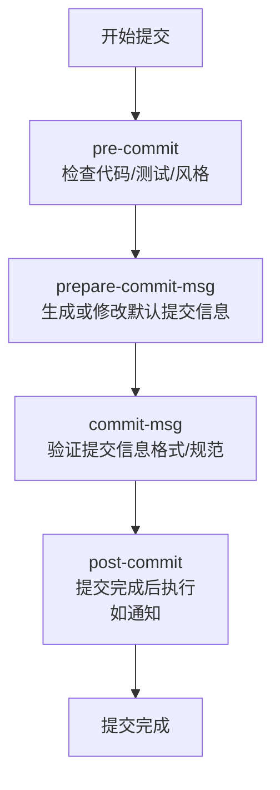

Git 能在特定的重要动作发生时触发自定义脚本。Git 有两组钩子：客户端的和服务器端的。

hooks 文件路径： `.git/hooks`，`.sample` 结尾的文件，为示例文件。

Git 支持的所有钩子：

| Git Hook              | 调用时机                                                                                                              | 说明                                          |
| --------------------- | ----------------------------------------------------------------------------------------------------------------- | ------------------------------------------- |
| pre-applypatch        | `git am`执行前                                                                                                       |                                             |
| applypatch-msg        | `git am`执行前                                                                                                       |                                             |
| post-applypatch       | `git am`执行后                                                                                                       | 不影响`git am`的结果                              |
| pre-commit            | `git commit`执行前                                                                                                   | 可以用`git commit --no-verify`绕过               |
| commit-msg            | `git commit`执行前                                                                                                   | 可以用`git commit --no-verify`绕过               |
| post-commit           | `git commit`执行后                                                                                                   | 不影响`git commit`的结果                          |
| pre-merge-commit      | `git merge`执行前                                                                                                    | 可以用`git merge --no-verify`绕过。               |
| prepare-commit-msg    | `git commit`执行后，编辑器打开之前                                                                                           |                                             |
| pre-rebase            | `git rebase`执行前                                                                                                   |                                             |
| post-checkout         | `git checkout`或`git switch`执行后                                                                                    | 如果不使用`--no-checkout`参数，则在`git clone`之后也会执行。 |
| post-merge            | `git commit`执行后                                                                                                   | 在执行`git pull`时也会被调用                         |
| pre-push              | `git push`执行前                                                                                                     |                                             |
| pre-receive           | `git-receive-pack`执行前                                                                                             |                                             |
| update                |                                                                                                                   |                                             |
| post-receive          | `git-receive-pack`执行后                                                                                             | 不影响`git-receive-pack`的结果                    |
| post-update           | 当 `git-receive-pack`对 `git push` 作出反应并更新仓库中的引用时                                                                   |                                             |
| push-to-checkout      | 当``git-receive-pack`对`git push`做出反应并更新仓库中的引用时，以及当推送试图更新当前被签出的分支且`receive.denyCurrentBranch`配置被设置为`updateInstead`时 |                                             |
| pre-auto-gc           | `git gc --auto`执行前                                                                                                |                                             |
| post-rewrite          | 执行`git commit --amend`或`git rebase`时                                                                              |                                             |
| sendemail-validate    | `git send-email`执行前                                                                                               |                                             |
| fsmonitor-watchman    | 配置`core.fsmonitor`被设置为`.git/hooks/fsmonitor-watchman`或`.git/hooks/fsmonitor-watchmanv2`时                          |                                             |
| p4-pre-submit         | `git-p4 submit`执行前                                                                                                | 可以用`git-p4 submit --no-verify`绕过            |
| p4-prepare-changelist | `git-p4 submit`执行后，编辑器启动前                                                                                         | 可以用`git-p4 submit --no-verify`绕过            |
| p4-changelist         | `git-p4 submit`执行并编辑完`changelist message`后                                                                        | 可以用`git-p4 submit --no-verify`绕过            |
| p4-post-changelist    | `git-p4 submit`执行后                                                                                                |                                             |
| post-index-change     | 索引被写入到`read-cache.c do_write_locked_index`后                                                                       |                                             |

Git 提交工作流：

>  https://git-scm.cn/docs/githooks
>  https://git-scm.com/book/zh/v2/%E8%87%AA%E5%AE%9A%E4%B9%89-Git-Git-%E9%92%A9%E5%AD%90