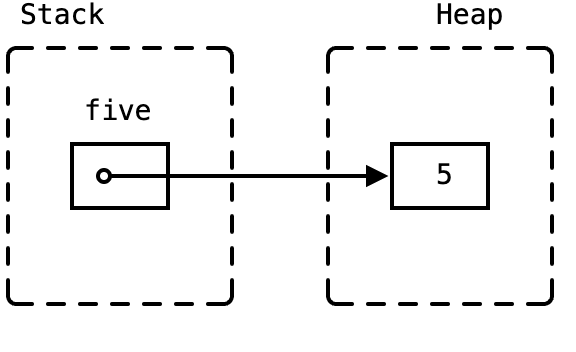

## Box
Box 是指向堆上数据的自有指针。

`Box<T>` 会实现 `Deref<Target = T>`，这意味着可以直接在 `Box<T>` 上通过 `T` 调用相应方法。


```rust
fn main() {
    let five = Box::new(5);
    println!("five: {}", *five);
}
```



Box 类似于 C++中的 `std::unique_ptr`，是单所有权或独占所有权模型的智能指针，只是它保证不为 null。

在以下情况下，`Box` 可能会很实用：
- 编译时无法确定其大小的类型，但 Rust 编译器需要知道确切大小。
- 当拥有大量数据并且想要转移所有权，但又希望在转移过程中数据不会被复制时
- 当拥有一个值并只关心它的类型是否实现了特定 trait 而不是其具体类型时

在创建 `Box<Point>` 实例的时候会发生所有权转移：资源从栈上 move 到了堆上，原来栈上的那片资源被置为无效状态。

```rust
struct Point {
    x: u32,
    y: u32
}

fn foo() -> Box<Point> {
    let p = Point {x: 10, y: 20};    
    let boxed = Box::new(p);  // 创建Box实例
    let q = p;                // 这一句用来检查p有没有被move走
    boxed
}
fn main() {
    let _p = foo();
}
```
Point 类型本身就是 move 语义的，所以会发生所有权这样的转移。如果是基本类型，具有 copy 语意，就不会发生所有权转移。

使用解引用符号 `*`，把里面的堆上的值再次移动回栈上：
```rust
let boxed: Box<u8> = Box::new(5);
let val: u8 = *boxed;    // 这里这个val整数实例就是在栈上的值
```
对于具有 copy 语义的类型来说，解引用回来后，Box 还能使用。对于具有 move 语义的类型来说，会发生所有权的转移。

使用 `Box<T>` 给递归类型一个已知的大小：

```rust
enum List {
    Cons(i32, Box<List>),
    Nil,
}

use crate::List::{Cons, Nil};

fn main() {
    let list = Cons(1, Box::new(Cons(2, Box::new(Cons(3, Box::new(Nil))))));
}
```
## Rc
`Rc` 是引用计数的共享指针。

```rust
use std::rc::Rc;

fn main() {
    let a = Rc::new(10);
    let b = Rc::clone(&a);

	println!("a: {a} count:{}", Rc::strong_count(&a)); // a: 10 count:2
	println!("b: {b} count {}", Rc::strong_count(&b)); // b: 10 count 2
}
```
注意： `Rc<T>` 只能用于单线程场景

## RefCell

 `RefCell` 具有内部可变性

`RefCell<T>` 允许在运行时执行不可变或可变借用检查，可以在即便 `RefCell<T>` 自身是不可变的情况下修改其内部的值。

`RefCell<T>` 只能用于单线程场景。

```rust
use std::cell::RefCell;

fn main() {
    let s = RefCell::new(String::from("hello, world"));
    let s1 = s.borrow();
    let s2 = s.borrow_mut();

    println!("{},{}", s1, s2);
}
```

在 Rust 中，一个常见的组合就是 `Rc` 和 `RefCell` 在一起使用，前者可以实现一个数据拥有多个所有者，后者可以实现数据的可变性：

```rust
use std::cell::RefCell;
use std::rc::Rc;
fn main() {
    let s = Rc::new(RefCell::new("hello".to_string()));

    let s1 = s.clone();
    let s2 = s.clone();
    // let mut s2 = s.borrow_mut();
    s2.borrow_mut().push_str(", world!");

    println!("{:?}\n{:?}\n{:?}", s, s1, s2);
}
```

## Arc
线程安全的引用计数指针。`Arc` 代表原子引用计数。

 `Arc<T>` 是共享所有权模型的智能指针，也就是多个变量可以同时拥有一个资源的所有权。和 `Box<T>` 一样，`Arc<T>` 也会保证被包装的内容被分配在堆上。
 
 Arc 的主要功能是和 `clone()` 配合使用。在 Arc 实例上每一次新的 `clone()` 操作，总是会将资源的引用数 +1，而保持原来那一份资源不动，这个信息记录在 Arc 实例里面。每一个指向同一个资源的 Arc 实例走出作用域，就会给这个引用计数 -1。直到最后一个 Arc 实例消失，目标资源才会被销毁释放。
```rust
use std::sync::Arc;

#[derive(Debug)]    // 这里不需要目标type实现Clone trait
struct Point {
    x: u32,
    y: u32,
}

impl Point {
    fn play(&self) {
        println!("I'am a method of Point.");
    }
}

fn main() {
    let arced: Arc<Point> = Arc::new(Point{x: 10, y: 20});
    let another_arced = arced.clone();      // 克隆引用
    println!("{:?}", arced);                // 打印一份值
    println!("{:?}", another_arced);        // 打印同一份值
    arced.play();
    another_arced.play();
    let arc3_ref = &another_arced;
    arc3_ref.play();
}
// 输出
Point { x: 10, y: 20 }
Point { x: 10, y: 20 }
I'am a method of Point.
I'am a method of Point.
I'am a method of Point.
```
相比于 `Box<T>`，`Arc<T>` 的 clone 不要求 T 实现了 Clone trait。`Arc<T>` 的克隆行为只会改变 Arc 的引用计数，而不会克隆里面的内容。

不能通过 `Arc<T>` 直接修改里面类型的值，也不能像 `Box<T>` 的解引用操作那样，把里面的内容从 `Arc<T>` 中移动出来。
想要修改 Arc 里面的内容，必须配合锁才能完成，比如 `Arc<Mutex<T>>`。