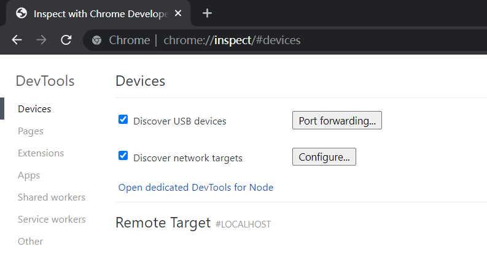
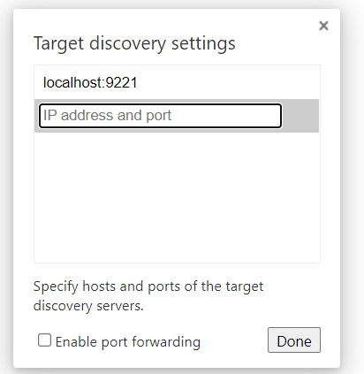
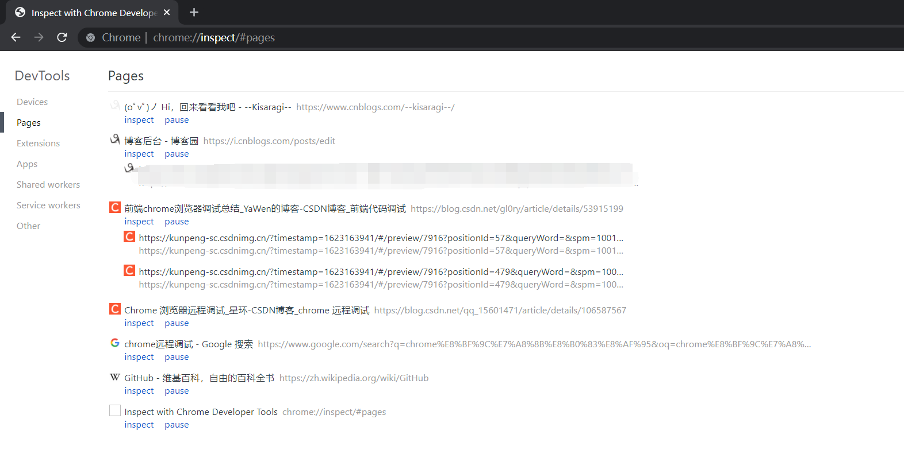

首先打开 Chrome 浏览器，在地址栏输入 `chrome://inspect/#devices`（Edge 浏览器一样），进入调试设置页面。

点击 `Configure`，设置监听的端口，这里设置的是 `localhost:9221`，然后点击 `Done`。 

 

找到 Chrome.exe 的目录，然后在该目录下启动命令行，这里我的目录是 `C:\Program Files (x86)\Google\Chrome\Application`，然后启动 Chrome.exe： `chrome.exe --remote-debugging-port=9221` 随便访问几个页面，就能在一开始打开的浏览器中看到访问的所有网页： 

 

点击 `inspect`，能进入到 `F12` 页面，从而查看 Cookies、Local Storage 等信息：

当能够控制目标主机执行命令之后，可以在该主机上建立全局代理，然后在自己这一边开启浏览器监听，接着在目标机器上执行 `chrome.exe --remote-debugging-port=xxxx` 这样的命令，在对方浏览网页的同时，自己这边也能获取到浏览网页所对应的 Cookie、Local Storage 等信息。

另外一个用途就是，开发CEF程序时，可以开启远程调试端口，然后使用此方法进行调试页面。