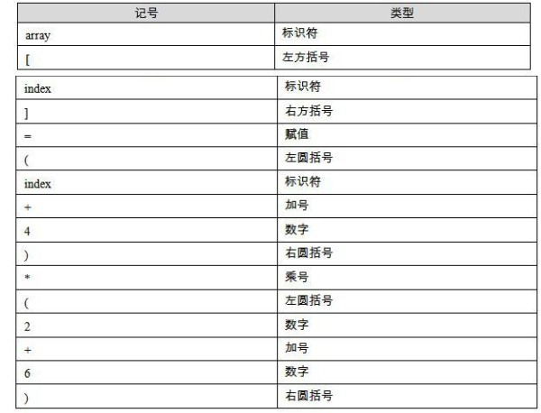

编译生成可执行文件的四个步骤：预处理（Prepressing）、编译（Compilation）、汇编（Assembly）和链接（Linking）


```c
#include <stdio.h>
int main()
{    
    printf("Hello World\n");    
    return 0;
}
```

# 生成可执行文件的过程

## 预编译

首先是源代码文件 hello. c 和相关的头文件，如 stdio. h 等被预编译器 cpp 预编译成一个. i 文件。

对于 C++程序来说，它的源代码文件的扩展名可能是. cpp 或. cxx，头文件的扩展名可能是. hpp，而预编译后的文件扩展名是. ii。

第一步预编译的过程相当于如下命令（-E 表示只进行预编译）：

```
$gcc –E hello.c –o hello.i
```

或者：

```
$ cpp hello. c > hello. i 
```

预编译过程主要处理那些源代码文件中的以“#”开始的预编译指令。比如“ #include ”、“ #define ”等，主要处理规则如下：

+ 将所有的“ #define ”删除，并且展开所有的宏定义。
+ 处理所有条件预编译指令，比如“ #if ”、“ #ifdef ”、“ #elif ”、“ #else ”、“ #endif ”。
+ 处理“ #include ”预编译指令，将被包含的文件插入到该预编译指令的位置。注意，这个过程是递归进行的，也就是说被包含的文件可能还包含其他文件。
+ 删除所有的注释“//”和“/* */”。
+ 添加行号和文件名标识，比如 `#2 “hello. c”2`，以便于编译时编译器产生调试用的行号信息及用于编译时产生编译错误或警告时能够显示行号。
+ 保留所有的 #pragma编译器指令 ，因为编译器须要使用它们。

经过预编译后的. i 文件不包含任何宏定义，因为所有的宏已经被展开，并且包含的文件也已经被插入到. i 文件中。所以当我们无法判断宏定义是否正确或头文件包含是否正确时，可以查看预编译后的文件来确定问题。

## 编译

编译过程就是把预处理完的文件进行一系列词法分析、语法分析、语义分析及优化后生产相应的汇编代码文件。

上面的编译过程相当于如下命令：

```
$gcc –S hello.i –o hello.s
```

现在版本的 GCC 把预编译和编译两个步骤合并成一个步骤，使用 cc1的程序来完成这两个步骤。这个程序位于 `/usr/lib/gcc/i486-linux-gnu/4.1/`

```
$ /usr/lib/gcc/i486-linux-gnu/4.1/cc1 hello.c
```

或者使用：

```
$gcc –S hello.c –o hello.s
```

## 汇编

汇编器是将汇编代码转变成机器可以执行的指令，每一个汇编语句几乎都对应一条机器指令。所以汇编器的汇编过程相对于编译器来讲比较简单，它没有复杂的语法，也没有语义，也不需要做指令优化，只是根据汇编指令和机器指令的对照表一一翻译就可以了，“汇编”这个名字也来源于此。

上面的汇编过程我们可以调用汇编器as来完成：

```
$as hello.s –o hello.o
```

或者使用gcc命令从C源代码文件开始，经过预编译、编译和汇编直接输出目标文件（Object File）：

```
$gcc –c hello.c –o hello.o
```

## 链接

链接通常是一个让人比较费解的过程，为什么汇编器不直接输出可执行文件而是输出一个目标文件呢？链接过程到底包含了什么内容？为什么要链接？正是因为这些疑惑总是挥之不去，所以我们特意用这一章的篇幅来分析链接，具体地说分析静态链接的章节。

下面来看看调用ld产生一个正常运行的HelloWorld程序：

```
$ld -static /usr/lib/crt1.o /usr/lib/crti.o /usr/lib/gcc/i486-linux-gnu/4.1.3/crtbeginT.o -L/usr/lib/gcc/i486-linux-gnu/4.1.3 -L/usr/lib -L/lib hello.o --start-group -lgcc -lgcc_eh -lc --end-group /usr/lib/gcc/i486-linux-gnu/4.1.3/crtend.o /usr/lib/crtn.o
```

可以看到，我们需要将一大堆文件链接起来才可以得到“a.out”，即最终的可执行文件。

# 编译器

从最直观的角度来讲，编译器就是将高级语言翻译成机器语言的一个工具。

编译过程一般可以分为6步：扫描、语法分析、语义分析、源代码优化、代码生成和目标代码优化。


结合图来简单描述从源代码（Source Code）到最终目标代码（Final Target Code）的过程。以一段很简单的C语言的代码为例子来讲述这个过程。比如我们有一行C语言的源代码如下：

```c
array[index] = (index + 4) * (2 + 6)
//CompilerExpression.c
```

## 词法分析

首先源代码程序被输入到扫描器（Scanner），扫描器的任务很简单，它只是简单地进行词法分析，运用一种类似于有限状态机（Finite State Machine）的算法可以很轻松地将源代码的字符序列分割成一系列的记号（Token）。

比如上面的那行程序，总共包含了28个非空字符，经过扫描以后，产生了16个记号，如表所示。




词法分析产生的记号一般可以分为如下几类：关键字、标识符、字面量（包含数字、字符串等）和特殊符号（如加号、等号）。在识别记号的同时，扫描器也完成了其他工作。比如将标识符存放到符号表，将数字、字符串常量存放到文字表等，以备后面的步骤使用。

有一个叫做lex的程序可以实现词法扫描，它会按照用户之前描述好的词法规则将输入的字符串分割成一个个记号。因为这样一个程序的存在，编译器的开发者就无须为每个编译器开发一个独立的词法扫描器，而是根据需要改变词法规则就可以了。

另外对于一些有预处理的语言，比如C语言，它的宏替换和文件包含等工作一般不归入编译器的范围而交给一个独立的预处理器。
