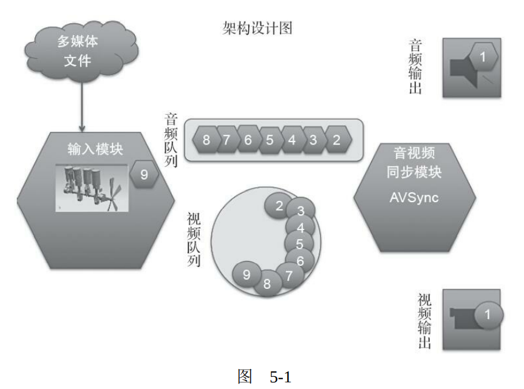
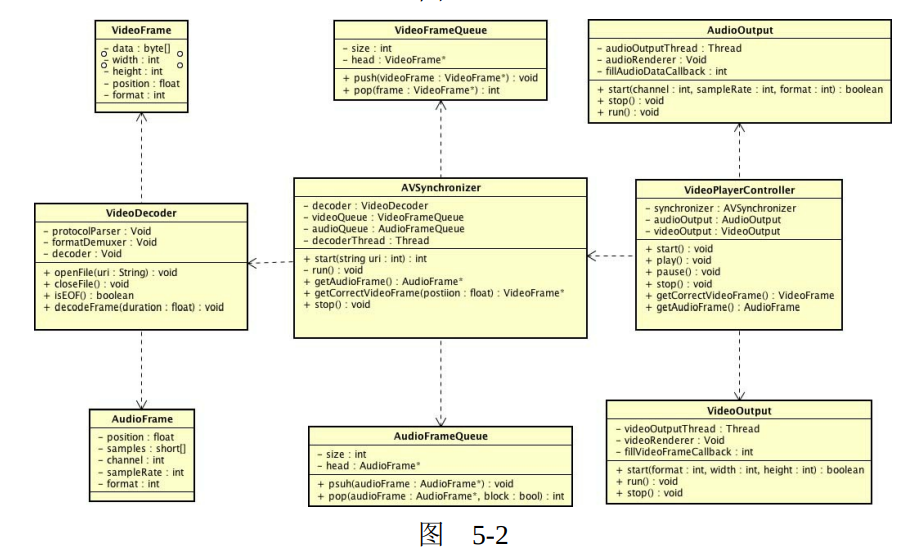
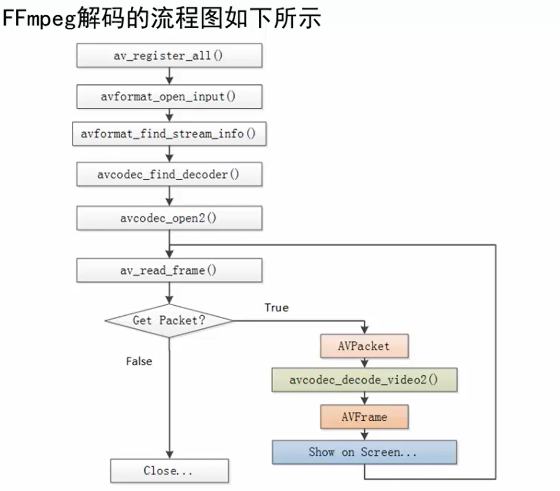

# FFmpeg

+ 容器／格式/文件（Conainer/Format/File）：即特定格式的多媒体文件，比如 MP4、flv、mov等。
+ 媒体流（Stream）：表示时间轴上的一段连续数据，如一段声音数据、一段视频数据或一段字幕数据，可以是压缩的，也可以是非压缩的，压缩的数据需要关联特定的编解码器。
+ 数据帧／数据包（Frame/Packet）：通常，一个媒体流是由大量的数据帧组成的，对于压缩数据，帧对应着编解码器的最小处理单元，分属于不同媒体流的数据帧交错存储于容器之中。
+ 编解码器（Codec）：编解码器是以帧为单位实现压缩数据和原始数据之间的相互转换的。

>  Codec是编码（Coder）和解码（Decoder）的合称。

<img src="data:image/svg+xml;base64,PHN2ZyBpZD0ia2l0eV9zdmdfNiIgeG1sbnM9Imh0dHA6Ly93d3cudzMub3JnLzIwMDAvc3ZnIiB4bWxuczp4bGluaz0iaHR0cDovL3d3dy53My5vcmcvMTk5OS94bGluayIgdmVyc2lvbj0iMS4xIiB3aWR0aD0iNjgzIiBoZWlnaHQ9IjIyOCIgc3R5bGU9ImJhY2tncm91bmQ6IHJnYigyNTEsIDI1MSwgMjUxKTsgdmlzaWJpbGl0eTogdmlzaWJsZTsiIHZpZXdCb3g9IjAgMCA2ODMgMjI4Ij48ZGVmcyBpZD0ia2l0eV9kZWZzXzciPjxsaW5lYXJHcmFkaWVudCBpZD0ia2l0eV9saW5lYXJHcmFkaWVudF8xNyIgeDE9IjAiIHkxPSIwIiB4Mj0iMCIgeTI9IjEiPjxzdG9wIGlkPSJraXR5X3N0b3BfMTgiIG9mZnNldD0iMCIgc3RvcC1jb2xvcj0icmdiKDI1NSwgMjU1LCAyNTUpIj48L3N0b3A+PHN0b3AgaWQ9ImtpdHlfc3RvcF8xOSIgb2Zmc2V0PSIxIiBzdG9wLWNvbG9yPSJyZ2IoMjA0LCAyMDQsIDIwNCkiPjwvc3RvcD48L2xpbmVhckdyYWRpZW50PjxtYXJrZXIgaWQ9ImtpdHlfbWFya2VyXzIiIG9yaWVudD0iYXV0byIgcmVmWD0iNiIgcmVmWT0iMCIgdmlld0JveD0iLTcgLTcgMTQgMTQiIG1hcmtlcldpZHRoPSI3IiBtYXJrZXJIZWlnaHQ9IjciIG1hcmtlclVuaXRzPSJ1c2VyU3BhY2VPblVzZSI+PHBhdGggaWQ9ImtpdHlfcGF0aF8zIiBmaWxsPSJyZ2IoMTkxLCAxMTUsIDExNSkiIHN0cm9rZT0ibm9uZSIgZD0iTTYsMEE2LDYsMCwxLDEsLTYsMEE2LDYsMCwxLDEsNiwwIj48L3BhdGg+PC9tYXJrZXI+PC9kZWZzPjxnIGlkPSJraXR5X2dfOCI+PGcgaWQ9Im1pbmRlcjEiIHRleHQtcmVuZGVyaW5nPSJvcHRpbWl6ZS1zcGVlZCI+PGcgaWQ9Im1pbmRlcl9jb25uZWN0X2dyb3VwMSI+PHBhdGggaWQ9ImtpdHlfcGF0aF8zMSIgZmlsbD0ibm9uZSIgc3Ryb2tlPSJyZ2IoMTkxLCAxMTUsIDExNSkiIHN0cm9rZS13aWR0aD0iMSIgZD0iTTY5LjAwMDAxMTA3OTAxMzM1LDExNC41MDAwMDQwMDA5NjE3OEExNjYuNSw1NywwLDAsMSwyMzUuNTAwMDExMDc5MDEzMzUsNTcuNTAwMDA0MDAwOTYxNzgiPjwvcGF0aD48cGF0aCBpZD0ia2l0eV9wYXRoXzM5IiBmaWxsPSJub25lIiBzdHJva2U9InJnYigxOTEsIDExNSwgMTE1KSIgc3Ryb2tlLXdpZHRoPSIxIiBkPSJNNjkuMDAwMDExMDc5MDEzMzUsMTE0LjUwMDAwNDAwMDk2MTc4QTE2Ni41LDU3LDAsMCwwLDIzNS41MDAwMTEwNzkwMTMzNSwxNzEuNTAwMDA0MDAwOTYxNzgiPjwvcGF0aD48cGF0aCBpZD0ia2l0eV9wYXRoXzQ3IiBmaWxsPSJub25lIiBzdHJva2U9InJnYigxOTEsIDExNSwgMTE1KSIgc3Ryb2tlLXdpZHRoPSIxIiBkPSJNMzA3LjUwMDAxMTA3OTAxMzM1LDU3LjUwMDAwNDAwMDk2MTc4QzMyNy41MDAwMTEwNzkwMTMzNSw1Ny41MDAwMDQwMDA5NjE3OCwzMjcuNTAwMDExMDc5MDEzMzUsMzEuNTAwMDA0MDAwOTYxNzgsMzQ3LjUwMDAxMTA3OTAxMzM1LDMxLjUwMDAwNDAwMDk2MTc4Ij48L3BhdGg+PHBhdGggaWQ9ImtpdHlfcGF0aF81NSIgZmlsbD0ibm9uZSIgc3Ryb2tlPSJyZ2IoMTkxLCAxMTUsIDExNSkiIHN0cm9rZS13aWR0aD0iMSIgZD0iTTMwNy41MDAwMTEwNzkwMTMzNSw1Ny41MDAwMDQwMDA5NjE3OEMzMjcuNTAwMDExMDc5MDEzMzUsNTcuNTAwMDA0MDAwOTYxNzgsMzI3LjUwMDAxMTA3OTAxMzM1LDgzLjUwMDAwNDAwMDk2MTc4LDM0Ny41MDAwMTEwNzkwMTMzNSw4My41MDAwMDQwMDA5NjE3OCI+PC9wYXRoPjxwYXRoIGlkPSJraXR5X3BhdGhfNjMiIGZpbGw9Im5vbmUiIHN0cm9rZT0icmdiKDE5MSwgMTE1LCAxMTUpIiBzdHJva2Utd2lkdGg9IjEiIGQ9Ik00MDQuNTAwMDExMDc5MDEzMzUsMzEuNTAwMDA0MDAwOTYxNzhDNDI0LjUwMDAxMTA3OTAxMzM1LDMxLjUwMDAwNDAwMDk2MTc4LDQyNC41MDAwMTEwNzkwMTMzNSwzMS41MDAwMDQwMDA5NjE3OCw0NDQuNTAwMDExMDc5MDEzMzUsMzEuNTAwMDA0MDAwOTYxNzgiPjwvcGF0aD48cGF0aCBpZD0ia2l0eV9wYXRoXzcxIiBmaWxsPSJub25lIiBzdHJva2U9InJnYigxOTEsIDExNSwgMTE1KSIgc3Ryb2tlLXdpZHRoPSIxIiBkPSJNNDIyLjUwMDAxMTA3OTAxMzM1LDgzLjUwMDAwNDAwMDk2MTc4QzQ0Mi41MDAwMTEwNzkwMTMzNSw4My41MDAwMDQwMDA5NjE3OCw0NDIuNTAwMDExMDc5MDEzMzUsODMuNTAwMDA0MDAwOTYxNzgsNDYyLjUwMDAxMTA3OTAxMzM1LDgzLjUwMDAwNDAwMDk2MTc4Ij48L3BhdGg+PHBhdGggaWQ9ImtpdHlfcGF0aF83OSIgZmlsbD0ibm9uZSIgc3Ryb2tlPSJyZ2IoMTkxLCAxMTUsIDExNSkiIHN0cm9rZS13aWR0aD0iMSIgZD0iTTMwNi41MDAwMTEwNzkwMTMzNSwxNzEuNTAwMDA0MDAwOTYxNzhDMzI2LjUwMDAxMTA3OTAxMzM1LDE3MS41MDAwMDQwMDA5NjE3OCwzMjYuNTAwMDExMDc5MDEzMzUsMTQ1LjUwMDAwNDAwMDk2MTc4LDM0Ni41MDAwMTEwNzkwMTMzNSwxNDUuNTAwMDA0MDAwOTYxNzgiPjwvcGF0aD48cGF0aCBpZD0ia2l0eV9wYXRoXzk1IiBmaWxsPSJub25lIiBzdHJva2U9InJnYigxOTEsIDExNSwgMTE1KSIgc3Ryb2tlLXdpZHRoPSIxIiBkPSJNMzA2LjUwMDAxMTA3OTAxMzM1LDE3MS41MDAwMDQwMDA5NjE3OEMzMjYuNTAwMDExMDc5MDEzMzUsMTcxLjUwMDAwNDAwMDk2MTc4LDMyNi41MDAwMTEwNzkwMTMzNSwxOTcuNTAwMDA0MDAwOTYxNzgsMzQ2LjUwMDAxMTA3OTAxMzM1LDE5Ny41MDAwMDQwMDA5NjE3OCI+PC9wYXRoPjxwYXRoIGlkPSJraXR5X3BhdGhfMTAzIiBmaWxsPSJub25lIiBzdHJva2U9InJnYigxOTEsIDExNSwgMTE1KSIgc3Ryb2tlLXdpZHRoPSIxIiBkPSJNNDAzLjUwMDAxMTA3OTAxMzM1LDE0NS41MDAwMDQwMDA5NjE3OEM0MjMuNTAwMDExMDc5MDEzMzUsMTQ1LjUwMDAwNDAwMDk2MTc4LDQyMy41MDAwMTEwNzkwMTMzNSwxNDUuNTAwMDA0MDAwOTYxNzgsNDQzLjUwMDAxMTA3OTAxMzM1LDE0NS41MDAwMDQwMDA5NjE3OCI+PC9wYXRoPjxwYXRoIGlkPSJraXR5X3BhdGhfMTExIiBmaWxsPSJub25lIiBzdHJva2U9InJnYigxOTEsIDExNSwgMTE1KSIgc3Ryb2tlLXdpZHRoPSIxIiBkPSJNNDIxLjUwMDAxMTA3OTAxMzM1LDE5Ny41MDAwMDQwMDA5NjE3OEM0NDEuNTAwMDExMDc5MDEzMzUsMTk3LjUwMDAwNDAwMDk2MTc4LDQ0MS41MDAwMTEwNzkwMTMzNSwxOTcuNTAwMDA0MDAwOTYxNzgsNDYxLjUwMDAxMTA3OTAxMzM1LDE5Ny41MDAwMDQwMDA5NjE3OCI+PC9wYXRoPjwvZz48ZyBpZD0ibWluZGVyX25vZGUxIj48cGF0aCBpZD0ia2l0eV9wYXRoXzEyMCIgZmlsbD0icmdiYSgwLCAwLCAwLCAuMjUpIiBzdHJva2U9Im5vbmUiIGQ9Ik0yOC41MDAwMTEwNzkwMTMzNDgsOTIuNTAwMDA0MDAwOTYxNzhoMTEzYTUsNSwwLDAsMSw1LDV2NDRhNSw1LDAsMCwxLC01LDVoLTExM2E1LDUsMCwwLDEsLTUsLTV2LTQ0YTUsNSwwLDAsMSw1LC01eiIgZGlzcGxheT0ibm9uZSI+PC9wYXRoPjxwYXRoIGlkPSJub2RlX291dGxpbmUxIiBmaWxsPSJyZ2IoMTkxLCAxMTUsIDExNSkiIHN0cm9rZT0icmdiKDE5MSwgMTE1LCAxMTUpIiBkPSJNMjUuNTAwMDExMDc5MDEzMzQ4LDk0LjUwMDAwNDAwMDk2MTc4aDg3YTUsNSwwLDAsMSw1LDV2MzBhNSw1LDAsMCwxLC01LDVoLTg3YTUsNSwwLDAsMSwtNSwtNXYtMzBhNSw1LDAsMCwxLDUsLTV6IiBzdHJva2Utd2lkdGg9IjMiPjwvcGF0aD48ZyBpZD0ibm9kZV90ZXh0MSIgZmlsbD0id2hpdGUiPjx0ZXh0IGlkPSJraXR5X3RleHRfMjIiIHRleHQtcmVuZGVyaW5nPSJpbmhlcml0IiBmb250LXNpemU9IjE2IiBkeT0iLjhlbSIgeT0iMTA0LjEwMDAwMzk2NTE5OSIgeD0iNDQuNTAwMDExMDc5MDEzMzUiPumfs+inhumikTwvdGV4dD48L2c+PC9nPjxnIGlkPSJraXR5X2dfMTIiPjxwYXRoIGlkPSJraXR5X3BhdGhfMTMiIGZpbGw9Im5vbmUiIHN0cm9rZT0ibm9uZSIgZD0iTTQ0LjUwMDAxMTA3OTAxMzM1LDExNC41MDAwMDQwMDA5NjE3OGgwdjBoMHoiPjwvcGF0aD48L2c+PGcgaWQ9ImtpdHlfZ18xNCI+PHBhdGggaWQ9ImtpdHlfcGF0aF8xNSIgZmlsbD0ibm9uZSIgc3Ryb2tlPSJub25lIiBkPSJNNDQuNTAwMDExMDc5MDEzMzUsMTE0LjUwMDAwNDAwMDk2MTc4aDB2MGgweiI+PC9wYXRoPjxwYXRoIGlkPSJraXR5X3BhdGhfMTYiIGZpbGw9Im5vbmUiIHN0cm9rZT0ibm9uZSI+PC9wYXRoPjwvZz48ZyBpZD0ibWluZGVyX25vZGUyIj48cGF0aCBpZD0ia2l0eV9wYXRoXzExOCIgZmlsbD0icmdiYSgwLCAwLCAwLCAuMjUpIiBzdHJva2U9Im5vbmUiIGQ9Ik0yNDYuNTAwMDE0MjUyOTYwNjgsNDguNTAwMDAzMTUxNTk1NTloNjNhNSw1LDAsMCwxLDUsNXYxOGE1LDUsMCwwLDEsLTUsNWgtNjNhNSw1LDAsMCwxLC01LC01di0xOGE1LDUsMCwwLDEsNSwtNXoiIGRpc3BsYXk9Im5vbmUiPjwvcGF0aD48ZyBpZD0ibm9kZV9leHBhbmRlcjEiIHN0eWxlPSJjdXJzb3I6IHBvaW50ZXI7Ij48cGF0aCBpZD0ia2l0eV9wYXRoXzM2IiBmaWxsPSJ3aGl0ZSIgc3Ryb2tlPSJncmF5IiBkPSJNMjM2LjUwMDAxMzg1MDYyOTMzLDU3LjUwMDAwMzE1MTU5NTU5QTYsNiwwLDEsMSwyMjQuNTAwMDEzODUwNjI5MzMsNTcuNTAwMDAzMTUxNTk1NTlBNiw2LDAsMSwxLDIzNi41MDAwMTM4NTA2MjkzMyw1Ny41MDAwMDMxNTE1OTU1OSI+PC9wYXRoPjxwYXRoIGlkPSJraXR5X3BhdGhfMzciIGZpbGw9Im5vbmUiIHN0cm9rZT0iZ3JheSIgZD0iTTIyNi4wMDAwMTM4NTA2MjkzMyw1Ny41MDAwMDMxNTE1OTU1OUwyMzUuMDAwMDEzODUwNjI5MzMsNTcuNTAwMDAzMTUxNTk1NTkiPjwvcGF0aD48L2c+PHBhdGggaWQ9Im5vZGVfb3V0bGluZTIiIGZpbGw9InJnYigyNDYsIDIzOCwgMjM4KSIgc3Ryb2tlPSJyZ2IoMTkxLCAxMTUsIDExNSkiIGQ9Ik0yNDAuNTAwMDE0MjUyOTYwNjgsNDQuNTAwMDAzMTUxNTk1NTloNjRhMywzLDAsMCwxLDMsM3YyMGEzLDMsMCwwLDEsLTMsM2gtNjRhMywzLDAsMCwxLC0zLC0zdi0yMGEzLDMsMCwwLDEsMywtM3oiIHN0cm9rZS13aWR0aD0iMSI+PC9wYXRoPjxnIGlkPSJub2RlX3RleHQyIiBmaWxsPSJibGFjayI+PHRleHQgaWQ9ImtpdHlfdGV4dF8zMyIgdGV4dC1yZW5kZXJpbmc9ImluaGVyaXQiIGZvbnQtc2l6ZT0iMTQiIGR5PSIuOGVtIiB5PSI0OC40MDAwMDMxMjAzMDMxNTQiIHg9IjI1Ny41MDAwMTQyNTI5NjA3Ij7op4bpopE8L3RleHQ+PC9nPjwvZz48ZyBpZD0ibWluZGVyX25vZGUzIj48cGF0aCBpZD0ia2l0eV9wYXRoXzExOSIgZmlsbD0icmdiYSgwLCAwLCAwLCAuMjUpIiBzdHJva2U9Im5vbmUiIGQ9Ik0yNDYuNTAwMDE0MjUyOTYwNjgsMTYyLjUwMDAwNDg1MDMyNzk3aDYzYTUsNSwwLDAsMSw1LDV2MThhNSw1LDAsMCwxLC01LDVoLTYzYTUsNSwwLDAsMSwtNSwtNXYtMThhNSw1LDAsMCwxLDUsLTV6IiBkaXNwbGF5PSJub25lIj48L3BhdGg+PGcgaWQ9Im5vZGVfZXhwYW5kZXIyIiBzdHlsZT0iY3Vyc29yOiBwb2ludGVyOyI+PHBhdGggaWQ9ImtpdHlfcGF0aF80NCIgZmlsbD0id2hpdGUiIHN0cm9rZT0iZ3JheSIgZD0iTTIzNi41MDAwMTM4NTA2MjkzMywxNzEuNTAwMDA0ODUwMzI3OTdBNiw2LDAsMSwxLDIyNC41MDAwMTM4NTA2MjkzMywxNzEuNTAwMDA0ODUwMzI3OTdBNiw2LDAsMSwxLDIzNi41MDAwMTM4NTA2MjkzMywxNzEuNTAwMDA0ODUwMzI3OTciPjwvcGF0aD48cGF0aCBpZD0ia2l0eV9wYXRoXzQ1IiBmaWxsPSJub25lIiBzdHJva2U9ImdyYXkiIGQ9Ik0yMjYuMDAwMDEzODUwNjI5MzMsMTcxLjUwMDAwNDg1MDMyNzk3TDIzNS4wMDAwMTM4NTA2MjkzMywxNzEuNTAwMDA0ODUwMzI3OTciPjwvcGF0aD48L2c+PHBhdGggaWQ9Im5vZGVfb3V0bGluZTMiIGZpbGw9InJnYigyNDYsIDIzOCwgMjM4KSIgc3Ryb2tlPSJyZ2IoMTkxLCAxMTUsIDExNSkiIGQ9Ik0yNDAuNTAwMDE0MjUyOTYwNjgsMTU4LjUwMDAwNDg1MDMyNzk3aDYzYTMsMywwLDAsMSwzLDN2MjBhMywzLDAsMCwxLC0zLDNoLTYzYTMsMywwLDAsMSwtMywtM3YtMjBhMywzLDAsMCwxLDMsLTN6IiBzdHJva2Utd2lkdGg9IjEiPjwvcGF0aD48ZyBpZD0ibm9kZV90ZXh0MyIgZmlsbD0iYmxhY2siPjx0ZXh0IGlkPSJraXR5X3RleHRfNDEiIHRleHQtcmVuZGVyaW5nPSJpbmhlcml0IiBmb250LXNpemU9IjE0IiBkeT0iLjhlbSIgeT0iMTYyLjQwMDAwNDgxOTAzNTUzIiB4PSIyNTcuNTAwMDE0MjUyOTYwNyI+6Z+z6aKRPC90ZXh0PjwvZz48L2c+PGcgaWQ9Im1pbmRlcl9ub2RlNCI+PHBhdGggaWQ9ImtpdHlfcGF0aF8xMjIiIGZpbGw9InJnYmEoMCwgMCwgMCwgLjI1KSIgc3Ryb2tlPSJub25lIiBkPSJNMzgxLjUwMDAxNTc0MzA3NjgsOS4wMDAwMDI3NjQxNjU0MDFoMGEyOCwyOCwwLDAsMSwyOCwyOHYwYTI4LDI4LDAsMCwxLC0yOCwyOGgwYTI4LDI4LDAsMCwxLC0yOCwtMjh2MGEyOCwyOCwwLDAsMSwyOCwtMjh6IiBkaXNwbGF5PSJub25lIj48L3BhdGg+PGcgaWQ9Im5vZGVfZXhwYW5kZXIzIiBzdHlsZT0iY3Vyc29yOiBwb2ludGVyOyI+PHBhdGggaWQ9ImtpdHlfcGF0aF81MiIgZmlsbD0id2hpdGUiIHN0cm9rZT0iZ3JheSIgZD0iTTM0Ny41MDAwMTU1MDQ2NTgyLDMxLjUwMDAwMjc2NDE2NTRBNiw2LDAsMSwxLDMzNS41MDAwMTU1MDQ2NTgyLDMxLjUwMDAwMjc2NDE2NTRBNiw2LDAsMSwxLDM0Ny41MDAwMTU1MDQ2NTgyLDMxLjUwMDAwMjc2NDE2NTQiPjwvcGF0aD48cGF0aCBpZD0ia2l0eV9wYXRoXzUzIiBmaWxsPSJub25lIiBzdHJva2U9ImdyYXkiIGQ9Ik0zMzcuMDAwMDE1NTA0NjU4MiwzMS41MDAwMDI3NjQxNjU0TDM0Ni4wMDAwMTU1MDQ2NTgyLDMxLjUwMDAwMjc2NDE2NTQiPjwvcGF0aD48L2c+PHBhdGggaWQ9Im5vZGVfb3V0bGluZTQiIGZpbGw9Im5vbmUiIHN0cm9rZT0ibm9uZSIgZD0iTTM1Mi41MDAwMTU3NDMwNzY4LDIwLjUwMDAwMjc2NDE2NTRoNDdhNSw1LDAsMCwxLDUsNXYxMmE1LDUsMCwwLDEsLTUsNWgtNDdhNSw1LDAsMCwxLC01LC01di0xMmE1LDUsMCwwLDEsNSwtNXoiIHN0cm9rZS13aWR0aD0iMyI+PC9wYXRoPjxnIGlkPSJub2RlX3RleHQ0IiBmaWxsPSJibGFjayI+PHRleHQgaWQ9ImtpdHlfdGV4dF80OSIgdGV4dC1yZW5kZXJpbmc9ImluaGVyaXQiIGZvbnQtc2l6ZT0iMTIiIGR5PSIuOGVtIiB5PSIyMy43MDAwMDI3MzczNDMzMSIgeD0iMzU3LjUwMDAxNTc0MzA3NjgiPue8luino+eggTwvdGV4dD48L2c+PC9nPjxnIGlkPSJtaW5kZXJfbm9kZTUiPjxwYXRoIGlkPSJraXR5X3BhdGhfMTI0IiBmaWxsPSJyZ2JhKDAsIDAsIDAsIC4yNSkiIHN0cm9rZT0ibm9uZSIgZD0iTTM5MS4wMDAwMTU3NDMwNzY4LDUzLjAwMDAwMzUzOTAyNTc4aDBhMzYsMzYsMCwwLDEsMzYsMzZ2MGEzNiwzNiwwLDAsMSwtMzYsMzZoMGEzNiwzNiwwLDAsMSwtMzYsLTM2djBhMzYsMzYsMCwwLDEsMzYsLTM2eiIgZGlzcGxheT0ibm9uZSI+PC9wYXRoPjxnIGlkPSJub2RlX2V4cGFuZGVyNCIgc3R5bGU9ImN1cnNvcjogcG9pbnRlcjsiPjxwYXRoIGlkPSJraXR5X3BhdGhfNjAiIGZpbGw9IndoaXRlIiBzdHJva2U9ImdyYXkiIGQ9Ik0zNDcuNTAwMDE1NTA0NjU4Miw4My41MDAwMDM1MzkwMjU3OEE2LDYsMCwxLDEsMzM1LjUwMDAxNTUwNDY1ODIsODMuNTAwMDAzNTM5MDI1NzhBNiw2LDAsMSwxLDM0Ny41MDAwMTU1MDQ2NTgyLDgzLjUwMDAwMzUzOTAyNTc4Ij48L3BhdGg+PHBhdGggaWQ9ImtpdHlfcGF0aF82MSIgZmlsbD0ibm9uZSIgc3Ryb2tlPSJncmF5IiBkPSJNMzM3LjAwMDAxNTUwNDY1ODIsODMuNTAwMDAzNTM5MDI1NzhMMzQ2LjAwMDAxNTUwNDY1ODIsODMuNTAwMDAzNTM5MDI1NzgiPjwvcGF0aD48L2c+PHBhdGggaWQ9Im5vZGVfb3V0bGluZTUiIGZpbGw9Im5vbmUiIHN0cm9rZT0ibm9uZSIgZD0iTTM1Mi41MDAwMTU3NDMwNzY4LDcyLjUwMDAwMzUzOTAyNTc4aDY1YTUsNSwwLDAsMSw1LDV2MTJhNSw1LDAsMCwxLC01LDVoLTY1YTUsNSwwLDAsMSwtNSwtNXYtMTJhNSw1LDAsMCwxLDUsLTV6IiBzdHJva2Utd2lkdGg9IjMiPjwvcGF0aD48ZyBpZD0ibm9kZV90ZXh0NSIgZmlsbD0iYmxhY2siPjx0ZXh0IGlkPSJraXR5X3RleHRfNTciIHRleHQtcmVuZGVyaW5nPSJpbmhlcml0IiBmb250LXNpemU9IjEyIiBkeT0iLjhlbSIgeT0iNzUuNzAwMDAzNTEyMjAzNyIgeD0iMzU3LjUwMDAxNTc0MzA3NjgiPuagvOW8jy/lrrnlmag8L3RleHQ+PC9nPjwvZz48ZyBpZD0ibWluZGVyX25vZGU2Ij48cGF0aCBpZD0ia2l0eV9wYXRoXzEyMSIgZmlsbD0icmdiYSgwLCAwLCAwLCAuMjUpIiBzdHJva2U9Im5vbmUiIGQ9Ik01NjYuMDAwMDE3MTg4NDg5NCwtNzUuOTk5OTk3MjM1ODM0NmgwYTExMywxMTMsMCwwLDEsMTEzLDExM3YwYTExMywxMTMsMCwwLDEsLTExMywxMTNoMGExMTMsMTEzLDAsMCwxLC0xMTMsLTExM3YwYTExMywxMTMsMCwwLDEsMTEzLC0xMTN6IiBkaXNwbGF5PSJub25lIj48L3BhdGg+PGcgaWQ9Im5vZGVfZXhwYW5kZXI1IiBzdHlsZT0iY3Vyc29yOiBwb2ludGVyOyIgZGlzcGxheT0ibm9uZSI+PHBhdGggaWQ9ImtpdHlfcGF0aF82OCIgZmlsbD0id2hpdGUiIHN0cm9rZT0iZ3JheSIgZD0iTTQ0NC41MDAwMTY5NTAwNzA4NiwzMS41MDAwMDI3NjQxNjU0QTYsNiwwLDEsMSw0MzIuNTAwMDE2OTUwMDcwODYsMzEuNTAwMDAyNzY0MTY1NEE2LDYsMCwxLDEsNDQ0LjUwMDAxNjk1MDA3MDg2LDMxLjUwMDAwMjc2NDE2NTQiPjwvcGF0aD48cGF0aCBpZD0ia2l0eV9wYXRoXzY5IiBmaWxsPSJub25lIiBzdHJva2U9ImdyYXkiPjwvcGF0aD48L2c+PHBhdGggaWQ9Im5vZGVfb3V0bGluZTYiIGZpbGw9Im5vbmUiIHN0cm9rZT0ibm9uZSIgZD0iTTQ0OS41MDAwMTcxODg0ODk0NCwyMC41MDAwMDI3NjQxNjU0aDIwOWE1LDUsMCwwLDEsNSw1djEyYTUsNSwwLDAsMSwtNSw1aC0yMDlhNSw1LDAsMCwxLC01LC01di0xMmE1LDUsMCwwLDEsNSwtNXoiIHN0cm9rZS13aWR0aD0iMyI+PC9wYXRoPjxnIGlkPSJub2RlX3RleHQ2IiBmaWxsPSJibGFjayI+PHRleHQgaWQ9ImtpdHlfdGV4dF82NSIgdGV4dC1yZW5kZXJpbmc9ImluaGVyaXQiIGZvbnQtc2l6ZT0iMTIiIGR5PSIuOGVtIiB5PSIyMy43MDAwMDI3MzczNDMzMSIgeD0iNDU0LjUwMDAxNzE4ODQ4OTQ0Ij5IMjYz44CBSDI2NOOAgUgyNjXjgIFNUEVH57O75YiX562JPC90ZXh0PjwvZz48L2c+PGcgaWQ9Im1pbmRlcl9ub2RlNyI+PHBhdGggaWQ9ImtpdHlfcGF0aF8xMjMiIGZpbGw9InJnYmEoMCwgMCwgMCwgLjI1KSIgc3Ryb2tlPSJub25lIiBkPSJNNTYxLjUwMDAxNzQ1NjcxMDMsLTEuOTk5OTk2NDYwOTc0MjE2NWgwYTkxLDkxLDAsMCwxLDkxLDkxdjBhOTEsOTEsMCwwLDEsLTkxLDkxaDBhOTEsOTEsMCwwLDEsLTkxLC05MXYwYTkxLDkxLDAsMCwxLDkxLC05MXoiIGRpc3BsYXk9Im5vbmUiPjwvcGF0aD48ZyBpZD0ibm9kZV9leHBhbmRlcjYiIHN0eWxlPSJjdXJzb3I6IHBvaW50ZXI7IiBkaXNwbGF5PSJub25lIj48cGF0aCBpZD0ia2l0eV9wYXRoXzc2IiBmaWxsPSJ3aGl0ZSIgc3Ryb2tlPSJncmF5IiBkPSJNNDYyLjUwMDAxNzIxODI5MTc2LDgzLjUwMDAwMzUzOTAyNTc4QTYsNiwwLDEsMSw0NTAuNTAwMDE3MjE4MjkxNzYsODMuNTAwMDAzNTM5MDI1NzhBNiw2LDAsMSwxLDQ2Mi41MDAwMTcyMTgyOTE3Niw4My41MDAwMDM1MzkwMjU3OCI+PC9wYXRoPjxwYXRoIGlkPSJraXR5X3BhdGhfNzciIGZpbGw9Im5vbmUiIHN0cm9rZT0iZ3JheSI+PC9wYXRoPjwvZz48cGF0aCBpZD0ibm9kZV9vdXRsaW5lNyIgZmlsbD0ibm9uZSIgc3Ryb2tlPSJub25lIiBkPSJNNDY3LjUwMDAxNzQ1NjcxMDM0LDcyLjUwMDAwMzUzOTAyNTc4aDE2N2E1LDUsMCwwLDEsNSw1djEyYTUsNSwwLDAsMSwtNSw1aC0xNjdhNSw1LDAsMCwxLC01LC01di0xMmE1LDUsMCwwLDEsNSwtNXoiIHN0cm9rZS13aWR0aD0iMyI+PC9wYXRoPjxnIGlkPSJub2RlX3RleHQ3IiBmaWxsPSJibGFjayI+PHRleHQgaWQ9ImtpdHlfdGV4dF83MyIgdGV4dC1yZW5kZXJpbmc9ImluaGVyaXQiIGZvbnQtc2l6ZT0iMTIiIGR5PSIuOGVtIiB5PSI3NS43MDAwMDM1MTIyMDM3IiB4PSI0NzIuNTAwMDE3NDU2NzEwMzQiPk1QNOOAgUFWSeOAgU1LVuOAgVJNVkLnrYk8L3RleHQ+PC9nPjwvZz48ZyBpZD0ibWluZGVyX25vZGU4Ij48cGF0aCBpZD0ia2l0eV9wYXRoXzEyNiIgZmlsbD0icmdiYSgwLCAwLCAwLCAuMjUpIiBzdHJva2U9Im5vbmUiIGQ9Ik0zODAuNTAwMDE1NzI4MTc1NjQsMTIzLjAwMDAwNDQ2Mjg5Nzc4aDBhMjgsMjgsMCwwLDEsMjgsMjh2MGEyOCwyOCwwLDAsMSwtMjgsMjhoMGEyOCwyOCwwLDAsMSwtMjgsLTI4djBhMjgsMjgsMCwwLDEsMjgsLTI4eiIgZGlzcGxheT0ibm9uZSI+PC9wYXRoPjxnIGlkPSJub2RlX2V4cGFuZGVyNyIgc3R5bGU9ImN1cnNvcjogcG9pbnRlcjsiPjxwYXRoIGlkPSJraXR5X3BhdGhfODQiIGZpbGw9IndoaXRlIiBzdHJva2U9ImdyYXkiIGQ9Ik0zNDYuNTAwMDE1NDg5NzU3MDYsMTQ1LjUwMDAwNDQ2Mjg5Nzc4QTYsNiwwLDEsMSwzMzQuNTAwMDE1NDg5NzU3MDYsMTQ1LjUwMDAwNDQ2Mjg5Nzc4QTYsNiwwLDEsMSwzNDYuNTAwMDE1NDg5NzU3MDYsMTQ1LjUwMDAwNDQ2Mjg5Nzc4Ij48L3BhdGg+PHBhdGggaWQ9ImtpdHlfcGF0aF84NSIgZmlsbD0ibm9uZSIgc3Ryb2tlPSJncmF5IiBkPSJNMzM2LjAwMDAxNTQ4OTc1NzA2LDE0NS41MDAwMDQ0NjI4OTc3OEwzNDUuMDAwMDE1NDg5NzU3MDYsMTQ1LjUwMDAwNDQ2Mjg5Nzc4Ij48L3BhdGg+PC9nPjxwYXRoIGlkPSJub2RlX291dGxpbmU4IiBmaWxsPSJub25lIiBzdHJva2U9Im5vbmUiIGQ9Ik0zNTEuNTAwMDE1NzI4MTc1NjQsMTM0LjUwMDAwNDQ2Mjg5Nzc4aDQ3YTUsNSwwLDAsMSw1LDV2MTJhNSw1LDAsMCwxLC01LDVoLTQ3YTUsNSwwLDAsMSwtNSwtNXYtMTJhNSw1LDAsMCwxLDUsLTV6IiBzdHJva2Utd2lkdGg9IjMiPjwvcGF0aD48ZyBpZD0ibm9kZV90ZXh0OCIgZmlsbD0iYmxhY2siPjx0ZXh0IGlkPSJraXR5X3RleHRfODEiIHRleHQtcmVuZGVyaW5nPSJpbmhlcml0IiBmb250LXNpemU9IjEyIiBkeT0iLjhlbSIgeT0iMTM3LjcwMDAwNDQzNjA3NTciIHg9IjM1Ni41MDAwMTU3MjgxNzU2NCI+57yW6Kej56CBPC90ZXh0PjwvZz48L2c+PGcgaWQ9Im1pbmRlcl9ub2RlMTAiPjxwYXRoIGlkPSJraXR5X3BhdGhfMTI4IiBmaWxsPSJyZ2JhKDAsIDAsIDAsIC4yNSkiIHN0cm9rZT0ibm9uZSIgZD0iTTM5MC4wMDAwMTU3MjgxNzU2NCwxNjcuMDAwMDA1MjM3NzU4MTZoMGEzNiwzNiwwLDAsMSwzNiwzNnYwYTM2LDM2LDAsMCwxLC0zNiwzNmgwYTM2LDM2LDAsMCwxLC0zNiwtMzZ2MGEzNiwzNiwwLDAsMSwzNiwtMzZ6IiBkaXNwbGF5PSJub25lIj48L3BhdGg+PGcgaWQ9Im5vZGVfZXhwYW5kZXI5IiBzdHlsZT0iY3Vyc29yOiBwb2ludGVyOyI+PHBhdGggaWQ9ImtpdHlfcGF0aF8xMDAiIGZpbGw9IndoaXRlIiBzdHJva2U9ImdyYXkiIGQ9Ik0zNDYuNTAwMDE1NDg5NzU3MDYsMTk3LjUwMDAwNTIzNzc1ODE2QTYsNiwwLDEsMSwzMzQuNTAwMDE1NDg5NzU3MDYsMTk3LjUwMDAwNTIzNzc1ODE2QTYsNiwwLDEsMSwzNDYuNTAwMDE1NDg5NzU3MDYsMTk3LjUwMDAwNTIzNzc1ODE2Ij48L3BhdGg+PHBhdGggaWQ9ImtpdHlfcGF0aF8xMDEiIGZpbGw9Im5vbmUiIHN0cm9rZT0iZ3JheSIgZD0iTTMzNi4wMDAwMTU0ODk3NTcwNiwxOTcuNTAwMDA1MjM3NzU4MTZMMzQ1LjAwMDAxNTQ4OTc1NzA2LDE5Ny41MDAwMDUyMzc3NTgxNiI+PC9wYXRoPjwvZz48cGF0aCBpZD0ibm9kZV9vdXRsaW5lMTAiIGZpbGw9Im5vbmUiIHN0cm9rZT0ibm9uZSIgZD0iTTM1MS41MDAwMTU3MjgxNzU2NCwxODYuNTAwMDA1MjM3NzU4MTZoNjVhNSw1LDAsMCwxLDUsNXYxMmE1LDUsMCwwLDEsLTUsNWgtNjVhNSw1LDAsMCwxLC01LC01di0xMmE1LDUsMCwwLDEsNSwtNXoiIHN0cm9rZS13aWR0aD0iMyI+PC9wYXRoPjxnIGlkPSJub2RlX3RleHQxMCIgZmlsbD0iYmxhY2siPjx0ZXh0IGlkPSJraXR5X3RleHRfOTciIHRleHQtcmVuZGVyaW5nPSJpbmhlcml0IiBmb250LXNpemU9IjEyIiBkeT0iLjhlbSIgeT0iMTg5LjcwMDAwNTIxMDkzNjA3IiB4PSIzNTYuNTAwMDE1NzI4MTc1NjQiPuagvOW8jy/lrrnlmag8L3RleHQ+PC9nPjwvZz48ZyBpZD0ibWluZGVyX25vZGUxMSI+PHBhdGggaWQ9ImtpdHlfcGF0aF8xMjUiIGZpbGw9InJnYmEoMCwgMCwgMCwgLjI1KSIgc3Ryb2tlPSJub25lIiBkPSJNNDk4LjUwMDAxNzE3MzU4ODMsMTA0LjAwMDAwNDQ2Mjg5Nzc4aDBhNDcsNDcsMCwwLDEsNDcsNDd2MGE0Nyw0NywwLDAsMSwtNDcsNDdoMGE0Nyw0NywwLDAsMSwtNDcsLTQ3djBhNDcsNDcsMCwwLDEsNDcsLTQ3eiIgZGlzcGxheT0ibm9uZSI+PC9wYXRoPjxnIGlkPSJub2RlX2V4cGFuZGVyMTAiIHN0eWxlPSJjdXJzb3I6IHBvaW50ZXI7IiBkaXNwbGF5PSJub25lIj48cGF0aCBpZD0ia2l0eV9wYXRoXzEwOCIgZmlsbD0id2hpdGUiIHN0cm9rZT0iZ3JheSIgZD0iTTQ0My41MDAwMTY5MzUxNjk3LDE0NS41MDAwMDQ0NjI4OTc3OEE2LDYsMCwxLDEsNDMxLjUwMDAxNjkzNTE2OTcsMTQ1LjUwMDAwNDQ2Mjg5Nzc4QTYsNiwwLDEsMSw0NDMuNTAwMDE2OTM1MTY5NywxNDUuNTAwMDA0NDYyODk3NzgiPjwvcGF0aD48cGF0aCBpZD0ia2l0eV9wYXRoXzEwOSIgZmlsbD0ibm9uZSIgc3Ryb2tlPSJncmF5Ij48L3BhdGg+PC9nPjxwYXRoIGlkPSJub2RlX291dGxpbmUxMSIgZmlsbD0ibm9uZSIgc3Ryb2tlPSJub25lIiBkPSJNNDQ4LjUwMDAxNzE3MzU4ODMsMTM0LjUwMDAwNDQ2Mjg5Nzc4aDg2YTUsNSwwLDAsMSw1LDV2MTJhNSw1LDAsMCwxLC01LDVoLTg2YTUsNSwwLDAsMSwtNSwtNXYtMTJhNSw1LDAsMCwxLDUsLTV6IiBzdHJva2Utd2lkdGg9IjMiPjwvcGF0aD48ZyBpZD0ibm9kZV90ZXh0MTEiIGZpbGw9ImJsYWNrIj48dGV4dCBpZD0ia2l0eV90ZXh0XzEwNSIgdGV4dC1yZW5kZXJpbmc9ImluaGVyaXQiIGZvbnQtc2l6ZT0iMTIiIGR5PSIuOGVtIiB5PSIxMzcuNzAwMDA0NDM2MDc1NyIgeD0iNDUzLjUwMDAxNzE3MzU4ODMiPk1QM+OAgUFBQ+etiTwvdGV4dD48L2c+PC9nPjxnIGlkPSJtaW5kZXJfbm9kZTEyIj48cGF0aCBpZD0ia2l0eV9wYXRoXzEyNyIgZmlsbD0icmdiYSgwLCAwLCAwLCAuMjUpIiBzdHJva2U9Im5vbmUiIGQ9Ik01MzguMDAwMDE3NDQxODA5MiwxMzUuMDAwMDA1MjM3NzU4MTZoMGE2OCw2OCwwLDAsMSw2OCw2OHYwYTY4LDY4LDAsMCwxLC02OCw2OGgwYTY4LDY4LDAsMCwxLC02OCwtNjh2MGE2OCw2OCwwLDAsMSw2OCwtNjh6IiBkaXNwbGF5PSJub25lIj48L3BhdGg+PGcgaWQ9Im5vZGVfZXhwYW5kZXIxMSIgc3R5bGU9ImN1cnNvcjogcG9pbnRlcjsiIGRpc3BsYXk9Im5vbmUiPjxwYXRoIGlkPSJraXR5X3BhdGhfMTE2IiBmaWxsPSJ3aGl0ZSIgc3Ryb2tlPSJncmF5IiBkPSJNNDYxLjUwMDAxNzIwMzM5MDYsMTk3LjUwMDAwNTIzNzc1ODE2QTYsNiwwLDEsMSw0NDkuNTAwMDE3MjAzMzkwNiwxOTcuNTAwMDA1MjM3NzU4MTZBNiw2LDAsMSwxLDQ2MS41MDAwMTcyMDMzOTA2LDE5Ny41MDAwMDUyMzc3NTgxNiI+PC9wYXRoPjxwYXRoIGlkPSJraXR5X3BhdGhfMTE3IiBmaWxsPSJub25lIiBzdHJva2U9ImdyYXkiPjwvcGF0aD48L2c+PHBhdGggaWQ9Im5vZGVfb3V0bGluZTEyIiBmaWxsPSJub25lIiBzdHJva2U9Im5vbmUiIGQ9Ik00NjYuNTAwMDE3NDQxODA5MiwxODYuNTAwMDA1MjM3NzU4MTZoMTI2YTUsNSwwLDAsMSw1LDV2MTJhNSw1LDAsMCwxLC01LDVoLTEyNmE1LDUsMCwwLDEsLTUsLTV2LTEyYTUsNSwwLDAsMSw1LC01eiIgc3Ryb2tlLXdpZHRoPSIzIj48L3BhdGg+PGcgaWQ9Im5vZGVfdGV4dDEyIiBmaWxsPSJibGFjayI+PHRleHQgaWQ9ImtpdHlfdGV4dF8xMTMiIHRleHQtcmVuZGVyaW5nPSJpbmhlcml0IiBmb250LXNpemU9IjEyIiBkeT0iLjhlbSIgeT0iMTg5LjcwMDAwNTIxMDkzNjA3IiB4PSI0NzEuNTAwMDE3NDQxODA5MiI+TVAz44CBV0FW44CBT2dn562JPC90ZXh0PjwvZz48L2c+PC9nPjwvZz48L3N2Zz4=" alt=""/>

这些是从FFmpeg中抽象出来的概念，其中AVFormatContext就是对容器或者说媒体文件层次的一个抽象，该文件中（或者说在这个容器里面）包含了多路流（音频流、视频流、字幕流等），对流的抽象就是AVStream；在每一路流中都会描述这路流的编码格式，对编解码格式以及编解码器的抽象就是AVCodecContext与AVCodec；对于编码器或者解码器的输入输出部分，也就是压缩数据以及原始数据的抽象就是AVPacket与AVFrame。

## FFmpeg架构

基本组成模块：
![](data:image/jpeg;base64,/9j/4AAQSkZJRgABAQAAAQABAAD/2wBDAAoHBwgHBgoICAgLCgoLDhgQDg0NDh0VFhEYIx8lJCIfIiEmKzcvJik0KSEiMEExNDk7Pj4+JS5ESUM8SDc9Pjv/2wBDAQoLCw4NDhwQEBw7KCIoOzs7Ozs7Ozs7Ozs7Ozs7Ozs7Ozs7Ozs7Ozs7Ozs7Ozs7Ozs7Ozs7Ozs7Ozs7Ozs7Ozv/wAARCADcAuYDASIAAhEBAxEB/8QAHwAAAQUBAQEBAQEAAAAAAAAAAAECAwQFBgcICQoL/8QAtRAAAgEDAwIEAwUFBAQAAAF9AQIDAAQRBRIhMUEGE1FhByJxFDKBkaEII0KxwRVS0fAkM2JyggkKFhcYGRolJicoKSo0NTY3ODk6Q0RFRkdISUpTVFVWV1hZWmNkZWZnaGlqc3R1dnd4eXqDhIWGh4iJipKTlJWWl5iZmqKjpKWmp6ipqrKztLW2t7i5usLDxMXGx8jJytLT1NXW19jZ2uHi4+Tl5ufo6erx8vP09fb3+Pn6/8QAHwEAAwEBAQEBAQEBAQAAAAAAAAECAwQFBgcICQoL/8QAtREAAgECBAQDBAcFBAQAAQJ3AAECAxEEBSExBhJBUQdhcRMiMoEIFEKRobHBCSMzUvAVYnLRChYkNOEl8RcYGRomJygpKjU2Nzg5OkNERUZHSElKU1RVVldYWVpjZGVmZ2hpanN0dXZ3eHl6goOEhYaHiImKkpOUlZaXmJmaoqOkpaanqKmqsrO0tba3uLm6wsPExcbHyMnK0tPU1dbX2Nna4uPk5ebn6Onq8vP09fb3+Pn6/9oADAMBAAIRAxEAPwD2TYv90flRsX+6PypaKVkAmxf7o/KjYv8AdH5UyaZIImkc8LWLNq9w7fu8ItFkBu7F/uj8qNi/3R+Vc7/aV5/z0NH9pXn/AD0NFkB0Wxf7o/KjYv8AdH5Vzv8AaV5/z0NH9pXn/PQ0WQHRbF/uj8qNi/3R+Vc7/aV5/wA9DR/aV5/z0NFkB0Wxf7o/KjYv90flXO/2lef89DR/aV5/z0NFkB0Wxf7o/KjYv90flXO/2lef89DR/aV5/wA9DRZAdFsX+6Pyo2L/AHR+Vc7/AGlef89DR/aV5/z0NFkB0Wxf7o/KjYv90flXO/2lef8APQ0f2lef89DRZAdFsX+6Pyo2L/dH5Vzv9pXn/PQ0f2lef89DRZAdFsX+6Pyo2L/dH5Vzv9pXn/PQ1PDq06N+8w696LIDb2L/AHR+VGxf7o/KkjkWVA6HKmnUWQCbF/uj8qNi/wB0flS1QvtRW1IjT5pD+lFkBe2L/dH5UbF/uj8q59tTu26S/kKb/aV5/wA9DRZAdFsX+6Pyo2L/AHR+Vc7/AGlef89DR/aV5/z0NFkB0Wxf7o/KjYv90flXO/2lef8APQ0f2lef89DRZAdFsX+6Pyo2L/dH5Vzv9pXn/PQ0f2lef89DRZAdFsX+6Pyo2L/dH5Vzv9pXn/PQ0f2lef8APQ0WQHRbF/uj8qNi/wB0flXO/wBpXn/PQ0f2lef89DRZAdFsX+6Pyo2L/dH5Vzv9pXn/AD0NH9pXn/PQ0WQHRbF/uj8qNi/3R+Vc7/aV5/z0NH9pXn/PQ0WQHRbF/uj8qNi/3R+Vc7/aV5/z0NO/tK8/56GiyA6DYv8AdH5UbF/uj8qzrDU/Pfyphhz0rSosgE2L/dH5UbF/uj8qWmsVRSxOAOSaLIBdi/3R+VGxf7o/Ksa41iRmxAMJ2Jqt/aV5/wA9DRZAdFsX+6Pyo2L/AHR+Vc7/AGlef89DR/aV5/z0NFkB0Wxf7o/KjYv90flXO/2lef8APQ0f2lef89DRZAdFsX+6Pyo2L/dH5Vzv9pXn/PQ0f2lef89DRZAdFsX+6Pyo2L/dH5Vzv9pXn/PQ0f2lef8APQ0WQHRbF/uj8qNi/wB0flXO/wBpXn/PQ0f2lef89DRZAdFsX+6Pyo2L/dH5Vzv9pXn/AD0NH9pXn/PQ0WQHRbF/uj8qNi/3R+Vc7/aV5/z0NH9pXn/PQ0WQHRbF/uj8qNi/3R+Vc7/aV5/z0NH9pXn/AD0NFkB0Wxf7o/KjYv8AdH5Vgx6rdI3zMGHoa2bW4S6gEid+o9DRZAS7F/uj8qNi/wB0flS0UWQCbF/uj8qNi/3R+VVr69S0QE8sei+tZMmqXLtlX2j2FFkBv7F/uj8qNi/3R+Vc7/aV5/z0NH9pXn/PQ0WQHRbF/uj8qNi/3R+Vc7/aV5/z0NH9pXn/AD0NFkB0Wxf7o/KjYv8AdH5Vzv8AaV5/z0NH9pXn/PQ0WQHRbF/uj8qNi/3R+Vc7/aV5/wA9DR/aV5/z0NFkB0Wxf7o/KjYv90flXO/2lef89DR/aV5/z0NFkB0Wxf7o/KjYv90flXO/2lef89DR/aV5/wA9DRZAdFsX+6Pyo2L/AHR+Vc7/AGlef89DR/aV5/z0NFkB0Wxf7o/KjYv90flXO/2lef8APQ0f2lef89DRZAdFsX+6Pyo2L/dH5Vzv9pXn/PQ1cs9WYyrHORhujelFkBrbF/uj8qNi/wB0flS0UWQEMwAxgAUUs/8ADRWE/iNI7EtFFFdBmZettiGNP7zVkVra392H6msmgBMUYpayrfXbW48RXOjq372CNX3epPUfhkfnQBqYoxWXruryaNZPeJZvcwouXKsAVHrT9D1V9Z01L8QCFJPuDcDnBIoA0cUYrK1zV5tISB0sWuVmlEShWAO407VdVn0vS31CSx8wRLukRZBlfpQBp4oxWHY63qGpWUV5baSWimXcu6dQauaVqct+bmOeyktZbaQKyOQc8ZBGKANDFGKWigBMUYpaKAExRilooATFGKWigBMUtRpNG7uiOGMbYYehIz/I1JQBuaMxNk2e0hH8qv1naL/x6N/10P8AIVo0AFczeNuvpv8AroRXTVzN5/x+Tf8AXQ/zoAipMUtFACYoxWXqmu2uk6hYWkzfPeSbAf7o7H86u3Us0UDPBB50g6JvxmgCfFGKwPD3idvEElwqWTQC3bEhdxkE57fhWtqV09jYy3KQibyQXZd2OAMmgCzijFUNI1CbU7BLuW0a2WQBkRjksp9arSeIBPfS2Ol25vJoj+9fO2OM+hPc0AbGKMViX2t3uk2kt1faeTGqk7oG3AexHpWvBN51vHMOjqG/MUASYoxS0UAJijFYXifX7nQoreWKzEyTSiPeXwATnt+Fb1ACYoxS0UAJiilooAdG5SVHXqrCuprlF++tdXQAVU1U4sJfw/nVuqWrf8g9v94fzoAwaTFLRQAmKMUtQXt1FZWUt1McRwxl2P0oAmxRiqOjapFrOk2+oRHAlXJH909CKyr/AMVzafrdvpUuluJblgsL+YNrZOKAOjxRikUnau7hj1A9ayLbWru51m505dOYfZsF5fMG0AjI/GgDYxRiudk8UXA19tFTTC9wE3D96ACuM1Pda1qNiIpLjSHELSBS6TK23JxmgDbxRis/UrvULW5so7KyNwksmyds48pfWqXinX7nw/Yrcw2YmDOE3l8AE57daAN3FGKbJIsMTySsFVVJZj2HU0obK7l/ioAXFGKWigBMUYpaKAErU0RzumTtgNWZWjon+uk/3aANqiiigDA1ht16R/dUCqdXNV/4/wCT/gP8qp0AJijFLWVpWvW2rXl/awHLWcmwn+8PX88/lQBqYoxWJ4i8QyeH4RcvYPPblgPMRxwT6itLTbp76xiunhEXnAOq7s8EZoAs4oxWRqes3On6laWkdg1wbzIjZXA5Ayc+1Vtd8Sy6B5BmsWkS4O1SjjhqAOgxRiseTV9Tgi8yXRJSvcRyqzflU2j67Ya5Cz2kvzx8PG4w6/hQBpYoxS0UAJijFLRQAmKMVnx3eoHX5rR7IpZJGHS4zyzccVo0AJijFLRQAmKKWigDprZi9tE7dWQH9KlqG0/484P+ua/yqagCKf8Ahoon/hornn8RpHYloooroMzK1v7sX1NZNa2t/di+prJoArajepp2nzXcgysKZx/ePYfia4XVrCfw1PpPiE5aYSEX+O5ckn9CR+ArpdYCavq9rowkIjQfabnY2CAOEH58/gKNS8KxX2nT2zXt27OpCh5cqG7HGPWgDYljhv7N42CvDPHg88MpFcl4Hml06+v/AA1ct89o++En+JD/AJB/E1Z8Aat9t0MWUzf6RYsYip67e3+FU/GMcmi61p/iaBCRG4huVX+Je36ZFAG5J/xMfE8cfWHTU8xv+urjC/kuT+Io8Xf8inqP/XE1NoFrLBp3n3IxcXTmebPYtyB+A4qLxeVXwnqO7/njQBkeHvEdpp/hSzEkdy7RQ87Iic9e9bM2sQWHh5dZulCl4Udwv8TEDA/M1F4O2t4S08DkGPkevJrP8e6dI/hDyrRTstXRio/uAEUAXbm71630s6kqW7FI/Ne1wchepG71pt14kaXwodc02FZVClnWRsbccEVowana3ehrqHmL5Dw73Ofu8cg1yOl2ctl8LL4TKVadJJArdgcY/lQBsWGq+IL+PTruGziNpOgMzM2GJxyRTbHxBq97rGp6ctnCJLTYE+Y7VJzyx71peGCp8MaZjn/RkX8hWR4dI/4TjxF8w+9H+goAfYeIdYfVLvRbm0ie/hAeN0OIypxyfzqfTNa1FfEj6JqyQ+Y8PnRSw5wwz0/SqtmR/wALR1Hn/lwX+aUXjD/haNhz/wAw4j9XoA0Dqd/fa7eabZoII7RU3TSKTvY84FN0PWbzV7fUbdlijvbGYwlv4GPY/pVW21Qaz4g1K0ubgWttYsq+UG2NL1ySfT2qt4Kltl1fX44nAVr3ES55I+agBPBEup3DahJJcROPtzrMzA7iQB0rs64/wLPDHFq0UkihzqL4QnBOeOn4V2FAG1ov/Ho3/XQ/yFaNZ2i/8ejf9dD/ACFaNABXM3n/AB+Tf9dD/Oumrmbz/j8m/wCuh/nQBFRRWV4hvGt9OW3t5AtzfOsEPqGbqfwFAHM67pjeIdK1LWIwxkif/QsH/lnHnJH+8dx/AV0/hzVRrOg214WBkZNsoHZxwf8AGo4fDVvb26W8V3eLFGm0KJuMflXP+FnHh7xVqHh2Rz5MhE1sWPfHT8sflQAr/wDFNfENZPuWesLhvRZP/wBf/oVb3iAm5S30hD819Jtk9ohy5/IY/Gq3jbSDqfh6SSIE3FofPix146j8qj8KXM2uf8Ty5TB8pLeIfTmRvxbA/CgDQ8R3raV4avbmAbHii2xkds8f1rP8AWqQ+FLeXrJcF5HY+u4j+QrX1rTv7V0a8sQwBmjIQ+hHT9awPAmpJDph0S7/AHF5ZswMb8FlJzx60AdVJHHPFJG67kkG1l9ayr/URo4sNMtUE11c4ihVj0Cjlm/CtK6u4bWNpZHC442jqx9AO9cl4glksfGWhavcqYrYxmJs8iJmz1P/AAIflQBo6trOoeHngudQEVxYTSBJHjXDRE96u6trP2NrO3tVE13evtgUnjGMlj7Yqh47VZvC0tvH80s8kawovVjuB4/AVk6pv0LxX4cubvP2aK1Fu0nYNgjP6igBfHQ1OPT7Jbl4ZoGu0O9V2lXwcCun1XVTZXFtZxeX9puidnmthUUdWJ9qwfiFcQnRbPEqNm8RhgjoA3NR+J7q30/xZpWqXaLNp7wvA7Y3KpJP/wBb8qALkviO50zXLSwvpYLiC+bZHND1RsgYI/GtB9UnvNVuNO07y1NoB9onfkKT0UD1prXOh+ZALaO1nmldRGsagnnq3tgVi6JfxaR4z1qwv3EJu5vOhd+Ac5PX8R+VAGzourX9zqd7pl/b7JLXlZkU7JFPcVuVSg1O3ur029syyiNMyyIchT2XPuKu0AC/fWurrlF++tdXQAVS1b/kHt/vD+dXapat/wAg9v8AeH86AMGiiigArE1pTqN9Z6OOY5D59yB/zyU8A/VsD8DW0zKqFmYBVXJJ6ACuc0ywGtPca1JcXEX2lysPlSbf3ScL+oJ/GgDP8IE6Lr2o+G5iRHv8+1J7r6flj8jVvx5pj3WjLfW/Fzp7iVGXrjv+vP4VmeLtOPh+7sPENtNLM1vKElEj5LKe38/zrtYngvrRZEYSQTrx7g0AU9L1qC+8PxasXCxmEvJ/ssPvUzw9C/2Br2dNtxfObiTP8Ofur+C4FcfpNtd2mq3fg5lJtpZxLv8ASAct+YCj8a9FAwMDgelAHDX13FY/FJZpVcp9k6IuT0robXXINV1U6dHC4jFuZH81CuTuUDGfSsRnH/C2FG4Z+yY/HbmuvMMbTrPt/eKjKD7HH+FAGHruu32maxptpHbxeRezpE0pbnGVzx+NVPiR/wAi0v8A18p/Wk8ZEDWfDe5h/wAf4/mtHxIIXw0uT/y8p/WgB3xDmvoPDrvbzLHAxCzAZ3Nk9BWpLqE2j6LJeai0b7ANgi4yTwBzWZ8RefCMxHK+Yh4+tN8Zt9p8LLLaMs32WaKdwvPyj/OaAH6vrupaNZLqLSWc8SsPOgjb5lBOOD3o1vxRc2C6Xc2luklrfyR4fq2Dg4xVm01Tw1d6aL0fZAjJlkZF3A+mKy/FkiiLw4xjEAa9iby8Y2Dj+VAG9ps+tvqFwuoWsUVsFDQlGyQfStaiigArR0T/AF8n+7WdWjon+vk/3aANqiiigDA1X/kISf8AAf5VTq5qv/IQk/4D/KqdAGdrl9JZ6ZIYRm5mIhgHrI3A/LrXJyWa+DvFunzxMRZX0Qt52J/j4GT+OD+dblzCmu+Img8+RIdLXcTG2D5rcAZ9lH61V8UeF0utBuWS6upZrdDLGJJMjI5oA3dX06PV9JubGTpMhCn0PY1heAtQkm0iXS7n5brTnMZU9dua0PCerrrWgQXBbMyJ5c3qGHf8RXO+IDc+GvGEeqWcJkTUomjMY7y4wP12n86AOksSdR8QXV/1htB9lgPq3WQ/ngfgaxfiN/qNK/6/RXTaVYrpulw2udzoD5jerHlj+dcx8RiBFpSsw/4+8/gKAOzxXBamP7E+JlhLbfIl+qCZV7kkr/hXcy3EMEfmyzIiDncxwK4q0jk8VeOU1eND/Z+nrtjcjAkYZwR+JzQB0t9qxTUU022kiSby/Nlklb5UXOBj3NZtp4iuU8SHQr1oZXmj8y3nhPB4PBH4VQvrm20r4gSNqcMf2W/tlWKSRchWX/J/Ot+KfSP7QhhsoraWZzy0SjKLjqSOnNAFPS9b1C48TXekXywxfZ08xdmf3in0rQN5dtr5tIjEbeOESSnHzLk8D9M1i+MEbStT03xJAmPsziG4x3jbjP8AP8xW1okbm0kvpVIlvWMpB6hf4F/BcfnQBRsNdvrnxdc6PPbxRRwQeau1txJyv+NWH1Se81W407TvLU2gH2id+QpPRQPWsuzI/wCFo6iu4Z+wDj8Uqvol/FpHjPWrC/cQm7m86F34Bzk9fxH5UAbOj6xezalfafqMCo1p8wnVSEdfWoF1i91Gxa9sLm0hT5jDFK3zSAf3vTPar1zdx6lFeafaOJX+yuGdDkIxHyjNc/4O1HR5tEjs72O3hvLXKOsqgE4PvQBu+GdfTxFpQvBF5citskTP3SOf61sVQ0uW0nikayhSOBX2q8ahRIf7351foA6W0/484f8Armv8qmqG0/484f8Armv8qmoAin/hoon/AIaK55/EaR2JaKKK6DMytb+5D/vGsmt7Vbdp7Tcg+dPmFYNAGfFommw3rXkVqFuGPMm5sn261ckRZo2jkAKnrgkVJRQBl2nh7SbCfz7SzSGQ9WUnn6881durKC+t/s1xEJI225U+xyKnooAKqX2mWmpIEvIVmXptLEA/lVujrQBUsdMstMQpZwCFf7oYkD6Zqyyq6lWUFWGCCODTqKAMqPw3pMZPl221C2THuOwn6dMVbvNPtNQg+zXUAkhAxsJIBHpxVqkoAr2en2lhbmG0iEUXTYCePpmq9toWmWd291BaLHO/3nDNlvrzWjRQBnJoOlxXpvFtVW4I5k3NuPt1pX0LS3vRetaq1wBxJubcPbrWhRQBm3GgaXc3/wBvmso2uD1fn5vqKlttH0+1vpb2CzRLiU5dwOT9PSrtFAFCHRtOg1B7+K0RbmQ5dwO/rV+koAYtgfMaANvRf+PRv+uh/kK0aqabA1vaKG+83zGrdABXM3n/AB+Tf9dD/OumrA1S3aO6dsfK/wA2fegCnVG70XT765S4urUSyocq245U+2DxV6koARVVUVQCFXgd81mSeG9HnuzdS2KNOefMLNkfrWrSYFADQqiNUAIUDbg85qK1tILG1S2tovLhj+6oPSrFFABWff6Jp2pyLLdWoMq9JF+VvzFaFFAFCz0WxspFeONmfOQ0rliv0zVi7s7bULdre5hSaJzyjjjPqKnooAz7XRbCzdJUiZmQ4UyOW2+4z0qa+0+01K2NvdwpNF12sOlWqKAMZfCui/ZhA1mrIGDgMSeR/Sr1zp1ldWZs57eN4CMbCvA96t0lAGZpnh/S9IdnsrRY5G/j6n8KfqmiabrGwX9skrLwrHgitGkoArWOn2umW4gsoUhiBzhR1q1RRQAL99a6uubsbc3NyoCnaGyTXSUAFUtW/wCQe3+8P51dqC8h+0WskQ6np9aAObopCpQsCpBHUGloAhurSC9gMFzH5kZGCuSM/lUdlp9npsJis4hFH0Cgk4+mas0tAFK/0iw1RFS+tlmUcgOTj9KkstPtNNiMVpEIkxgKCSB9M1ZooArizgF59tEQ8/y/L3/7Oc4qZlDLtJwPWnUlAGZ/wjukfa/tf2NfP6+Zvbdj860lUKu1TwvTPWlxRQBRvND07UJ0nvLRZZEOVYsflPqOeKL3RtN1KJY7u2EyIMKrE8e/Xmr1LQBUk020msDYS24e3ZcbGJI/OltdOsrG1+zW1uqQ4wVAzuHvmrVFAGNB4T0O3vReRWEYkHzDOSM/SrV/oenanKsl5aLMynKksePpzV+koAZGiwxrHGAFHTJJ/WpKKKACtHRP9fJ/u1nVsaNbtFE0rjBfgD2oA06KKKAMDVv+Qg34fyqiyqyspBIbg9iK1dZt28xZ16Hg1mUAZ9poun2E7z2lqIpHOXYMfmPqcnmrNzbQXkBgmj3xuMFeRx+FTYpaAM6x0PTdMkL2NokBPXaTg/hmrU9nBdmA3EQc28nmx57MO9T+1FABWde6DpepSrJd2azOvQuTgfhmtGigDMHh3SQNpslYejOzD8iavxxpEgjiRUQdFUYAqSigCnqGl2OqwLDf26TIvQHqPxpml6Np+jIVsLVIg4+YjkkelXqWgCvdWkF9avbXUQeGThlPep8AAADgdKWigDOTQtMhvjepaKLknmXcxJ9uvSjVNE03WNgv7ZJWXhWPBFaNJQBWsdOtNMtxBZQpDHnOFHJqle+FtF1C6N1c2Mby925GfrWvRQBHFFFBCkUSCONPuqoqSinQxtO6pGpJNAHR2n/HnD/1zX+VTUyKMRxLGOirin0ART/w0UT/AMNFc8/iNI7EtFFFdBmFVJdNtpjuaPB/2TirdFAFH+yLX0f86P7ItfR/zq9RQBR/si19H/Oj+yLX0f8AOr1FAFH+yLX0f86P7ItfR/zq9RQBR/si19H/ADo/si19H/Or1FAFH+yLX0f86P7ItfR/zq9RQBR/si19H/Oj+yLX0f8AOr1FAFH+yLX0f86P7ItfR/zq9RQBR/si19H/ADo/si19H/Or1FAFH+yLX0f86lgsbeA5SMbvU1ZooAKKKKACmSRpKm11DA9jT6KAKLaRbHs350f2Ra+j/nV6igCj/ZFr6P8AnR/ZFr6P+dXqKAKP9kWvo/50f2Ra+j/nV6igCj/ZFr6P+dH9kWvo/wCdXqKAKP8AZFr6P+dH9kWvo/51eooAo/2Ra+j/AJ0f2Ra+j/nV6igCj/ZFr6P+dH9kWvo/51eooAo/2Ra+j/nR/ZFr6P8AnV6igCj/AGRa+j/nQNJtR2b86vUUARxQxwJtjXaKkoooAKKKKAK09jBOxLx8n+IVF/ZFr6P+dXqKAKP9kWvo/wCdH9kWvo/51eooAo/2Ra+j/nR/ZFr6P+dXqKAKP9kWvo/50f2Ra+j/AJ1eooAo/wBkWvo/50f2Ra+j/nV6igCj/ZFr6P8AnR/ZFr6P+dXqKAKP9kWvo/50f2Ra+j/nV6igCj/ZFr6P+dH9kWvo/wCdXqKAKP8AZFr6P+dH9kWvo/51eooAqR6baxNuEeT7nNWsAdqWigAooooARlDDDAEehqm+lWhbJQr9Gq7RQBR/si19H/Oj+yLX0f8AOr1FAFH+yLX0f86P7ItfR/zq9RQBR/si19H/ADo/si19H/Or1FAFH+yLX0f86P7ItfR/zq9RQBR/si19H/Oj+yLX0f8AOr1FAFH+yLX0f86P7ItfR/zq9RQBR/si19H/ADo/si19H/Or1FAFH+yLX0f86P7ItfR/zq9RQBR/si19H/OrMNtDbjEaBfepaKACiiigCKf+Giif+GiuefxGkdiWiiiugzCiiigAooooAKKKKACiiigAooooAKKKKACiiigAooooAKKKKACiiigAooooAKKKKACiiigAooooAKKKKACiiigAooooAKKKKACiiigAooooAKKKKACiiigAooooAKKKKACiiigAooooAKKKKACiiigAooooAKKKKACiiigAooooAKKKKACiiigAooooAKKKKACiiigAooooAKKKKACiiigAooooAKKKKACiiigAooooAKKKKAIp/wCGiif+GiuefxGkdiWiiiugzCiiigAooooAKKKKACiiigAooooAKKKKACiiigAooooAKKKKACiiigAooooAKKKKACiiigAooooAKKKKACiiigAooooAKKKKACiiigAooooAKKKKACiiigAooooAKKKKACiiigAooooAKKKKACiiigAooooAKKKKACiiigAooooAKKKKACiiigAooooAKKKKACiiigAooooAKKKKACiiigAooooAKKKKACiiigAooooAKKKKAIp/4aKJ/wCGiuefxGkdiWiiiugzCiiigAooooAKKKKACiiigAqvcXsNqP3jfN6CpydozXLzStNM0rdTzQBqNraDpCxpf7bT/ni1ZFFAGv8A22n/ADxaj+20/wCeLVkUUAa/9tp/zxaj+20/54tWRRQBr/22n/PFqP7bT/ni1ZFFAGv/AG2n/PFqP7bT/ni1ZFFAGv8A22n/ADxaj+20/wCeLVkUUAa/9tp/zxaj+20/54tWRRQBr/22n/PFqP7bT/ni1ZFFAGv/AG2n/PFqVdaj/iiYfSseigDpobiOePzIzkd/apawdJnMd4E/hk4Nb1ABRRVTUbn7Nakr95uBQBLLdwQnEkgB9Ki/tO0/56fpXPkknJOT6migDoP7TtP+en6Uf2naf89P0rn6KAOg/tO0/wCen6Uf2naf89P0rn6KAOg/tO0/56fpR/adp/z0/SufooA6D+07T/np+lH9p2n/AD0/SufooA6D+07T/np+lH9p2n/PT9K5+igDoP7TtP8Anp+lH9p2n/PT9K5+igDoP7TtP+en6Uf2naf89P0rn6KAOg/tO0/56fpR/adp/wA9P0rn6KAOg/tO0/56fpR/adp/z0/SufooA6D+07T/AJ6fpR/adp/z0/SufooA6D+07T/np+lL/adp/wA9R+Vc9RQB1Ec0cy7o2DD2p9cza3DWsysCeOo7V0qsGUEdDQAtFFITtGaAEdlUZYgD3NRfbLb/AJ7r+dYV3dyXMzMSdn8I9qgoA6T7Zbf891/Oj7Zbf891/OubooA6T7Zbf891/Oj7Zbf891/OubooA6T7Zbf891/Oj7Zbf891/OubooA6T7Zbf891/Oj7Zbf891/OubooA6T7Zbf891/Oj7Zbf891/OubooA6T7Zbf891/Oj7Zbf891/OubooA6T7Zbf891/Oj7Zbf891/OubooA6T7Zbf891/Oj7Zbf891/OubooA6ZbqBjtEqH8akzkZHNcr0rT0i8Yv9nck55BNAGxRRRQAUUUUAFFFFABRRRQAUUUUART/wANFE/8NFc8/iNI7EtFFFdBmFFFFABRRRQAUUUUAFFFFACN901ytdU33TXK0AFFFFABRRRQBGZUWYRM672BYLnkgYyf1ps9xDbJunkSJT3dsCuD1nUru28R2niQH/iWpO1mAO6jhm/E7v8AvkV3F5ZW+qWbW86JJHLHtz14I6igCSG7trlmWG4jkx12kGie5gtgrTypED03tgVx/gErYTaloU6Bbq0lLhscuvA/wP41t+KIY7+0g0sqGlvpVQHHKIPmdvyyPxoA0TqFmEEhuYwh6HeMH8akguYLkZglSUDujZFYHjGytYfBl7HFbxosUabAABj5lq74Thjh8L6c0aKC1uhJA68UAaEt7bQPsluI4yegYgVKjq6K6OGB6GsXxPbQSnSzJCrH+0IgTtHI54qDxJ4ij0ZrSziVxJNPGrMF4VNwz9TQBu3V1DY273NzKI4Y+XZu3am/bbYWqXRuEWBgHWQnggjIqnf6jpEukSSX7oLOTKusikbvwpt6lndeFpfJjQ2xsyYht4A2ZGKANCzu7e9t0ubWRZYWztZT1wcf0qeue8C/8iXYf8D/APQ2roaACiiigCfT/wDj+h/3q6Sub0//AI/of96ukoAKzNb/AOPaP/e/pWnWZrf/AB7R/wC9/SgDHooooAKKKqzajZwSeXLcxo/oW6fWgC1RVZ761jgSd7mNY5PuuWAU0Nf2kcKTtcxLE33XZuD+NAFmioY7u3kgadJkaJf+WinIqN9RsUtzcG6hEX98uMcUAWqKrpfWr3X2VLmNpwu7y9wzUcuq6fDL5Ul3EkhO3BfofSgC5RTWdVRpGcBAuSScDHrmqseqWM8ixR3cbO/RQeTQBcoqtcahaWh23FwkbEZweuPWpIbmG4iE0EySRH+JW4GKAJaKqf2nY+S832qHyojtdt4wD1xSpqNlJam6W7i8gDBk3DA/+vQBaoqta3ttexGS2uEmUcFkOcUjajZqJm+0w4hx5nzDCZzj+VAFqmCSMymIOhcDcUzyB64qG1vba9jL2twkyjg7DnFcvpcEdv8AEzUIosqgsg2CS3Up60AdjRUNzdQWqhriZIgem49cUlteW93EJbaZJkHBKHODQBPRRRQAV09v/wAe8X+6P5VzFdPb/wDHvF/uj+VAElMm/wBS/wDumn0yb/USf7poA5eiiigAooooAKKjE0JcqJVLDqNwyKUyIhwXGfQmgB9FMMiA4LgH0JpS6gKS4APQk0AOopjyoiKzuiqehJ4pVdW+YOG+hzQA6io2miVlQyIrnopODTiwAyTgDqaAHU2mrNFIzBJEYjrtOa5XxWZoNf0B47qdVmvEVow3ynle1AHXUU0kAZJwB3pFkjkzsdGx12nOKAH0UUUAFWdN/wCQhD/ntVarGnf8f8P+9/SgDo6KKKACiiigAooooAKKKKACiiigCKf+Giif+GiuefxGkdiWiiiugzCiiigAooooAKKKKACiiigBG+6a5Wuqb7prlaACiiigArM169mtNLkFuM3NwRBbj1duh/DrWnWJeafql1rtreCe1+z2pfZE27JLDG76igDPvtLvrvww2irpKhBCFRvPXO4dDU3gbVG1DQEhm4uLI+TIG68dP0wPwro2LBcr94dK5fS/Duq6Z4gutSiuLXyrxy0lvhsDnNAFTxSh0DxPYeI41IikPkXQHcH/AOtn8hW1pxGpa7c6iGDQWw+ywHse8jD8cD8DVnXdLTWdHuLBuC6/Ix7P1BqXR9PXSdKtrFORDGAzepPU/jQBneNVLeENRVRn92p/Jgan8KkHwrpjL/z7IPy4rRubeK9tZbadd8UqFXHtWDpmk63oNubO0kt7y0ViYlmJV0H4UAW/EHzHS0/iOoxY/AMT/Kszxt/x9aF/2EU/nWpa6bez38d/qsqFoQfIgiHyIT3yeppnibQ5tZtrc206Q3FrcLKjPyCRQBH41RW8JX5ZQSsYKkjp8wqS3/5EWH/sGL/6LpNW0vUtT0CXT2uYPPuP9Y5UhV5H3R+FSRadqEfhj+yzJb+ctv5Ak527dm3P1oAreBf+RMsP+B/+htXQ1j+GdMu9G0aLT7mSKQQ7trRg85JPf61sUAFFFFAE+n/8f0P+9XSVzen/APH9D/vV0lABWZrf/HtH/vf0rTrM1v8A49o/97+lAGPRRRQAVwqao3hy9vbLXtPaa1urh3W7CbgwY8A13Vc7Euqf2dNZajpf2pSziNhICHQk4z6EUASy6RY6n4R/s63ZZYTb7YJcZwR0/WsWxni1b4eGyniBuU/0IRY5EvRT/I/ga6Pw3pT6LoUFhLIHkj3Fj25OaoWPhx7bxXe3+7/Q5Ns0cfpKQQT/AD/76oAztC1Nm8FyWXlqt9DJ9h8vH8ZOFJ+gP/jppPHWl2ll4NEcMSqbdo0Rv0rStfDj2/jG61RW/wBFkVZVT/pt90n8sn/gVO8Z6df6vo5sLKASPI6sWZwo4oAr6vYWWi6Hcazawf6fFbbVmP3stxn9aBo1zqPhlLNYbHZPANspLFskcNnHWth7RtU0R7K+g8lpovLdQ+7acdRXOaXB4v0aMaYkFtdQI2Ip3f7q+9AFu60fVk8EDTUnS5vISpBBP7xVbO3modO1zTtZ1G0gvLU6dqVrJuSN1xuOCMA++a17uz1O20iFLFxcXkc4lYudokOcsKo6npU+vX+nzNYm1a0nWaSZiCSB1QY60AP8u2tPEt5cZe+vblEAtwufJAHr2zVDwVGGu/EFpIgSJbwjygcheW4FT2una5pfiTUbi1ghubbUGVxJI+Cnsfzp2g6XrGlavqs0scUkF1L5yuGwXPPQdutAFHwPplpNHqiyxCVYr+RER+Qo9cUnhXTLR9c160aLdb21yPKiJyiZ3Z471peFdN1PSv7QW8tFH2mdp02yg4z2o0DTtTsNd1a6ubRVhv5VdCsoJTG7r+dAFXQbdLXxxr2nQKEtmjjYRg4VSVUnH/fRqr4d0iyu/E3iGKaMSQw3CARH7p+/1FaWm6dqcHjG/wBVmtFW2vEVB+9BKkBRk/lVHw/NdW/izxI8Nt50RmRZMNhlPzYIoAbZWi6B8RlsrPK2t9bGQxZ4Xr/VauWP/JT9R/68F/mlaFlpdxPr8uuXyeW/lCC3iByUTqSfc1TttP1WPxvdau1ootp4FgGJRkY28/pQBHps13qXiLWJEjt5Ps0wgVZ8/IBnp+NWNF0C903xDd3zSQpa3a/8esWcK/HIz+P51U1PRdZ03xDLrGheXKt2uLiBzjJrZ0mLVJ5ftmriKF9uyO3iOQgPJJPrxQBrUUUUAFdPb/8AHvF/uj+VcxXT2/8Ax7xf7o/lQBJTJv8AUSf7pp9Mm/1En+6aAOXooooAKpawLo6LeiyP+kmF/Kx/exV2qWrSXMOk3ElkvmXCrmNB3NAHKaZe6NrFrbWLZsdSt2jJWTKsWUjIz3zVrx1aC3gtdbgDZtJ0MyKxAdM9x9ah8RWcfiKyi+y6dNb6qXXa7R7THzzuNdXeWaXunS2U/KzRlG/LrQByXjhoRaadqVoGkkVlmYISA0PGSfxK/nWxqH2bV49LtIPmjuCJyVJBESgH9SVH4mqnhjRbhdFmh1dd7NG1oqntECR+pOfwFO8GaTeadaSm/JaSJzbw57RKSc/iT+goAra7qMej+JIpdStXk0xrYJE6glY2zzkVO13Z6P4f1bVtLuFngdvMiGSdjEBcfnzV+6vZY9UntL2wlnsJI0KSiPcobnIrG0/wv5sGuwxRvbWF9tFrG/VSB97HpuoAvR6BHqPhiNWlzeXMIkNyzHcJCM5HtT9R0u+bw9ZWlxqiL5EiG7mYlfMQds+tZei6tr+mWiaPc6JNczQDy4pVYBCvbJqx4mstVNjpcqo16be5827hT+PJzj3FAFXUbi3g8V6DLpkcsEc0hikbaVSUfL+fWrnjLjWvDeP+f9f5rVfXf7T1DUND1GHSZxDaz5MeRv529R26VP4ohvrrUtDlisJ5PslwJpvLXcFGVOAfwoAta5eyza/YaRHE0kUiPcSRo4UvjhefTvVSbStVj8Q2N/pdj9jjVtt0hmBV1yO30p/inTtRlurHXtJj3XVoMNCwwXQ9sVY0/VtV1uWOI6XLYRoymaWU9QOy0AdHRRRQAVY07/j/AIf97+lV6sad/wAf8P8Avf0oA6OiiigAooooAKKKKACiiigAooooAin/AIaKJ/4aK55/EaR2JaKKK6DMKKKKACiiigAooooAKKKKAEYblxXLOjRyMjfeXiuqqheaYly/modj+tAGHRV7+xrj1X86P7GuPVfzoAo0Ve/sa49V/Oj+xrj1X86AKNFXv7GuPVfzo/sa49V/OgCjRV7+xrj1X86P7GuPVfzoAo0mKv8A9jXHqv50f2Nceq/nQBRpKv8A9jXHqv50f2Nceq/nQBRoq9/Y1x6r+dH9jXHqv50AUKWr39jXHqv50f2Nceq/nQBRoq9/Y1x6r+dOXRrgt8zoF9qAINMRpL2PA4HzGuiqtaWUdopC8serVZoAKztaUtaKccBua0ajnhW4haN+hoA5iirc2nXML4C7x6iofslx/wA8X/KgCKipfslx/wA8X/Kj7Jcf88X/ACoAhpal+yXH/PF/yo+yXH/PF/yoAipMD0qb7Jcf88X/ACo+yXH/ADxf8qAIqKl+yXH/ADxf8qPslx/zxf8AKgCKipfslx/zxf8AKj7Jcf8APF/yoAioqX7Jcf8APF/yo+yXH/PF/wAqAIqKl+yXH/PF/wAqPslx/wA8X/KgCBt21vLILDpu6Vg6Nod/pmsahfSzwOt+6vIqggrjOMfnXS/Y7j/ni/5UfZLj/ni/5UAQ0tS/ZLj/AJ4v+VH2S4/54v8AlQBDilqX7Jcf88X/ACo+yXH/ADxf8qAIqKl+yXH/ADxf8qX7Hc/8+7flQBDXTwgiCMN1CjNZVnpbmRZJ+FHRfWtmgApki7omX1Wn0UAcpRWhfac8crSQruRuSB2qj9nn/wCeTflQA2kp/wBnn/55N+VH2ef/AJ5N+VADaKd9nn/55N+VH2ef/nk35UANpOtP+zz/APPJvyo+zz/88m/KgBlLTvs8/wDzyb8qPs8//PJvyoAZS9ad9nn/AOeTflR9nn/55N+VADaKd9nn/wCeTflR9nn/AOeTflQA2infZ5/+eTflR9nn/wCeTflQA2infZ5/+eTflR9nn/55N+VADasaYu7UI/x/lUa2s7ttETn8MVr6dp5t/wB7LzIeg9KANCiiigAooooAKKKKACiiigAooooAin/hoon/AIaK55/EaR2H+Yn94UeYn94VWoqvaMXKWfMT+8KPMT+8KrUUe0YcpZ8xP7wo8xP7wqtRR7RhylnzE/vCjzE/vCq1FHtGHKWfMT+8KPMT+8KrUUe0YcpZ8xP7wo8xf7wqtRR7Rhylnen94Ub0/vCq1FHtGHKWd6f3hRvT+8KrUUe0YcpZ3p/eFG9P7wqtRR7Rhylnen94Ub0/vCq1FHtGHKWd6f3hRvT+8KrUUe0YcpZ3p/eFG9P7wqtRR7Rhylnen94Ub0/vCq1FHtGHKWd6f3hRvT+8KrUUe0YcpZ3p/eFHmJ/eFVqKPaMOUs+Yv94UeYn94VWoo9ow5Sz5if3hRvT+8KrUUe0YcpZ8xP7wo8xf7wqtRR7RhylnzF/vCjzF/vCq1FHtGHKWfMX+8KPMX+8KrUUe0YcpZ8xf7wo8xf7wqtRR7RhylnzF/vCjzF/vCq1FHtGHKWfMX+8KPMX+8KrUUe0YcpZ8xf7wo8xf7wqtRR7RhylnzF/vCjzF/vCq1FHtGHKWfMX+8KPMX+8KrUUe0YcpZ8xf7wo8xf7wqtRR7RhylnzF/vCjzF/vCq1FHtGHKWfMX+8KPMX+8KrUUe0YcpZ8xP7wo8xP7wqtRR7RhylnzE/vCjzE/vCq1FHtGHKWfMT+8KPMT+8KrUUe0YcpZ8xP7wo8xP7wqtRR7RhylnzE/vCjzE/vCq1FHtGHKWfMT+8KPMT+8KrUUe0YcpZ8xP7wo8xP7wqtRR7RhylnzE/vCjzE/vCq1FHtGHKWfMT+8KPMT+8KrUUe0YcpZ8xP7wo8xP7wqtRR7RhylnzE/vCjzE/vCq1FHtGHKWfMT+8KPMX+8KrUUe0YcpZ8xP7wo8xP7wqtRR7RhylnzE/vCjzE/vCq1FHtGHKWfMT+8KPMT+8KrUUe0YcpZ8xP7wo8xP7wqtRR7RhylnzE/vCjzE/vCq1FHtGHKSysGxg5oqKiobu7lJWCiiikMKKKKACiiigAooooAKKKKACiiigAooooAKKKKACiiigAooooAKKKKACiiigAooooAKKKKACsVtZuUsXuCsbP9ra2jiVDlsSFfX0GT9K2q5uzE81pdxWtn5sn2m5XzJTiNAZGzgZyT9OPcUuodP68zTk1Bs3EUc8Zngh80o1u4wOcZye+DVqwna60+2uHUK0sSuQvQEgGsCya7trK7je2kuxNv828+5JuC4+dGxjAAA2kj0FatlDJP4fskjuZbZvs8Z3xBS33Rx8wI/Si+jfp+odv67GjRXN+HdZS38Gw6lqt25UM++Z8uf8AWEDpk+laNhreneIIp49Lv3LRgbnSMqyZ6Y3rg9D2NMDTorB8Kz3Eq6olzdS3Bh1CSJXlOTtAGOmAPwAreoAKq6lfjTLJ7treadIwWcQ7cqoGSeSOPpVqqGvf8i9qP/XrJ/6CamTsmxxV3YqJ4k8zTRqKaPqLWpTzA6+UTt9dvmZ/SifxPDBcWcH9nXsjXyhrcqI8PwDjlxgjPesvRbzVYNC0ONLaBbSVo43lWUu2056qVAGenU1J4mDxeIvDi2sUZZJJQkbNsX7q8ZAOB+FU/it52Etvka8etZ1KCwn028tpLgMUeQRlDtGTyrnmtOsexl1C+vNQhvkS1eAr9naEiTZlT8wZl5PXqPasa11HWZvCNzqr6q3n2rSEYgj2yBT0YY9u2PxpXsO1zsaK5u81LULSPR9Q+170vp4opbYxqEAcdVONwI9yafJNqJ8YPpi6nKltJZmcARR7ozuxhTt/nmn1sLpc6GiuSn8T3ekW+s292RdXGnlPJl2hd4f7u4DuO+MZ9qs2eo6imp2UYlvr6GcFbgzWDQrC2MhlOxeM8YJNJag1Y6SmyOyAbYmf/dI4/MiuMm1nVZbR2GpvBqn2ryhpscUZITdjgMpb7vO7pXWSO9na7pJVkSNMvNM4U/U4XH8qL6XC2tjMt/EsMukC5d4UuDEWKeamA30LZq/pt7PeQQyS2jxiSBJPMyuwkjJAG4n8xWHYR3o0WOy8+dJ2tmdYPlBK5x3j46jgnPNamizXDwW8SNZy2sMCxu8czFxIBggqVGPoeaa6/wBdwf8AX4F2XUbGGQxy3lvG46q0qgj8M1RtNetZru9imu7RI4JQsTCUfOCoOevqcVb1G9a0hCwp5t1MdsEX95vU+ijqT6Vg6bbvos2ozRl7gwXCm4OPmlDRoXYD13HOPqB1pdRnR2t7a3qu1rcRzqjbWMbBgD6cVUGqYmut/lCGNvKgy2DLIFJYD+X1Bq3DcwXtoJ7adXikXKyIQfxrA0tbW4R5Y7uS8itkeO3cgNzj5nJUAAnoM89T/FSlpcFZmnJqlwumQXy2sZE5iwpmPG9lH93turRZlRC7sFVRkknAArmfJgXw/pzqbrfutPvPKU++nYnbW7qhA0m8JOB5D/8AoJqpaXFHWxDqWqxW2lXN3bTwSPFC0iAuCGwM9jUaa3Ct3HFO8SxTorRTCQAFjgbCD37j/wCtVSIXq2unaZI8EkN1bMj4hIZQI/XcR3HamaLqNxfyafbwSbY7S2/01cA/vPuhPY5Vj+XrRtJr+uobq/8AXQ0tX1WLTbVm86BZsrhJXAyCwBOM56Z/KmyasHltPsarcQzyshkRlYHCsTghuuR3qr4q82WwjtoWK/vUklYfwqGGPxLY/I+lVLyK7W/FzqUFu6RWxV5Gt/MQ/vCFIBYYJGOOetIfQ1tL1G5vY1aW0dQWkHmKVCjaxUDG7OTj0xU1xeSQ6paWixqyzrIzMTgrtA6evWqWjWr22pX3mW8cO8R7DHCI1YAHOACemfXvTdTto5NbsUbzmDxT5CTMp/h6EEY/DFAiz/aqf2z9k82DyRb+YW3c7t2MZzjpV6CeG5hWaCVJY3GVdGBB/EVjicR+Jdnky5FmsYBYE5LMRzn0U9+1WPD6XUGlQWl1ZyW728aplnRg/HONpP60Lb+u7B7/ANdjTooopgFFFFABRRRQAUUUUAFFFFABRRRQAUUUUAFFFFABRRRQAUUUUAFFFFABRRRQAUUUUAFFFFABRRRQAUUUUAFFFFABRRRQAUUUUAFFFFABRRRQAUUUUAFFFFABRRRQAUUUUAFFFFABRRRQAUUUUAFFFFABWVY6dOtrPFcLDtkuZZAjx7+GckHr6GtWikBmLpU1tbXUcFyzrMhCxyFnCHBHy7mJGfyqaK1u4tHt7WGaKGeOFELvGZFBAAPAI/nV2iiwGV4e0e50OwFjJex3MKZKEQFGGSScncc9fStKYStEwhdEkI+VnUsAfcAjP5in0UwMfRNGvNJmuml1CK4jupmndRbFCHPod549sVsUUUAFU9Ws59Q06a0guEg85Sju8Rf5SCDgbhz7/pVyik1cE7FDRNOm0rTIrGa5S4EI2o6xbDt9/mOT+VU9V0O81HVrO/j1CGEWTFoYzbF+SBncd4z07Yrbop9bgtNBsglMLCN1WTb8rMuQD64yMj2zXPweGbyHw/daQNThKXDMfM+ynKhs7hjf+Xp710VFK1wTsYF34evrqw061OpQr9gkSQP9lJ3lOFyN/HHX19qqXaXT+P4Vt7uKGYabyXi3q/z8jbuB9+D2rqqqNpGmNc/am061M+7f5phXfu9c4zmjrcOljPXwvbS2V/FezNcTagQ08wG3kfd2jnAHbrVm3s7+2iT7ZqP2iO3GQI4SjyYH8Z3Hd+AGTWlRR6Acbp8eqXGky6tY+IVsbSVpJvIliSbZkkkM5wR9O3vW7p7S6rpVle3VqvnPEGZGdlVT6gYPPcHqPWrLaPpbXH2htNtDNnd5hgXdn1zjNXKAZjPo0j6gs53+WIWjI+3Tbskg9fTg1YttNRdRNzLYWitGgSKcOXlPruJX9ck/nWjRTQEIs4DI8joJHfqzjPHYD0H+etZ9npEf2zUWurOBopp1eIMisMBFGcduQa1qKQFeGxt7MTtZW8MEkxLMypjc3qcdapix1FbXElylzKRgID5EScdgoJP0JNalFFgTsYr2OqNpNtY+TaZgMOW+0NzsZT/c77auzRXV3pv2edI45Jhsl8tyyqp64JAPT26mrtFMFoZs2mMuoC9t5JGm2FEEshaKLJGWC9c8DgYHHaqEuh6hY+cdKuVkW7ybqO4JyzHq6EdGPp0+ldDRSAo6xay3WnSRW6AyM8Z6gZAcE8/QGo7rT/t8yI9tHFbq4eTcAXlIOQOOgzgk5ycYxWlRQBmW9lNBqSl7KzkiQHy7ofLKgP8ACRt5+oIon0mI3LXLRSXszE7FuJf3cQOMjb0xx6E1p0UAZy6OhtZ0klbz52DGZBtKFfu7RzgL2H1znJqXTm1IxsmoxwB0OFkhc4kHrtI+X6ZNXKKYBRRRQAUUUUAFFFFABRRRQAUUUUAFFFFABRRRQAUUUUAFFFFABRRRQAUUUUAFFFFABRRRQAUUUUAFFFFAH//Z)


FFmpeg的8个模块，具体包括如下内容。

+ AVUtil：核心工具库，该模块是最基础的模块之一，下面的许多其他模块都会依赖该库做一些基本的音视频处理操作。
+ AVFormat：文件格式和协议库，该模块是最重要的模块之一，封装了Protocol层和Demuxer、Muxer层，使得协议和格式对于开发者来说是透明的。实现了目前多媒体领域中的绝大多数媒体封装格式，包括封装和解封装,如MP4、FLV、TS等文件封装格式，RTMP、RTSP、MMS、HLS等网络协议封装格式。是否支持某种媒体封装格式，取决于编译时是否包含了该格式的封装库。
+ AVCodec：编解码库，该模块也是最重要的模块之一，封装了 Codec层，但是有一些Codec是具备自己的License的，FFmpeg是不会默认添加像libx264、FDK-AAC、lame等库的，但是FFmpeg就像一个平台一样，可以将其他的第三方的Codec以插件的方式添加进来，然后为开发者提供统一的接口。
+ AVFilter：音视频滤镜库，该模块提供了包括音频特效和视频特效的处理，在使用FFmpeg的API进行编解码的过程中，直接使用该模块为音视频数据做特效处理是非常方便同时也非常高效的一种方式。
+ AVDevice：输入输出设备库，比如，需要编译出播放声音或者视频的工具ffplay，就需要确保该模块是打开的，同时也需要libSDL的预先编译，因为该设备模块播放声音与播放视频使用的都是libSDL库。
+ SwrRessample：该模块可用于音频重采样，可以对数字音频进行声道数、数据格式、采样率等多种基本信息的转换。
+ SWScale：该模块是将图像进行格式转换的模块，比如，可以将 YUV的数据转换为RGB的数据。
+ PostProc：该模块可用于进行后期处理，当我们使用AVFilter的时候需要打开该模块的开关，因为Filter中会使用到该模块的一些基础函数。


对于容器，主要有两种操作，封装和解封装，分别对应muxer和demuxer。**「封装器(muxer)」**，也叫复用器，对应的结构体是AVOutputFormat，是对编码后的音视频封装进格式容器的工具。简单说，就是打包工具。

### FFmpeg的格式

**「解封装器(demuxer)」**，也叫解复用器，正式的结构体是AVInputFormat，是对封装后的格式容器解开获得编码后的音视频的工具。简单说，就是拆包工具。

所有的muxer和demuxer，都定义在[libavformat/allformats.](https://www.ffmpeg.org/doxygen/trunk/allformats_8c_source.html)

### FFmpeg的编解码器

FFmpeg的编解码器全部可以在[libavcodec/allcodecs.c](https://ffmpeg.org/doxygen/trunk/allcodecs_8c.html)找到。无论是编码器还是解码器，都是用[AVCodec](https://ffmpeg.org/doxygen/trunk/structAVCodec.html)结构体表示的，差别在于编码器是实现了[encode2()](https://ffmpeg.org/doxygen/trunk/structAVCodec.html#ac764e717bb18064de8e4608b8dce5ca4)方法，解码器是实现了[decode()](https://ffmpeg.org/doxygen/trunk/structAVCodec.html#a2e8ca285370a79a060026b9c36f65f0d)方法。例如，我们可以找到H264的解码器在[libavcodec/h264dec.c](https://www.ffmpeg.org/doxygen/trunk/libavcodec_2h264dec_8c.html#ad9b3e147970f02d2ffa0bd2940d7f946)。

### FFmpeg的流和帧

前面说到，流是对音视频文件的处理，而帧是一个编码后的图像/声音。FFmpeg的流是用[AVStream](https://ffmpeg.org/doxygen/trunk/structAVStream.html)表示。FFmpeg的帧是用[AVFrame](https://ffmpeg.org/doxygen/trunk/structAVFrame.html)表示。

## 音画同步

音画同步，在 ffplay中音画同步的实现方式其实有三种，分别是：以音频为主时间轴作为同步源；以视频为主时间轴作为同步源；以外部时钟为主时间轴作为同步源。

播放器接收到的视频帧或者音频帧，内部都会有时间戳（PTS时钟）来标识它实际应该在什么时刻进行展示。实际的对齐策略如下：比较视频当前的播放时间和音频当前的播放时间，如果视频播放过快，则通过加大延迟或者重复播放来降低视频播放速度；如果视频播放慢了，则通过减小延迟或者丢帧来追赶音频播放的时间点。关键就在于音视频时间的比较以及延迟的计算，当然在比较的过程中会设置一个阈值（Threshold），若超过预设的阈值就应该做调整（丢帧渲染或者重复渲染），这就是整个对齐策略。

（1）音频向视频同步 先来看一下这种同步方式是如何实现的，音频向视频同步，顾名思 义，就是视频会维持一定的刷新频率，或者根据渲染视频帧的时长来决 定当前视频帧的渲染时长，或者说视频的每一帧肯定可以全都渲染出 来，当我们向AudioOutput模块填充音频数据的时候，会与当前渲染的 视频帧的时间戳进行比较，这个差值如果不在阈值的范围内，就需要做 对齐操作；如果其在阈值范围内，那么就可以直接将本帧音频帧填充到 AudioOutput模块，进而让用户听到该声音。那如果不在阈值范围内， 又该如何进行对齐操作呢？这就需要我们去调整音频帧了，也就是说如 果要填充的音频帧的时间戳比当前渲染的视频帧的时间戳小，那就需要 进行跳帧操作（具体的跳帧操作可以是加快速度播放的实现，也可以是 丢弃一部分音频帧的实现）；如果音频帧的时间戳比当前渲染的视频帧 的时间戳大，那么就需要等待，具体实现可以是向AudioOutput模块填 充空数据并进行播放，也可以是将音频的速度放慢播放给用户听，而此 时视频帧是继续一帧一帧进行渲染的，一旦视频的时间戳赶上了音频的 时间戳，就可以将本帧音频帧的数据填充到AudioOutput模块了。这就 是音频向视频同步的实现，其优点就是视频可以将每一帧都播放给用户 看，画面看上去是最流畅的，但是音频就会有所丢帧或者会插入静音 帧，所以这种对齐方式会有一个明显的缺点，那就是音频有可能会加速 （或者跳变）也有可能会有静音数据（或者慢速播放），如果变速系数 不太大，那么用户感知可能不太强（但是如果系数变化比较大那么用户 感知就会非常强烈了），发生丢帧或者插入空数据的时候，用户的耳朵 是可以明显感觉到的。 

（2）视频向音频同步 再来看一下视频向音频同步的方式是如何实现的，这与上面提到的 方式恰好相反，由于不论是哪一个平台播放音频的引擎，都可以保证播 放音频的时间长度与实际这段音频所代表的时间长度是一致的，所以我 们可以依赖于音频的顺序播放为我们提供的时间戳，当客户端代码请求 发送视频帧的时候，会先计算出当前视频队列头部的视频帧元素的时间 戳与当前音频播放帧的时间戳的差值。如果在阈值范围内，就可以渲染 这一帧视频帧；如果不在阈值范围内，则要进行对齐操作。具体的对齐 操作方法就是：如果当前队列头部的视频帧的时间戳小于当前播放音频 帧的时间戳，那么就进行跳帧操作；如果大于当前播放音频帧的时间 戳，那么就进行等待（重复渲染上一帧或者不进行渲染）的操作。其优 点是音频可以连续地播放，缺点是视频画面有可能会有跳帧的操作，但 是对于视频画面的丢帧和跳帧，用户的眼睛是不太容易分辨得出来的。

 （3）统一向外部时钟同步 这种策略其实更像是上述两种对齐方式的合体，其实现就是在外部 单独维护一轨外部时钟，我们要保证该外部时钟的更新是按照时间的增 加而慢慢增加的，当我们获取音频数据和视频帧的时候，都需要与这个 外部时钟进行对齐，如果没有超过阈值，那么就直接返回本帧音频帧或 者视频帧，如果超过了阈值就要进行对齐操作。具体的对齐操作是：使 用上述两种方式里面的对齐操作，将其分别应用于音频的对齐和视频的 对齐。优点是可以最大限度地保证音视频都可以不发生跳帧的行为，缺 点是如果控制不好外部时钟，极有可能引发音频和视频都跳帧的行为。

## FFmpeg api介绍与使用

### ~~注册协议、格式与编解码器~~

~~使用FFmpeg的API，首先要调用FFmpeg的注册协议、格式与编解码器的方法，确保所有的格式与编解码器都被注册到了FFmpeg框架中~~

```
av_register_all();
```

~~文档中还有一个方法是avcodec_register_all（），其用于将所有编解码器注册到FFmpeg框架中，但是av_register_all方法内部已经调用了 avcodec_register_all方法，所以其实只需要调用av_register_all就可以了。~~

### 打开媒体文件源，并设置超时回调

注册了格式以及编解码器之后，接下来就应该打开对应的媒体文件了，当然该文件既可能是本地磁盘的文件，也可能是网络媒体资源的一个链接，如果是网络链接，则会涉及不同的协议，比如RTMP、HTTP 等协议的视频源。打开媒体资源以及设置超时回调的代码如下：

```C++
AVFormatContext *formatCtx = avformat_alloc_context(); 
AVIOInterruptCB int_cb = {interrupt_callback,(__bridge void *)(self)}; 
formatCtx->interrupt_callback = int_cb; 
avformat_open_input(formatCtx, path, NULL, NULL); 
avformat_find_stream_info(formatCtx, NULL);
```

### 寻找各个流，并且打开对应的解码器

上一步中已打开了媒体文件，相当于打开了一根电线，这根电线里面其实还有一条红色的线和一条蓝色的线，这就和媒体文件中的流非常类似了，红色的线代表音频流，蓝色的线代表视频流。所以这一步我们就要寻找出各个流，然后找到流中对应的解码器，并且打开它。

寻找音视频流：

```c++
for(int i = 0; i < formatCtx->nb_streams; i++){
	AVStream* stream = formatCtx->streams[i];
	if(AVMEDIA_TYPE_VIDEO == stream->codec->codec_type){
		//视频流
		videoStreamIndex = i;
	}
 else if(AVMEDIA_TYPE_AUDIO == stream->codec->codec_type ){
		//音频流
		audioStreamIndex = i;
	}
}
```

打开音频流解码器：

```c++
AVCodecContext * audioCodecCtx = audioStream->codec;
AVCodec *codec = avcodec_find_decoder(audioCodecCtx ->codec_id);
if(!codec){
	//找不到对应的音频解码器
}
int openCodecErrCode = 0;
if ((openCodecErrCode = avcodec_open2(codecCtx, codec, NULL))< 0){
	//打开音频解码器失败
}
```

打开视频流解码器：

```c++
AVCodecContext *videoCodecCtx = videoStream->codec;
AVCodec *codec = avcodec_find_decoder(videoCodecCtx->codec_id);
if(!codec){
	//找不到对应的视频解码器
}
int openCodecErrCode = 0;
if ((openCodecErrCode = avcodec_open2(codecCtx, codec, NULL))< 0){
	//打开视频解码器失败
}
```

### 初始化解码后数据的结构体

知道了音视频解码器的信息之后，下面需要分配出解码之后的数据所存放的内存空间，以及进行格式转换需要用到的对象。

构建音频的格式转换对象以及音频解码后数据存放的对象：

```c++
SwrContext *swrContext = NULL;
if(audioCodecCtx->sample_fmt ！= AV_SAMPLE_FMT_S16){
	//如果不是我们需要的数据格式
	swrContext = swr_alloc_set_opts(NULL,outputChannel, AV_SAMPLE_FMT_S16, outSampleRate,
		in_ch_layout, in_sample_fmt, in_sample_rate,0, NULL);
	if(!swrContext || swr_init(swrContext)){
		if(swrContext){
			swr_free(&swrContext);
		}
	}
	audioFrame = avcodec_alloc_frame();
}
```

构建视频的格式转换对象以及视频解码后数据存放的对象：

```c++
AVPicture picture;
bool pictureValid = avpicture_alloc(&picture,PIX_FMT_YUV420P,videoCodecCtx->width,videoCodecCtx->height)== 0;
if (!pictureValid){
//分配失败
 return false;
}
swsContext = sws_getCachedContext(swsContext,videoCodecCtx->width,videoCodecCtx->height,
videoCodecCtx->pix_fmt,videoCodecCtx->width,videoCodecCtx->height,
PIX_FMT_YUV420P,SWS_FAST_BILINEAR,NULL, NULL, NULL);
videoFrame = avcodec_alloc_frame();
```

### 读取流内容并且解码

打开了解码器之后，就可以读取一部分流中的数据（压缩数据），然后将压缩数据作为解码器的输入，解码器将其解码为原始数据（裸数据），之后就可以将原始数据写入文件了：

```c++
AVPacket packet;
int gotFrame = 0;
while(true){
	if(av_read_frame(formatContext,&packet)){
	// End Of File
	break;
}
	int packetStreamIndex = packet.stream_index;
	if(packetStreamIndex == videoStreamIndex){
 int len = avcodec_decode_video2(videoCodecCtx, videoFrame,&gotFrame,&packet);
 if(len < 0){
 break;
}
 if(gotFrame){
 self->handleVideoFrame();
}
}
 else if(packetStreamIndex == audioStreamIndex){
 int len = avcodec_decode_audio4(audioCodecCtx, audioFrame,&gotFrame,&packet);
 if(len < 0){
 break;
}
 if(gotFrame){
 self->handleVideoFrame();
}
}
}
```

### 处理解码后的裸数据

解码之后会得到裸数据，音频就是PCM数据，视频就是YUV数据。

音频裸数据的处理：

```c++
void *audioData;
int numFrames;
if (swrContext){
 int bufSize = av_samples_get_buffer_size(NULL, channels,
(int)(audioFrame->nb_samples * channels),
 AV_SAMPLE_FMT_S16,1);
 if (!_swrBuffer || _swrBufferSize < bufSize){
 swrBufferSize = bufSize;
 swrBuffer = realloc(_swrBuffer, _swrBufferSize);
}
 Byte *outbuf[2]= {_swrBuffer,0};
 numFrames = swr_convert(_swrContext, outbuf,
(int)(audioFrame->nb_samples * channels),
(const uint8_t **)_audioFrame->data,
 audioFrame->nb_samples);
 audioData = swrBuffer;
} else {
 audioData = audioFrame->data[0];
 numFrames = audioFrame->nb_samples;
}
```

接收到音频裸数据之后，就可以直接写文件了，比如写到文件 audio.pcm中。

```c++
uint8_t* luma;
uint8_t* chromaB;
uint8_t* chromaR;
if (videoCodecCtx->pix_fmt == AV_PIX_FMT_YUV420P ||
 videoCodecCtx->pix_fmt == AV_PIX_FMT_YUVJ420P){
 luma = copyFrameData(videoFrame->data[0],
 videoFrame->linesize[0],
 videoCodecCtx->width,
 videoCodecCtx->height);
 chromaB = copyFrameData(videoFrame->data[1],
 videoFrame->linesize[1],
 videoCodecCtx->width /2,
 videoCodecCtx->height /2);
 chromaR = copyFrameData(videoFrame->data[2],
 videoFrame->linesize[2],
 videoCodecCtx->width /2,
 videoCodecCtx->height /2);
} else {
 sws_scale(_swsContext,
(const uint8_t**)videoFrame->data,
 videoFrame->linesize,
0,
 videoCodecCtx->height,
 picture.data,
 picture.linesize);
 luma = copyFrameData(picture.data[0],
 picture.linesize[0],
 videoCodecCtx->width,
 videoCodecCtx->height);
 chromaB = copyFrameData(picture.data[1],
 picture.linesize[1],
 videoCodecCtx->width /2,
 videoCodecCtx->height /2);
 chromaR = copyFrameData(picture.data[2],
 picture.linesize[2],
 videoCodecCtx->width /2,
 videoCodecCtx->height /2);
}
```

接收到YUV数据之后也可以直接写入文件了，比如写到文件 video.yuv中。

### 关闭所有资源

解码完毕之后，或者在解码过程中不想继续解码了，可以退出程序，当然，退出的时候，要将用到的FFmpeg框架中的资源，包括 FFmpeg框架对外的连接资源等全都释放掉。

关闭音频资源：

```c++
if (swrBuffer){
 free(swrBuffer);
 swrBuffer = NULL;
 swrBufferSize = 0;
}
if (swrContext){
 swr_free(&swrContext);
 swrContext = NULL;
}
if (audioFrame){
 av_free(audioFrame);
 audioFrame = NULL;
}
if (audioCodecCtx){
 avcodec_close(audioCodecCtx);
 audioCodecCtx = NULL;
}
```

关闭视频资源：

```c++
if (swsContext){
 sws_freeContext(swsContext);
 swsContext = NULL;
}
if (pictureValid){
 avpicture_free(&picture);
 pictureValid = false;
}
if (videoFrame){
 av_free(videoFrame);
 videoFrame = NULL;
}
if (videoCodecCtx){
 avcodec_close(videoCodecCtx);
 videoCodecCtx = NULL;
}
```

关闭连接资源：

```c++
if (formatCtx){
 avformat_close_input(&formatCtx);
 formatCtx = NULL;
}
```

以上就是利用FFmpeg解码的全部过程了，其中包括打开文件流、解析格式、解析流并且打开解码器、解码和处理，以及最终关闭所有资源的操作。

### libavformat与libavcodec介绍

AVFormatContext是API层直接接触到的结构体，它会进行格式的封装与解封装，它的数据部分由底层提供，底层使用了AVIOContext，这个AVIOContext实际上就是为普通的I/O增加了一层Buffer缓冲区，再往底层就是URLContext，也就是到达了协议层，协议层的具体实现有很多，包括rtmp、http、hls、file等，这就是libavformat的内部封装了。

<img src="data:image/svg+xml;base64,PD94bWwgdmVyc2lvbj0iMS4wIiBlbmNvZGluZz0iVVRGLTgiPz4KPCFET0NUWVBFIHN2ZyBQVUJMSUMgIi0vL1czQy8vRFREIFNWRyAxLjEvL0VOIiAiaHR0cDovL3d3dy53My5vcmcvR3JhcGhpY3MvU1ZHLzEuMS9EVEQvc3ZnMTEuZHRkIj4KPHN2ZyB4bWxucz0iaHR0cDovL3d3dy53My5vcmcvMjAwMC9zdmciIHhtbG5zOnhsaW5rPSJodHRwOi8vd3d3LnczLm9yZy8xOTk5L3hsaW5rIiB2ZXJzaW9uPSIxLjEiIHdpZHRoPSIzMzFweCIgaGVpZ2h0PSIyODFweCIgdmlld0JveD0iLTAuNSAtMC41IDMzMSAyODEiIGNvbnRlbnQ9IiZsdDtteGZpbGUgaG9zdD0mcXVvdDt3d3cuamlhbmd1b3l1bi5jb20mcXVvdDsgbW9kaWZpZWQ9JnF1b3Q7MjAyMS0xMS0wMlQwNTowMzo1MS4xOTNaJnF1b3Q7IGFnZW50PSZxdW90O01vemlsbGEvNS4wIChXaW5kb3dzIE5UIDEwLjA7IFdpbjY0OyB4NjQpIEFwcGxlV2ViS2l0LzUzNy4zNiAoS0hUTUwsIGxpa2UgR2Vja28pIENocm9tZS85NS4wLjQ2MzguNTQgU2FmYXJpLzUzNy4zNiBFZGcvOTUuMC4xMDIwLjQwJnF1b3Q7IHZlcnNpb249JnF1b3Q7MTIuNC43JnF1b3Q7IGV0YWc9JnF1b3Q7MGVnSkY5dTRlZXdHMHU1MW8taDQmcXVvdDsgdHlwZT0mcXVvdDtudXRzdG9yZSZxdW90OyZndDsmbHQ7ZGlhZ3JhbSBpZD0mcXVvdDs5MDI2YjM2Ny1jNDNkLTU5ZGMtODUzMy1kZDc4YjBkZjcyOWMmcXVvdDsgbmFtZT0mcXVvdDvnrKwgMSDpobUmcXVvdDsmZ3Q7NVZoZGs1b3dGUDAxZVd5SEpLTHdxQWo5R0hmc3JOdXZwMDVXcmtBTGhJbGgxZjc2QmdnaXNqcTIyMTJaMlJmaG51VG1KdWZlZTBBUWRaTHRPOEd5OEliN0VDTmkrRnRFcDRnUTJ6YlVid0hzS3NBYzJSVVFpTWl2SU53QWkrZzNhRkQ3Qlhua3c3bzFVWElleXlocmcwdWVwckNVTFl3SndUZnRhU3NldDZObUxJQU9zRml5dUl0K2pYd1pWcWhGUmczK0hxSWdyQ1Bqb1Q3ZlBWditDZ1RQVXgwUEVlcDVIbmFIMWZCYTd1b1FYTEJVYmFLRUUxYUgwT2RmaDh6bm13T0l1b2c2Z25OWjNTVmJCK0tDOFpyTnlzODdNYm8vam9CVVh1THdjWURUdWRqTTcyWUx5RzUvME9EdUpuZ3pxRlo1WUhFTzllbU9EZ1crb2xHYlhNaVFCenhsc2R1Z2s1SWJLTUlZeW1ybXpEalBGSWdWK0JPazNPbWFZTG5rQ2dwbEV1dlJLbVlSNk9UWk5MVG11VmpDbVFQVmxjVkVBUExNUExMUGdLcDM0QWxJc1ZOK0FtSW1vNGYyUHBpdXZHQS9yNkZaM1dpbS80SjFxeGVzSzI3RjdwdjJMNDN2aGZIV3JNM3A5bkJ3dXRQV0ZiSTFmR0sydE9zbkhxa2RFa05MbWtsMWEycEZ3NmJSWHFMYWwvWTZ5dmwrRy85ZUJyaFRCdU12SGhkS09SeWVTdGpLVGxXMGM3NEpJd21MakpVVWI1Um9QOVpWRHlEVVV1Y3oxV1cyZHNCSEROV01iUm9GeGJYQWhRZnFPVFJPSitOSnJXUDJvblgrWXd1UUMxdUFYbE93Y0xkVVg2bGlYWm91KzFrVWl4NzFJeG05ckdLUlJ4VHJ3N3hXSzlkREV3ZFoxbjIrV29Hb1RidDNLa1lHMTFZeGJMN1M5cUVYdGc4ZVhGUHVhS2ZNUDkvTyt2cE1wdWExcTNuWW9Xc0tTYjVWRXFCV3E2N0dRZ3BneWZvTWUvaEYyS09rYjI4MGR2ZlI2cHBvVEpEdEZqZldHSTJOaVZiVUViTEh5Qm9VTjBwYWJWcE9HS0pKNldJNWFETHVIY0U5RU52dW4xd2hrMHl0RlVwWlhtSlZsOTRxaXFGMzdEMW5jeXV6K2ZwUXZTRTBIMzZvK3djPSZsdDsvZGlhZ3JhbSZndDsmbHQ7L214ZmlsZSZndDsiIHN0eWxlPSJiYWNrZ3JvdW5kLWNvbG9yOiByZ2IoMjU1LCAyNDEsIDIzMCk7Ij48ZGVmcy8+PGc+PHBhdGggZD0iTSA2MCA2MCBMIDYwIDEwMS43NiIgZmlsbD0ibm9uZSIgc3Ryb2tlPSIjZmZjNzc5IiBzdHJva2Utd2lkdGg9IjIiIHN0cm9rZS1taXRlcmxpbWl0PSIxMCIgc3Ryb2tlLWRhc2hhcnJheT0iNiA2IiBwb2ludGVyLWV2ZW50cz0ic3Ryb2tlIi8+PHBhdGggZD0iTSA2MCAxMDcuNzYgTCA1OCAxMDEuNzYgTCA2MiAxMDEuNzYgWiIgZmlsbD0iI2ZmYzc3OSIgc3Ryb2tlPSIjZmZjNzc5IiBzdHJva2Utd2lkdGg9IjIiIHN0cm9rZS1taXRlcmxpbWl0PSIxMCIgcG9pbnRlci1ldmVudHM9ImFsbCIvPjxwYXRoIGQ9Ik0gMTIwIDMwIEwgMjAxLjc2IDMwIiBmaWxsPSJub25lIiBzdHJva2U9IiNmZmM3NzkiIHN0cm9rZS13aWR0aD0iMiIgc3Ryb2tlLW1pdGVybGltaXQ9IjEwIiBzdHJva2UtZGFzaGFycmF5PSI2IDYiIHBvaW50ZXItZXZlbnRzPSJzdHJva2UiLz48cGF0aCBkPSJNIDIwNy43NiAzMCBMIDIwMS43NiAzMiBMIDIwMS43NiAyOCBaIiBmaWxsPSIjZmZjNzc5IiBzdHJva2U9IiNmZmM3NzkiIHN0cm9rZS13aWR0aD0iMiIgc3Ryb2tlLW1pdGVybGltaXQ9IjEwIiBwb2ludGVyLWV2ZW50cz0iYWxsIi8+PHJlY3QgeD0iMCIgeT0iMCIgd2lkdGg9IjEyMCIgaGVpZ2h0PSI2MCIgZmlsbD0iI2ZmOTg3MCIgc3Ryb2tlPSIjZmY5ODcwIiBwb2ludGVyLWV2ZW50cz0iYWxsIi8+PGcgdHJhbnNmb3JtPSJ0cmFuc2xhdGUoMTIuNSwyMy41KSI+PHN3aXRjaD48Zm9yZWlnbk9iamVjdCBzdHlsZT0ib3ZlcmZsb3c6dmlzaWJsZTsiIHBvaW50ZXItZXZlbnRzPSJhbGwiIHdpZHRoPSI5NCIgaGVpZ2h0PSIxMiIgcmVxdWlyZWRGZWF0dXJlcz0iaHR0cDovL3d3dy53My5vcmcvVFIvU1ZHMTEvZmVhdHVyZSNFeHRlbnNpYmlsaXR5Ij48ZGl2IHhtbG5zPSJodHRwOi8vd3d3LnczLm9yZy8xOTk5L3hodG1sIiBzdHlsZT0iZGlzcGxheTogaW5saW5lLWJsb2NrOyBmb250LXNpemU6IDEycHg7IGZvbnQtZmFtaWx5OiBIZWx2ZXRpY2E7IGNvbG9yOiByZ2IoMjU1LCAyNTUsIDI1NSk7IGxpbmUtaGVpZ2h0OiAxLjI7IHZlcnRpY2FsLWFsaWduOiB0b3A7IHdpZHRoOiA5NXB4OyB3aGl0ZS1zcGFjZTogbm93cmFwOyBvdmVyZmxvdy13cmFwOiBub3JtYWw7IHRleHQtYWxpZ246IGNlbnRlcjsiPjxkaXYgeG1sbnM9Imh0dHA6Ly93d3cudzMub3JnLzE5OTkveGh0bWwiIHN0eWxlPSJkaXNwbGF5OmlubGluZS1ibG9jazt0ZXh0LWFsaWduOmluaGVyaXQ7dGV4dC1kZWNvcmF0aW9uOmluaGVyaXQ7d2hpdGUtc3BhY2U6bm9ybWFsOyI+QVZGb3JtYXRDb250ZXh0PC9kaXY+PC9kaXY+PC9mb3JlaWduT2JqZWN0Pjx0ZXh0IHg9IjQ3IiB5PSIxMiIgZmlsbD0iI2ZmZmZmZiIgdGV4dC1hbmNob3I9Im1pZGRsZSIgZm9udC1zaXplPSIxMnB4IiBmb250LWZhbWlseT0iSGVsdmV0aWNhIj5BVkZvcm1hdENvbnRleHQ8L3RleHQ+PC9zd2l0Y2g+PC9nPjxwYXRoIGQ9Ik0gNjAgMTcwIEwgNjAgMjExLjc2IiBmaWxsPSJub25lIiBzdHJva2U9IiNmZmM3NzkiIHN0cm9rZS13aWR0aD0iMiIgc3Ryb2tlLW1pdGVybGltaXQ9IjEwIiBzdHJva2UtZGFzaGFycmF5PSI2IDYiIHBvaW50ZXItZXZlbnRzPSJzdHJva2UiLz48cGF0aCBkPSJNIDYwIDIxNy43NiBMIDU4IDIxMS43NiBMIDYyIDIxMS43NiBaIiBmaWxsPSIjZmZjNzc5IiBzdHJva2U9IiNmZmM3NzkiIHN0cm9rZS13aWR0aD0iMiIgc3Ryb2tlLW1pdGVybGltaXQ9IjEwIiBwb2ludGVyLWV2ZW50cz0iYWxsIi8+PHBhdGggZD0iTSAxMjAgMTQwIEwgMjAxLjc2IDE0MCIgZmlsbD0ibm9uZSIgc3Ryb2tlPSIjZmZjNzc5IiBzdHJva2Utd2lkdGg9IjIiIHN0cm9rZS1taXRlcmxpbWl0PSIxMCIgc3Ryb2tlLWRhc2hhcnJheT0iNiA2IiBwb2ludGVyLWV2ZW50cz0ic3Ryb2tlIi8+PHBhdGggZD0iTSAyMDcuNzYgMTQwIEwgMjAxLjc2IDE0MiBMIDIwMS43NiAxMzggWiIgZmlsbD0iI2ZmYzc3OSIgc3Ryb2tlPSIjZmZjNzc5IiBzdHJva2Utd2lkdGg9IjIiIHN0cm9rZS1taXRlcmxpbWl0PSIxMCIgcG9pbnRlci1ldmVudHM9ImFsbCIvPjxyZWN0IHg9IjAiIHk9IjExMCIgd2lkdGg9IjEyMCIgaGVpZ2h0PSI2MCIgZmlsbD0iI2ZmOTg3MCIgc3Ryb2tlPSIjZmY5ODcwIiBwb2ludGVyLWV2ZW50cz0iYWxsIi8+PGcgdHJhbnNmb3JtPSJ0cmFuc2xhdGUoMS41LDEyNi41KSI+PHN3aXRjaD48Zm9yZWlnbk9iamVjdCBzdHlsZT0ib3ZlcmZsb3c6dmlzaWJsZTsiIHBvaW50ZXItZXZlbnRzPSJhbGwiIHdpZHRoPSIxMTYiIGhlaWdodD0iMjciIHJlcXVpcmVkRmVhdHVyZXM9Imh0dHA6Ly93d3cudzMub3JnL1RSL1NWRzExL2ZlYXR1cmUjRXh0ZW5zaWJpbGl0eSI+PGRpdiB4bWxucz0iaHR0cDovL3d3dy53My5vcmcvMTk5OS94aHRtbCIgc3R5bGU9ImRpc3BsYXk6IGlubGluZS1ibG9jazsgZm9udC1zaXplOiAxMnB4OyBmb250LWZhbWlseTogSGVsdmV0aWNhOyBjb2xvcjogcmdiKDI1NSwgMjU1LCAyNTUpOyBsaW5lLWhlaWdodDogMS4yOyB2ZXJ0aWNhbC1hbGlnbjogdG9wOyB3aWR0aDogMTE2cHg7IHdoaXRlLXNwYWNlOiBub3dyYXA7IG92ZXJmbG93LXdyYXA6IG5vcm1hbDsgdGV4dC1hbGlnbjogY2VudGVyOyI+PGRpdiB4bWxucz0iaHR0cDovL3d3dy53My5vcmcvMTk5OS94aHRtbCIgc3R5bGU9ImRpc3BsYXk6aW5saW5lLWJsb2NrO3RleHQtYWxpZ246aW5oZXJpdDt0ZXh0LWRlY29yYXRpb246aW5oZXJpdDt3aGl0ZS1zcGFjZTpub3JtYWw7Ij5BVklPQ29udGV4dO+8iGJ1ZmZlcu+8iTwvZGl2PjwvZGl2PjwvZm9yZWlnbk9iamVjdD48dGV4dCB4PSI1OCIgeT0iMjAiIGZpbGw9IiNmZmZmZmYiIHRleHQtYW5jaG9yPSJtaWRkbGUiIGZvbnQtc2l6ZT0iMTJweCIgZm9udC1mYW1pbHk9IkhlbHZldGljYSI+QVZJT0NvbnRleHTvvIhidWZmZXLvvIk8L3RleHQ+PC9zd2l0Y2g+PC9nPjxwYXRoIGQ9Ik0gMTIwIDI1MCBMIDIwMS43NiAyNTAiIGZpbGw9Im5vbmUiIHN0cm9rZT0iI2ZmYzc3OSIgc3Ryb2tlLXdpZHRoPSIyIiBzdHJva2UtbWl0ZXJsaW1pdD0iMTAiIHN0cm9rZS1kYXNoYXJyYXk9IjYgNiIgcG9pbnRlci1ldmVudHM9InN0cm9rZSIvPjxwYXRoIGQ9Ik0gMjA3Ljc2IDI1MCBMIDIwMS43NiAyNTIgTCAyMDEuNzYgMjQ4IFoiIGZpbGw9IiNmZmM3NzkiIHN0cm9rZT0iI2ZmYzc3OSIgc3Ryb2tlLXdpZHRoPSIyIiBzdHJva2UtbWl0ZXJsaW1pdD0iMTAiIHBvaW50ZXItZXZlbnRzPSJhbGwiLz48cmVjdCB4PSIwIiB5PSIyMjAiIHdpZHRoPSIxMjAiIGhlaWdodD0iNjAiIGZpbGw9IiNmZjk4NzAiIHN0cm9rZT0iI2ZmOTg3MCIgcG9pbnRlci1ldmVudHM9ImFsbCIvPjxnIHRyYW5zZm9ybT0idHJhbnNsYXRlKDI2LjUsMjQzLjUpIj48c3dpdGNoPjxmb3JlaWduT2JqZWN0IHN0eWxlPSJvdmVyZmxvdzp2aXNpYmxlOyIgcG9pbnRlci1ldmVudHM9ImFsbCIgd2lkdGg9IjY2IiBoZWlnaHQ9IjEyIiByZXF1aXJlZEZlYXR1cmVzPSJodHRwOi8vd3d3LnczLm9yZy9UUi9TVkcxMS9mZWF0dXJlI0V4dGVuc2liaWxpdHkiPjxkaXYgeG1sbnM9Imh0dHA6Ly93d3cudzMub3JnLzE5OTkveGh0bWwiIHN0eWxlPSJkaXNwbGF5OiBpbmxpbmUtYmxvY2s7IGZvbnQtc2l6ZTogMTJweDsgZm9udC1mYW1pbHk6IEhlbHZldGljYTsgY29sb3I6IHJnYigyNTUsIDI1NSwgMjU1KTsgbGluZS1oZWlnaHQ6IDEuMjsgdmVydGljYWwtYWxpZ246IHRvcDsgd2lkdGg6IDY3cHg7IHdoaXRlLXNwYWNlOiBub3dyYXA7IG92ZXJmbG93LXdyYXA6IG5vcm1hbDsgdGV4dC1hbGlnbjogY2VudGVyOyI+PGRpdiB4bWxucz0iaHR0cDovL3d3dy53My5vcmcvMTk5OS94aHRtbCIgc3R5bGU9ImRpc3BsYXk6aW5saW5lLWJsb2NrO3RleHQtYWxpZ246aW5oZXJpdDt0ZXh0LWRlY29yYXRpb246aW5oZXJpdDt3aGl0ZS1zcGFjZTpub3JtYWw7Ij5VUkxDb250ZXh0PC9kaXY+PC9kaXY+PC9mb3JlaWduT2JqZWN0Pjx0ZXh0IHg9IjMzIiB5PSIxMiIgZmlsbD0iI2ZmZmZmZiIgdGV4dC1hbmNob3I9Im1pZGRsZSIgZm9udC1zaXplPSIxMnB4IiBmb250LWZhbWlseT0iSGVsdmV0aWNhIj5VUkxDb250ZXh0PC90ZXh0Pjwvc3dpdGNoPjwvZz48cmVjdCB4PSIyMTAiIHk9IjAiIHdpZHRoPSIxMjAiIGhlaWdodD0iNjAiIHJ4PSI5IiByeT0iOSIgZmlsbD0iI2ZmOTg3MCIgc3Ryb2tlPSIjZmY5ODcwIiBwb2ludGVyLWV2ZW50cz0iYWxsIi8+PGcgdHJhbnNmb3JtPSJ0cmFuc2xhdGUoMjExLjUsMTYuNSkiPjxzd2l0Y2g+PGZvcmVpZ25PYmplY3Qgc3R5bGU9Im92ZXJmbG93OnZpc2libGU7IiBwb2ludGVyLWV2ZW50cz0iYWxsIiB3aWR0aD0iMTE2IiBoZWlnaHQ9IjI3IiByZXF1aXJlZEZlYXR1cmVzPSJodHRwOi8vd3d3LnczLm9yZy9UUi9TVkcxMS9mZWF0dXJlI0V4dGVuc2liaWxpdHkiPjxkaXYgeG1sbnM9Imh0dHA6Ly93d3cudzMub3JnLzE5OTkveGh0bWwiIHN0eWxlPSJkaXNwbGF5OiBpbmxpbmUtYmxvY2s7IGZvbnQtc2l6ZTogMTJweDsgZm9udC1mYW1pbHk6IEhlbHZldGljYTsgY29sb3I6IHJnYigyNTUsIDI1NSwgMjU1KTsgbGluZS1oZWlnaHQ6IDEuMjsgdmVydGljYWwtYWxpZ246IHRvcDsgd2lkdGg6IDExNnB4OyB3aGl0ZS1zcGFjZTogbm93cmFwOyBvdmVyZmxvdy13cmFwOiBub3JtYWw7IHRleHQtYWxpZ246IGNlbnRlcjsiPjxkaXYgeG1sbnM9Imh0dHA6Ly93d3cudzMub3JnLzE5OTkveGh0bWwiIHN0eWxlPSJkaXNwbGF5OmlubGluZS1ibG9jazt0ZXh0LWFsaWduOmluaGVyaXQ7dGV4dC1kZWNvcmF0aW9uOmluaGVyaXQ7d2hpdGUtc3BhY2U6bm9ybWFsOyI+RGVtdXhlci9tdXhlciBTdHJlYW1zPC9kaXY+PC9kaXY+PC9mb3JlaWduT2JqZWN0Pjx0ZXh0IHg9IjU4IiB5PSIyMCIgZmlsbD0iI2ZmZmZmZiIgdGV4dC1hbmNob3I9Im1pZGRsZSIgZm9udC1zaXplPSIxMnB4IiBmb250LWZhbWlseT0iSGVsdmV0aWNhIj5EZW11eGVyL211eGVyIFN0cmVhbXM8L3RleHQ+PC9zd2l0Y2g+PC9nPjxyZWN0IHg9IjIxMCIgeT0iMTEwIiB3aWR0aD0iMTIwIiBoZWlnaHQ9IjYwIiByeD0iOSIgcnk9IjkiIGZpbGw9IiNmZjk4NzAiIHN0cm9rZT0iI2ZmOTg3MCIgcG9pbnRlci1ldmVudHM9ImFsbCIvPjxnIHRyYW5zZm9ybT0idHJhbnNsYXRlKDIxNy41LDEzMy41KSI+PHN3aXRjaD48Zm9yZWlnbk9iamVjdCBzdHlsZT0ib3ZlcmZsb3c6dmlzaWJsZTsiIHBvaW50ZXItZXZlbnRzPSJhbGwiIHdpZHRoPSIxMDQiIGhlaWdodD0iMTIiIHJlcXVpcmVkRmVhdHVyZXM9Imh0dHA6Ly93d3cudzMub3JnL1RSL1NWRzExL2ZlYXR1cmUjRXh0ZW5zaWJpbGl0eSI+PGRpdiB4bWxucz0iaHR0cDovL3d3dy53My5vcmcvMTk5OS94aHRtbCIgc3R5bGU9ImRpc3BsYXk6IGlubGluZS1ibG9jazsgZm9udC1zaXplOiAxMnB4OyBmb250LWZhbWlseTogSGVsdmV0aWNhOyBjb2xvcjogcmdiKDI1NSwgMjU1LCAyNTUpOyBsaW5lLWhlaWdodDogMS4yOyB2ZXJ0aWNhbC1hbGlnbjogdG9wOyB3aWR0aDogMTA1cHg7IHdoaXRlLXNwYWNlOiBub3dyYXA7IG92ZXJmbG93LXdyYXA6IG5vcm1hbDsgdGV4dC1hbGlnbjogY2VudGVyOyI+PGRpdiB4bWxucz0iaHR0cDovL3d3dy53My5vcmcvMTk5OS94aHRtbCIgc3R5bGU9ImRpc3BsYXk6aW5saW5lLWJsb2NrO3RleHQtYWxpZ246aW5oZXJpdDt0ZXh0LWRlY29yYXRpb246aW5oZXJpdDt3aGl0ZS1zcGFjZTpub3JtYWw7Ij7lop7liqBCdWZmZXLnmoTnvJPlhrLljLo8L2Rpdj48L2Rpdj48L2ZvcmVpZ25PYmplY3Q+PHRleHQgeD0iNTIiIHk9IjEyIiBmaWxsPSIjZmZmZmZmIiB0ZXh0LWFuY2hvcj0ibWlkZGxlIiBmb250LXNpemU9IjEycHgiIGZvbnQtZmFtaWx5PSJIZWx2ZXRpY2EiPuWinuWKoEJ1ZmZlcueahOe8k+WGsuWMujwvdGV4dD48L3N3aXRjaD48L2c+PHJlY3QgeD0iMjEwIiB5PSIyMjAiIHdpZHRoPSIxMjAiIGhlaWdodD0iNjAiIHJ4PSI5IiByeT0iOSIgZmlsbD0iI2ZmOTg3MCIgc3Ryb2tlPSIjZmY5ODcwIiBwb2ludGVyLWV2ZW50cz0iYWxsIi8+PGcgdHJhbnNmb3JtPSJ0cmFuc2xhdGUoMjI3LjUsMjQzLjUpIj48c3dpdGNoPjxmb3JlaWduT2JqZWN0IHN0eWxlPSJvdmVyZmxvdzp2aXNpYmxlOyIgcG9pbnRlci1ldmVudHM9ImFsbCIgd2lkdGg9Ijg1IiBoZWlnaHQ9IjEyIiByZXF1aXJlZEZlYXR1cmVzPSJodHRwOi8vd3d3LnczLm9yZy9UUi9TVkcxMS9mZWF0dXJlI0V4dGVuc2liaWxpdHkiPjxkaXYgeG1sbnM9Imh0dHA6Ly93d3cudzMub3JnLzE5OTkveGh0bWwiIHN0eWxlPSJkaXNwbGF5OiBpbmxpbmUtYmxvY2s7IGZvbnQtc2l6ZTogMTJweDsgZm9udC1mYW1pbHk6IEhlbHZldGljYTsgY29sb3I6IHJnYigyNTUsIDI1NSwgMjU1KTsgbGluZS1oZWlnaHQ6IDEuMjsgdmVydGljYWwtYWxpZ246IHRvcDsgd2lkdGg6IDg2cHg7IHdoaXRlLXNwYWNlOiBub3dyYXA7IG92ZXJmbG93LXdyYXA6IG5vcm1hbDsgdGV4dC1hbGlnbjogY2VudGVyOyI+PGRpdiB4bWxucz0iaHR0cDovL3d3dy53My5vcmcvMTk5OS94aHRtbCIgc3R5bGU9ImRpc3BsYXk6aW5saW5lLWJsb2NrO3RleHQtYWxpZ246aW5oZXJpdDt0ZXh0LWRlY29yYXRpb246aW5oZXJpdDt3aGl0ZS1zcGFjZTpub3JtYWw7Ij5ydG1wL2h0dHAvaGxzL2ZpbGU8L2Rpdj48L2Rpdj48L2ZvcmVpZ25PYmplY3Q+PHRleHQgeD0iNDMiIHk9IjEyIiBmaWxsPSIjZmZmZmZmIiB0ZXh0LWFuY2hvcj0ibWlkZGxlIiBmb250LXNpemU9IjEycHgiIGZvbnQtZmFtaWx5PSJIZWx2ZXRpY2EiPnJ0bXAvaHR0cC9obHMvZmlsZTwvdGV4dD48L3N3aXRjaD48L2c+PC9nPjwvc3ZnPg==" alt=""/>

AVCodecContext，该结构体包含的就是与实际的编解码有关的部分。首先，AVCodecContext是包含在一个AVStream里面的，即描述了这路流的编码格式是什么，其中存放了具体的编码格式信息，根据Codec的信息可以打开编码器或者解码器，然后利用该编码器或者解码器进行 AVPacket与AVFrame之间的转换（实际上就是解码或者编码的过程），这是FFmpeg中最重要的一部分。

<img src="data:image/svg+xml;base64,PD94bWwgdmVyc2lvbj0iMS4wIiBlbmNvZGluZz0iVVRGLTgiPz4KPCFET0NUWVBFIHN2ZyBQVUJMSUMgIi0vL1czQy8vRFREIFNWRyAxLjEvL0VOIiAiaHR0cDovL3d3dy53My5vcmcvR3JhcGhpY3MvU1ZHLzEuMS9EVEQvc3ZnMTEuZHRkIj4KPHN2ZyB4bWxucz0iaHR0cDovL3d3dy53My5vcmcvMjAwMC9zdmciIHhtbG5zOnhsaW5rPSJodHRwOi8vd3d3LnczLm9yZy8xOTk5L3hsaW5rIiB2ZXJzaW9uPSIxLjEiIHdpZHRoPSI1MjFweCIgaGVpZ2h0PSIzMTVweCIgdmlld0JveD0iLTAuNSAtMC41IDUyMSAzMTUiIGNvbnRlbnQ9IiZsdDtteGZpbGUgaG9zdD0mcXVvdDt3d3cuamlhbmd1b3l1bi5jb20mcXVvdDsgbW9kaWZpZWQ9JnF1b3Q7MjAyMS0xMS0wMlQwNzoxOToyOS45MzBaJnF1b3Q7IGFnZW50PSZxdW90O01vemlsbGEvNS4wIChXaW5kb3dzIE5UIDEwLjA7IFdpbjY0OyB4NjQpIEFwcGxlV2ViS2l0LzUzNy4zNiAoS0hUTUwsIGxpa2UgR2Vja28pIENocm9tZS85NS4wLjQ2MzguNTQgU2FmYXJpLzUzNy4zNiBFZGcvOTUuMC4xMDIwLjQwJnF1b3Q7IHZlcnNpb249JnF1b3Q7MTIuNC43JnF1b3Q7IGV0YWc9JnF1b3Q7RW50VXFzTmpqWXhmSkdDeVRWYlgmcXVvdDsgdHlwZT0mcXVvdDtudXRzdG9yZSZxdW90OyZndDsmbHQ7ZGlhZ3JhbSBpZD0mcXVvdDs5MDI2YjM2Ny1jNDNkLTU5ZGMtODUzMy1kZDc4YjBkZjcyOWMmcXVvdDsgbmFtZT0mcXVvdDvnrKwgMSDpobUmcXVvdDsmZ3Q7NVZoZGM1czRGUDAxZXR3TTM0aEhqS0Y5YUdhOFNiZmI3RXRHQmhYb0FtS0VIT1A4K3BWQUdDakVJWnM2VHFjekhzL1Z2ZWhLdWtmbkNBUjBMNjgvVUZRbTF5VENHZENVcUFiNkdtaWE0eWo4WHpnT3JjTzBuZFlSMHpScVhXcnZ1RTBmc1hUS2Z2RXVqWEExZXBBUmtyRzBIRHREVWhRNFpDTWZvcFRzeDQ5OUk5bDQxQkxGZU9LNERWRTI5ZjZkUml4cHZWQ3plLzlIbk1aSk43SnF5ZlZ0VWZodlRNbXVrT01CVFErQ1FQV3RObHl4UXpjRW9hamdrMmpjT2VxR2tPdXZFaFNSL2NDbCswRDNLQ0dzdGZMYXc1bW9lRmZOdGwvd1JQUzRISW9MdHFSRGRuUC9aMzVkYTQvcGpXMTQvM3htajUvTlA1ekpHbkRFcXlhYmhMS0V4S1JBbWQ5N1YwMHBzTWlxOEZiL3pDZENTdTVVdWZNN1p1d2d0d0RhTWNKZENjc3pHZVVUcG9ldnNuL1R1Qk9OSzdOcnJ1dGhjSDJRclhhdVlvSlBsa0M2S3JLaklUNng3bTRESWhwamR1STU0d2dVcHdVbU9lYno0ZjBvemhCTEg4YnpRSEtEeHNmbmVqUzRJUUY1QVRneTd3UEtkbklrOTR2SGFSbDZwR0M0WnNBUHdNb0RqZ3MwSytPcldHMHB0MkpoaGVLeGUzWW84Vk14UHZJa3duTlNkQjhoaHFheHlVWVpiNE45a2pKOFc2S202bnN1SUdQSTVVb3c1Zk0rRGQ2MDJKMEFTUjVKK1ZGdDJkNzNaRlk3cmlVRElwdldtZUN4TDh1ZG5pNTNJN2FjblR2YVF1NDhBZWZiY0VlYjRjNHRveGpsejdGbTZpNXArdkNMc01KY1NBcExPVlBkNFhzaWhmcDJwTkIvQlZMb002VFk4TGNiZk9vb0tWbkZCNHZFLzQraGxoTkJKWENaQkt1R2JmY3BoN2FlUnI5bEtKN0x1S084RHFSNC8welQ0RUtxUWVOTWFCb3phQVlVNWZnNU1DZEZuM091Wi9WdS9YN3gwZUVQTHdpV3Znd2crMXhhcUpvWEVjTTZaUU10NUsyN1FhUlhRdEY0cVJDK1FyaGsxdzFKZWNZZU5IME1tcTVyNHhTdDhNcGV3NitibHlacWxYbVNxQUgydUo1WHZHOG9GOFY2Z0xReVJGbzFoMUJES0ZzYlRGTytZa3lIeCtMWDRZbjU5bDlrY09FSnFsL3lCTzFtT1JCZDRKdkFYUU1IQ2dOcXdHME5IOEFWOEcwaHhLNERmQXM0SmxncHdvQnI0UHBTb3praVBnU3VEYUFGZkFlNEduRFVKaUdQT3NKWXVjQXhQbXFXSVhMeFlhRFRHQXFBcXNpMU1xVXhuOTBUU1IxdTZ5ZXl1NjZveGZWR2ozQVIvNjlocHJjSXo4aDlsYUJTUlBJNkZuZE5WMXRVcGVGVlE0Y2JIRElQWlJuWk5VZVQySGU2MkdyTnRWT3puYXVXRGNMY3RnVDZ0UDJKNThqeHdxWTc2STJaZzk2Y08ramhtVGJka1VQdldWc2M1VGx0dWR3WHErb3MxSmJMWHZjNGk3U0ZFNXA3L0o4dU1qY2ZlTW1EdTcrK05KbDFBSU1tc3lGVTRIVUNzL0d1UlJUYTRzY3o4SVFyK3pkUkU4TWFxNG0xVUV5Y2w3K1U4bVovbTl5KzEvUVgrYnIvSHc9PSZsdDsvZGlhZ3JhbSZndDsmbHQ7L214ZmlsZSZndDsiIHN0eWxlPSJiYWNrZ3JvdW5kLWNvbG9yOiByZ2IoMjU1LCAyNDEsIDIzMCk7Ij48ZGVmcy8+PGc+PHBhdGggZD0iTSAxMjAgMTQ4IEwgMjgxLjc2IDE0OCIgZmlsbD0ibm9uZSIgc3Ryb2tlPSIjZmZjNzc5IiBzdHJva2Utd2lkdGg9IjIiIHN0cm9rZS1taXRlcmxpbWl0PSIxMCIgc3Ryb2tlLWRhc2hhcnJheT0iNiA2IiBwb2ludGVyLWV2ZW50cz0ic3Ryb2tlIi8+PHBhdGggZD0iTSAyODcuNzYgMTQ4IEwgMjgxLjc2IDE1MCBMIDI4MS43NiAxNDYgWiIgZmlsbD0iI2ZmYzc3OSIgc3Ryb2tlPSIjZmZjNzc5IiBzdHJva2Utd2lkdGg9IjIiIHN0cm9rZS1taXRlcmxpbWl0PSIxMCIgcG9pbnRlci1ldmVudHM9ImFsbCIvPjxyZWN0IHg9IjAiIHk9IjEyMCIgd2lkdGg9IjEyMCIgaGVpZ2h0PSI1NiIgZmlsbD0iI2ZmOTg3MCIgc3Ryb2tlPSIjZmY5ODcwIiBwb2ludGVyLWV2ZW50cz0iYWxsIi8+PGcgdHJhbnNmb3JtPSJ0cmFuc2xhdGUoOC41LDExOS41KSI+PHN3aXRjaD48Zm9yZWlnbk9iamVjdCBzdHlsZT0ib3ZlcmZsb3c6dmlzaWJsZTsiIHBvaW50ZXItZXZlbnRzPSJhbGwiIHdpZHRoPSIxMDIiIGhlaWdodD0iNTYiIHJlcXVpcmVkRmVhdHVyZXM9Imh0dHA6Ly93d3cudzMub3JnL1RSL1NWRzExL2ZlYXR1cmUjRXh0ZW5zaWJpbGl0eSI+PGRpdiB4bWxucz0iaHR0cDovL3d3dy53My5vcmcvMTk5OS94aHRtbCIgc3R5bGU9ImRpc3BsYXk6IGlubGluZS1ibG9jazsgZm9udC1zaXplOiAxMnB4OyBmb250LWZhbWlseTogSGVsdmV0aWNhOyBjb2xvcjogcmdiKDI1NSwgMjU1LCAyNTUpOyBsaW5lLWhlaWdodDogMS4yOyB2ZXJ0aWNhbC1hbGlnbjogdG9wOyB3aWR0aDogMTA0cHg7IHdoaXRlLXNwYWNlOiBub3dyYXA7IG92ZXJmbG93LXdyYXA6IG5vcm1hbDsgdGV4dC1hbGlnbjogY2VudGVyOyI+PGRpdiB4bWxucz0iaHR0cDovL3d3dy53My5vcmcvMTk5OS94aHRtbCIgc3R5bGU9ImRpc3BsYXk6aW5saW5lLWJsb2NrO3RleHQtYWxpZ246aW5oZXJpdDt0ZXh0LWRlY29yYXRpb246aW5oZXJpdDt3aGl0ZS1zcGFjZTpub3JtYWw7Ij5BVkNvZGVjQ29udGV4dO+8mjxiciAvPmNvZGVjX3R5cGU8YnIgLz5jb2RlY19pZDxiciAvPmV4dHJhX2RhdGE8YnIgLz48L2Rpdj48L2Rpdj48L2ZvcmVpZ25PYmplY3Q+PHRleHQgeD0iNTEiIHk9IjM0IiBmaWxsPSIjZmZmZmZmIiB0ZXh0LWFuY2hvcj0ibWlkZGxlIiBmb250LXNpemU9IjEycHgiIGZvbnQtZmFtaWx5PSJIZWx2ZXRpY2EiPltOb3Qgc3VwcG9ydGVkIGJ5IHZpZXdlcl08L3RleHQ+PC9zd2l0Y2g+PC9nPjxwYXRoIGQ9Ik0gNjAgNjAgTCA2MCAxMTEuNzYiIGZpbGw9Im5vbmUiIHN0cm9rZT0iI2ZmYzc3OSIgc3Ryb2tlLXdpZHRoPSIyIiBzdHJva2UtbWl0ZXJsaW1pdD0iMTAiIHN0cm9rZS1kYXNoYXJyYXk9IjYgNiIgcG9pbnRlci1ldmVudHM9InN0cm9rZSIvPjxwYXRoIGQ9Ik0gNjAgMTE3Ljc2IEwgNTggMTExLjc2IEwgNjIgMTExLjc2IFoiIGZpbGw9IiNmZmM3NzkiIHN0cm9rZT0iI2ZmYzc3OSIgc3Ryb2tlLXdpZHRoPSIyIiBzdHJva2UtbWl0ZXJsaW1pdD0iMTAiIHBvaW50ZXItZXZlbnRzPSJhbGwiLz48cmVjdCB4PSIwIiB5PSIwIiB3aWR0aD0iMTIwIiBoZWlnaHQ9IjYwIiBmaWxsPSIjZmY5ODcwIiBzdHJva2U9IiNmZjk4NzAiIHBvaW50ZXItZXZlbnRzPSJhbGwiLz48ZyB0cmFuc2Zvcm09InRyYW5zbGF0ZSgyNi41LDkuNSkiPjxzd2l0Y2g+PGZvcmVpZ25PYmplY3Qgc3R5bGU9Im92ZXJmbG93OnZpc2libGU7IiBwb2ludGVyLWV2ZW50cz0iYWxsIiB3aWR0aD0iNjYiIGhlaWdodD0iNDEiIHJlcXVpcmVkRmVhdHVyZXM9Imh0dHA6Ly93d3cudzMub3JnL1RSL1NWRzExL2ZlYXR1cmUjRXh0ZW5zaWJpbGl0eSI+PGRpdiB4bWxucz0iaHR0cDovL3d3dy53My5vcmcvMTk5OS94aHRtbCIgc3R5bGU9ImRpc3BsYXk6IGlubGluZS1ibG9jazsgZm9udC1zaXplOiAxMnB4OyBmb250LWZhbWlseTogSGVsdmV0aWNhOyBjb2xvcjogcmdiKDI1NSwgMjU1LCAyNTUpOyBsaW5lLWhlaWdodDogMS4yOyB2ZXJ0aWNhbC1hbGlnbjogdG9wOyB3aWR0aDogNjdweDsgd2hpdGUtc3BhY2U6IG5vd3JhcDsgb3ZlcmZsb3ctd3JhcDogbm9ybWFsOyB0ZXh0LWFsaWduOiBjZW50ZXI7Ij48ZGl2IHhtbG5zPSJodHRwOi8vd3d3LnczLm9yZy8xOTk5L3hodG1sIiBzdHlsZT0iZGlzcGxheTppbmxpbmUtYmxvY2s7dGV4dC1hbGlnbjppbmhlcml0O3RleHQtZGVjb3JhdGlvbjppbmhlcml0O3doaXRlLXNwYWNlOm5vcm1hbDsiPkFWU3RyZWFt77yaPGJyIC8+Y29kZWM8YnIgLz5wcml2X2RhdGE8YnIgLz48L2Rpdj48L2Rpdj48L2ZvcmVpZ25PYmplY3Q+PHRleHQgeD0iMzMiIHk9IjI3IiBmaWxsPSIjZmZmZmZmIiB0ZXh0LWFuY2hvcj0ibWlkZGxlIiBmb250LXNpemU9IjEycHgiIGZvbnQtZmFtaWx5PSJIZWx2ZXRpY2EiPltOb3Qgc3VwcG9ydGVkIGJ5IHZpZXdlcl08L3RleHQ+PC9zd2l0Y2g+PC9nPjxwYXRoIGQ9Ik0gNjAgMjMwIEwgNjAgMTg0LjI0IiBmaWxsPSJub25lIiBzdHJva2U9IiNmZmM3NzkiIHN0cm9rZS13aWR0aD0iMiIgc3Ryb2tlLW1pdGVybGltaXQ9IjEwIiBzdHJva2UtZGFzaGFycmF5PSI2IDYiIHBvaW50ZXItZXZlbnRzPSJzdHJva2UiLz48cGF0aCBkPSJNIDYwIDE3OC4yNCBMIDYyIDE4NC4yNCBMIDU4IDE4NC4yNCBaIiBmaWxsPSIjZmZjNzc5IiBzdHJva2U9IiNmZmM3NzkiIHN0cm9rZS13aWR0aD0iMiIgc3Ryb2tlLW1pdGVybGltaXQ9IjEwIiBwb2ludGVyLWV2ZW50cz0iYWxsIi8+PHJlY3QgeD0iMCIgeT0iMjMwIiB3aWR0aD0iMTIwIiBoZWlnaHQ9Ijg0IiBmaWxsPSIjZmY5ODcwIiBzdHJva2U9IiNmZjk4NzAiIHBvaW50ZXItZXZlbnRzPSJhbGwiLz48ZyB0cmFuc2Zvcm09InRyYW5zbGF0ZSgyMy41LDIyOS41KSI+PHN3aXRjaD48Zm9yZWlnbk9iamVjdCBzdHlsZT0ib3ZlcmZsb3c6dmlzaWJsZTsiIHBvaW50ZXItZXZlbnRzPSJhbGwiIHdpZHRoPSI3MiIgaGVpZ2h0PSI4NCIgcmVxdWlyZWRGZWF0dXJlcz0iaHR0cDovL3d3dy53My5vcmcvVFIvU1ZHMTEvZmVhdHVyZSNFeHRlbnNpYmlsaXR5Ij48ZGl2IHhtbG5zPSJodHRwOi8vd3d3LnczLm9yZy8xOTk5L3hodG1sIiBzdHlsZT0iZGlzcGxheTogaW5saW5lLWJsb2NrOyBmb250LXNpemU6IDEycHg7IGZvbnQtZmFtaWx5OiBIZWx2ZXRpY2E7IGNvbG9yOiByZ2IoMjU1LCAyNTUsIDI1NSk7IGxpbmUtaGVpZ2h0OiAxLjI7IHZlcnRpY2FsLWFsaWduOiB0b3A7IHdpZHRoOiA3M3B4OyB3aGl0ZS1zcGFjZTogbm93cmFwOyBvdmVyZmxvdy13cmFwOiBub3JtYWw7IHRleHQtYWxpZ246IGNlbnRlcjsiPjxkaXYgeG1sbnM9Imh0dHA6Ly93d3cudzMub3JnLzE5OTkveGh0bWwiIHN0eWxlPSJkaXNwbGF5OmlubGluZS1ibG9jazt0ZXh0LWFsaWduOmluaGVyaXQ7dGV4dC1kZWNvcmF0aW9uOmluaGVyaXQ7d2hpdGUtc3BhY2U6bm9ybWFsOyI+QVZQYWNrZXTvvJo8YnIgLz5wdHMvZHRzPGJyIC8+ZGF0YS9zaXplPGJyIC8+c3RyZWFtX2luZGV4PGJyIC8+ZmxhZ3M8YnIgLz5kdXJhdGlvbjxiciAvPjwvZGl2PjwvZGl2PjwvZm9yZWlnbk9iamVjdD48dGV4dCB4PSIzNiIgeT0iNDgiIGZpbGw9IiNmZmZmZmYiIHRleHQtYW5jaG9yPSJtaWRkbGUiIGZvbnQtc2l6ZT0iMTJweCIgZm9udC1mYW1pbHk9IkhlbHZldGljYSI+W05vdCBzdXBwb3J0ZWQgYnkgdmlld2VyXTwvdGV4dD48L3N3aXRjaD48L2c+PHJlY3QgeD0iMjkwIiB5PSIxMTMiIHdpZHRoPSIxMjAiIGhlaWdodD0iNzAiIGZpbGw9IiNmZjk4NzAiIHN0cm9rZT0iI2ZmOTg3MCIgcG9pbnRlci1ldmVudHM9ImFsbCIvPjxnIHRyYW5zZm9ybT0idHJhbnNsYXRlKDMxOC41LDExMi41KSI+PHN3aXRjaD48Zm9yZWlnbk9iamVjdCBzdHlsZT0ib3ZlcmZsb3c6dmlzaWJsZTsiIHBvaW50ZXItZXZlbnRzPSJhbGwiIHdpZHRoPSI2MiIgaGVpZ2h0PSI3MCIgcmVxdWlyZWRGZWF0dXJlcz0iaHR0cDovL3d3dy53My5vcmcvVFIvU1ZHMTEvZmVhdHVyZSNFeHRlbnNpYmlsaXR5Ij48ZGl2IHhtbG5zPSJodHRwOi8vd3d3LnczLm9yZy8xOTk5L3hodG1sIiBzdHlsZT0iZGlzcGxheTogaW5saW5lLWJsb2NrOyBmb250LXNpemU6IDEycHg7IGZvbnQtZmFtaWx5OiBIZWx2ZXRpY2E7IGNvbG9yOiByZ2IoMjU1LCAyNTUsIDI1NSk7IGxpbmUtaGVpZ2h0OiAxLjI7IHZlcnRpY2FsLWFsaWduOiB0b3A7IHdpZHRoOiA2M3B4OyB3aGl0ZS1zcGFjZTogbm93cmFwOyBvdmVyZmxvdy13cmFwOiBub3JtYWw7IHRleHQtYWxpZ246IGNlbnRlcjsiPjxkaXYgeG1sbnM9Imh0dHA6Ly93d3cudzMub3JnLzE5OTkveGh0bWwiIHN0eWxlPSJkaXNwbGF5OmlubGluZS1ibG9jazt0ZXh0LWFsaWduOmluaGVyaXQ7dGV4dC1kZWNvcmF0aW9uOmluaGVyaXQ7d2hpdGUtc3BhY2U6bm9ybWFsOyI+QVZGcmFtZe+8mjxiciAvPnB0czxiciAvPmR0czxiciAvPkRhdGE8YnIgLz5EdXJhdGlvbjxiciAvPjwvZGl2PjwvZGl2PjwvZm9yZWlnbk9iamVjdD48dGV4dCB4PSIzMSIgeT0iNDEiIGZpbGw9IiNmZmZmZmYiIHRleHQtYW5jaG9yPSJtaWRkbGUiIGZvbnQtc2l6ZT0iMTJweCIgZm9udC1mYW1pbHk9IkhlbHZldGljYSI+W05vdCBzdXBwb3J0ZWQgYnkgdmlld2VyXTwvdGV4dD48L3N3aXRjaD48L2c+PHBhdGggZD0iTSAyNDAgMjgyIEwgMjQwIDI4MiIgZmlsbD0ibm9uZSIgc3Ryb2tlPSIjZmZjNzc5IiBzdHJva2Utd2lkdGg9IjIiIHN0cm9rZS1taXRlcmxpbWl0PSIxMCIgc3Ryb2tlLWRhc2hhcnJheT0iNiA2IiBwb2ludGVyLWV2ZW50cz0ic3Ryb2tlIi8+PHBhdGggZD0iTSAyNDAgMjgyIEwgMjQwIDI4MiBMIDI0MCAyODIgWiIgZmlsbD0iI2ZmYzc3OSIgc3Ryb2tlPSIjZmZjNzc5IiBzdHJva2Utd2lkdGg9IjIiIHN0cm9rZS1taXRlcmxpbWl0PSIxMCIgcG9pbnRlci1ldmVudHM9ImFsbCIvPjxwYXRoIGQ9Ik0gMTQ1IDI3OCBMIDEyMCAyNzggTCAxMjAgMjgwLjI0IiBmaWxsPSJub25lIiBzdHJva2U9IiNmZmM3NzkiIHN0cm9rZS13aWR0aD0iMiIgc3Ryb2tlLW1pdGVybGltaXQ9IjEwIiBzdHJva2UtZGFzaGFycmF5PSI2IDYiIHBvaW50ZXItZXZlbnRzPSJzdHJva2UiLz48cGF0aCBkPSJNIDEyMCAyNzQuMjQgTCAxMjIgMjgwLjI0IEwgMTE4IDI4MC4yNCBaIiBmaWxsPSIjZmZjNzc5IiBzdHJva2U9IiNmZmM3NzkiIHN0cm9rZS13aWR0aD0iMiIgc3Ryb2tlLW1pdGVybGltaXQ9IjEwIiBwb2ludGVyLWV2ZW50cz0iYWxsIi8+PHBhdGggZD0iTSAxNTIuNSAyNjMgTCAxMzUgMjYzIEMgMTMyLjI0IDI2MyAxMzAgMjYwLjc2IDEzMCAyNTggTCAxMzAgMTk1IEMgMTMwIDE5Mi4yNCAxMzIuMjQgMTkwIDEzNSAxOTAgTCAyNzUgMTkwIEMgMjc3Ljc2IDE5MCAyODAgMTkyLjI0IDI4MCAxOTUgTCAyODAgMjU4IEMgMjgwIDI2MC43NiAyNzcuNzYgMjYzIDI3NSAyNjMgTCAxNjcuNSAyNjMgQyAxNjQuNTQgMjcwLjc3IDE1NS43OSAyNzYuNiAxNDUgMjc4IEMgMTQ4Ljg5IDI3NS4xNSAxNTEuNjggMjY5LjU3IDE1Mi41IDI2MyBaIiBmaWxsPSIjZmY5ODcwIiBzdHJva2U9IiNmZjk4NzAiIHN0cm9rZS1taXRlcmxpbWl0PSIxMCIgcG9pbnRlci1ldmVudHM9ImFsbCIvPjxnIHRyYW5zZm9ybT0idHJhbnNsYXRlKDEzMS41LDE5OC41KSI+PHN3aXRjaD48Zm9yZWlnbk9iamVjdCBzdHlsZT0ib3ZlcmZsb3c6dmlzaWJsZTsiIHBvaW50ZXItZXZlbnRzPSJhbGwiIHdpZHRoPSIxNDYiIGhlaWdodD0iNTYiIHJlcXVpcmVkRmVhdHVyZXM9Imh0dHA6Ly93d3cudzMub3JnL1RSL1NWRzExL2ZlYXR1cmUjRXh0ZW5zaWJpbGl0eSI+PGRpdiB4bWxucz0iaHR0cDovL3d3dy53My5vcmcvMTk5OS94aHRtbCIgc3R5bGU9ImRpc3BsYXk6IGlubGluZS1ibG9jazsgZm9udC1zaXplOiAxMnB4OyBmb250LWZhbWlseTogSGVsdmV0aWNhOyBjb2xvcjogcmdiKDI1NSwgMjU1LCAyNTUpOyBsaW5lLWhlaWdodDogMS4yOyB2ZXJ0aWNhbC1hbGlnbjogdG9wOyB3aWR0aDogMTQ2cHg7IHdoaXRlLXNwYWNlOiBub3dyYXA7IG92ZXJmbG93LXdyYXA6IG5vcm1hbDsgdGV4dC1hbGlnbjogY2VudGVyOyI+PGRpdiB4bWxucz0iaHR0cDovL3d3dy53My5vcmcvMTk5OS94aHRtbCIgc3R5bGU9ImRpc3BsYXk6aW5saW5lLWJsb2NrO3RleHQtYWxpZ246aW5oZXJpdDt0ZXh0LWRlY29yYXRpb246aW5oZXJpdDt3aGl0ZS1zcGFjZTpub3JtYWw7Ij7lrZjlgqjljovnvKnmlbDmja7vvIjop4bpopHlr7nlupRIMjY0562J56CB5rWB5pWw5o2u77yM6Z+z6aKR5a+55bqUQUFDL01QM2RlbmfnrYnnoIHmtYHmlbDmja7vvIk8L2Rpdj48L2Rpdj48L2ZvcmVpZ25PYmplY3Q+PHRleHQgeD0iNzMiIHk9IjM0IiBmaWxsPSIjZmZmZmZmIiB0ZXh0LWFuY2hvcj0ibWlkZGxlIiBmb250LXNpemU9IjEycHgiIGZvbnQtZmFtaWx5PSJIZWx2ZXRpY2EiPuWtmOWCqOWOi+e8qeaVsOaNru+8iOinhumikeWvueW6lEgyNjTnrYnnoIHmtYHmlbDmja7vvIzpn7PpopHlr7nlupRBQUMvTVAzZGVuZ+etieeggea1geaVsOaNru+8iTwvdGV4dD48L3N3aXRjaD48L2c+PHBhdGggZD0iTSAzODUgMTAwIEwgMzUwIDEwMCBMIDM1MCAxMDQuNzYiIGZpbGw9Im5vbmUiIHN0cm9rZT0iI2ZmYzc3OSIgc3Ryb2tlLXdpZHRoPSIyIiBzdHJva2UtbWl0ZXJsaW1pdD0iMTAiIHN0cm9rZS1kYXNoYXJyYXk9IjYgNiIgcG9pbnRlci1ldmVudHM9InN0cm9rZSIvPjxwYXRoIGQ9Ik0gMzUwIDExMC43NiBMIDM0OCAxMDQuNzYgTCAzNTIgMTA0Ljc2IFoiIGZpbGw9IiNmZmM3NzkiIHN0cm9rZT0iI2ZmYzc3OSIgc3Ryb2tlLXdpZHRoPSIyIiBzdHJva2UtbWl0ZXJsaW1pdD0iMTAiIHBvaW50ZXItZXZlbnRzPSJhbGwiLz48cGF0aCBkPSJNIDM5Mi41IDg1IEwgMzc1IDg1IEMgMzcyLjI0IDg1IDM3MCA4Mi43NiAzNzAgODAgTCAzNzAgMTUgQyAzNzAgMTIuMjQgMzcyLjI0IDEwIDM3NSAxMCBMIDUxNSAxMCBDIDUxNy43NiAxMCA1MjAgMTIuMjQgNTIwIDE1IEwgNTIwIDgwIEMgNTIwIDgyLjc2IDUxNy43NiA4NSA1MTUgODUgTCA0MDcuNSA4NSBDIDQwNC41NCA5Mi43NyAzOTUuNzkgOTguNiAzODUgMTAwIEMgMzg4Ljg5IDk3LjE1IDM5MS42OCA5MS41NyAzOTIuNSA4NSBaIiBmaWxsPSIjZmY5ODcwIiBzdHJva2U9IiNmZjk4NzAiIHN0cm9rZS1taXRlcmxpbWl0PSIxMCIgcG9pbnRlci1ldmVudHM9ImFsbCIvPjxnIHRyYW5zZm9ybT0idHJhbnNsYXRlKDM3MS41LDI2LjUpIj48c3dpdGNoPjxmb3JlaWduT2JqZWN0IHN0eWxlPSJvdmVyZmxvdzp2aXNpYmxlOyIgcG9pbnRlci1ldmVudHM9ImFsbCIgd2lkdGg9IjE0NiIgaGVpZ2h0PSI0MSIgcmVxdWlyZWRGZWF0dXJlcz0iaHR0cDovL3d3dy53My5vcmcvVFIvU1ZHMTEvZmVhdHVyZSNFeHRlbnNpYmlsaXR5Ij48ZGl2IHhtbG5zPSJodHRwOi8vd3d3LnczLm9yZy8xOTk5L3hodG1sIiBzdHlsZT0iZGlzcGxheTogaW5saW5lLWJsb2NrOyBmb250LXNpemU6IDEycHg7IGZvbnQtZmFtaWx5OiBIZWx2ZXRpY2E7IGNvbG9yOiByZ2IoMjU1LCAyNTUsIDI1NSk7IGxpbmUtaGVpZ2h0OiAxLjI7IHZlcnRpY2FsLWFsaWduOiB0b3A7IHdpZHRoOiAxNDZweDsgd2hpdGUtc3BhY2U6IG5vd3JhcDsgb3ZlcmZsb3ctd3JhcDogbm9ybWFsOyB0ZXh0LWFsaWduOiBjZW50ZXI7Ij48ZGl2IHhtbG5zPSJodHRwOi8vd3d3LnczLm9yZy8xOTk5L3hodG1sIiBzdHlsZT0iZGlzcGxheTppbmxpbmUtYmxvY2s7dGV4dC1hbGlnbjppbmhlcml0O3RleHQtZGVjb3JhdGlvbjppbmhlcml0O3doaXRlLXNwYWNlOm5vcm1hbDsiPuWtmOWCqOmdnuWOi+e8qeaVsOaNru+8iOinhumikeWvueW6lFJHQi9ZVVblg4/ntKDmlbDmja7vvIzpn7PpopHlr7nlupRQQ03ph4fmoLfmlbDmja7vvIk8L2Rpdj48L2Rpdj48L2ZvcmVpZ25PYmplY3Q+PHRleHQgeD0iNzMiIHk9IjI3IiBmaWxsPSIjZmZmZmZmIiB0ZXh0LWFuY2hvcj0ibWlkZGxlIiBmb250LXNpemU9IjEycHgiIGZvbnQtZmFtaWx5PSJIZWx2ZXRpY2EiPuWtmOWCqOmdnuWOi+e8qeaVsOaNru+8iOinhumikeWvueW6lFJHQi9ZVVblg4/ntKDmlbDmja7vvIzpn7PpopHlr7nlupRQQ03ph4fmoLfmlbDmja7vvIk8L3RleHQ+PC9zd2l0Y2g+PC9nPjwvZz48L3N2Zz4=" alt=""/>

## 通俗流程

首先我们需要加载媒体文件到 [AVFormatContext](https://link.zhihu.com/?target=https%3A//ffmpeg.org/doxygen/trunk/structAVFormatContext.html) 组件（容器这个词你认为是文件格式就好了），它并不是真正的加载整个文件，它只是加载了文件头。

首先我们加载了**容器的头信息**，这样我们就可以访问媒体文件流（流只是最基本的音频和视频数据）。

每个流对于[`AVStream`](https://ffmpeg.org/doxygen/trunk/structAVStream.html)都是有用的。

> 流只是数据流的一个昵称

Suppose our video has two streams: an audio encoded with [AAC CODEC](https://en.wikipedia.org/wiki/Advanced_Audio_Coding) and a video encoded with [H264 (AVC) CODEC](https://en.wikipedia.org/wiki/H.264/MPEG-4_AVC). From each stream we can extract **pieces (slices) of data** called packets that will be loaded into components named [`AVPacket`](https://ffmpeg.org/doxygen/trunk/structAVPacket.html).

假如我们的视频文件有两个流：一个是 [AAC](https://link.zhihu.com/?target=https%3A//en.wikipedia.org/wiki/Advanced_Audio_Coding) 的音频流，一个是 [H264（AVC）](https://link.zhihu.com/?target=https%3A//en.wikipedia.org/wiki/H.264/MPEG-4_AVC)视频流。我们可以从每一个流中提取出数据包，这些数据包将被加载到 [AVPacket](https://link.zhihu.com/?target=https%3A//ffmpeg.org/doxygen/trunk/structAVPacket.html)。

**数据包中的数据仍然是被编码的**（也就是被压缩的），我们为了解码这些数据，我们需要将这些数据给到 [`AVCodec`](https://ffmpeg.org/doxygen/trunk/structAVCodec.html)。

AVCodec将解压这些数据到 [`AVFrame`](https://ffmpeg.org/doxygen/trunk/structAVFrame.html)，最后我们将得到**解码后的帧**。这个处理流程适用于视频流和音频流。

对于输入部分的分析具体如下，MP4、FLV、MOV等封装格式里面的内容，会有两路流，分别是音频流和视频流，我们需要将这两路流都解码为裸数据。待视频流和音频流都解码为裸数据之后，需要为音视频各自建立一个队列将裸数据存储起来，不过，如果是 在需要播放一帧的时候再去做解码，那么这一帧的视频就有可能产生卡 顿或者延迟，所以这里引出了第一个线程，即为播放器的后台解码分配 一个线程，该线程用于解析协议，处理解封装以及解码，并最终将裸数 据放到音频和视频的队列中，这个模块称为输入模块。

输出部分其实是由两部分组成的：一部分是 音频的输出，另一部分是视频的输出。不过可以确定的是，不论是音频 的输出还是视频的输出，它们都会用一个线程来进行管理，这两个模块 应该先从队列中获取音视频的裸数据，然后分别进行音视频的渲染，并 最终发布到扬声器和屏幕上，使得用户可以听得到、看得到，这两个模 块称为音频输出和视频输出模块。

由于输出模块都在各自的线程中，音频和 视频均是单独播放，这就导致了两个输出模块的播放频率以及线程控制 没有任何关系，从而无法保证音画对齐。我们规划的各个模块里，好像 还没有一个模块的职责是负责音视频同步的，所以需要再建立一个模块 来负责相关的工作，这个模块称为音视频同步模块。 至此，模块都已拆分完毕，具体的模块分布如图5-1所示。 不过，我们还应该再写一个调度器，将这几个模块组装起来。也就 是说，先把输入模块、音频队列、视频队列都封装到音视频同步模块 中，然后为外界提供获取音频数据、视频数据的接口，这两个接口必须 保证音视频的同步，内部将负责解码线程的运行与暂停的维护。然后把 音视频同步模块、音频输出模块、视频输出模块都封装到调度器中，调 度器模块会分别向音频输出模块和视频输出模块注册回调函数，回调函 数允许两个输出模块获取音频数据和视频数据。这样就可以对类图设计 做进一步整理了，如图5-2所示。





对于音频的格式转换，FFmpeg提供了一个libswresample库，开发者只需要把原始音频的格式（包括声道、采样率、表示格式）和目标音 频的格式（包括声道、采样率、表示格式）传递给这个库的初始化上下文方法（swr_alloc_set_opts），就可以构造出一个重采样上下文，然后 调用swr_convert将解码器输出的AVFrame传递进来，那么重采样之后的 数据就是开发者所期望的音频格式的数据了，最终使用完毕之后再调用 swr_free方法即可释放掉重采样上下文。 

对于视频帧的格式转换，FFmpeg提供了一个libswscale的库，用于转换视频的裸数据的表示格式，如果原始视频的裸数据其表示格式不是 YUV420P，那么就需要使用该库来将非YUV420P格式的视频数据转换 为YUV420P格式。转换方式也很简单，就是把源的格式（包括视频 宽、高、表示格式）和目标的格式（包括视频宽、高、表示格式）传递 给该库的获取上下文方法（sws_getCachedContext），以构造出转换视 频的上下文，然后在需要使用的时候调用sws_scale将解码器输出的 AVFrame传递进来，那么转换之后的视频数据就存在于AVPicture结构 体里面了，最终我们可以从AVPicture里面再提取出对应的数据封装到 自定义的结构体中，使用完毕之后调用sws_freeContext来销毁掉该转换 上下文。 

销毁资源阶段的实现，与打开流阶段恰恰相反，首先要销毁掉音频 相关的资源，包括分配的AVFrame以及音频解码器（如果分配了重采样 上下文与重采样的buffer，那么也需要销毁掉）；然后再销毁掉视频的 相关资源，包括分配的AVFrame与视频解码器（如果分配了格式转换上 下文与转换后的AVPicture，那么也需要销毁掉）；最后断开连接通 道，最终所有的资源都销毁掉了。

## 通用函数介绍





### av_find_codec

包含了两部分的内容：一部分是寻找解码器，一部分是 寻找编码器。其实在第一步的avcodec_register_all函数里面已经把编码 器和解码器都存放到一个链表中了，在这里寻找编码器或者解码器都是 从第一步构造的链表中进行遍历，通过Codec的ID或者name进行条件匹 配，最终返回对应的Codec。

### avcodec_open2

打开编解码器（Codec）的函数，无论是编码过程还是解 码过程，都会用到该函数，该函数的输入参数有三个：第一个是 AVCodecContext，解码过程由FFmpeg引擎填充，编码过程由开发者自 己构造，如果想要传入私有参数，则为它的priv_data设置参数，比如在 libx264编码器中设置preset、tune、profile等；第二个参数是上一步通过 av_find_codec寻找出来的编解码器（Codec）；第三个参数一般会传递 NULL。具体到该函数的实现时，就会找到对应的实现文件，那么其是 如何找到对应的实现文件的呢？这就需要回到第一步中来看看其是如何 注册的，比如libx264的编码器，查看其注册会发现ff_libx264_encoder结 构体的定义存在于libx264.c中，所以该Codec的生命周期方法就会委托 给该结构体对应的函数指针所指向的函数，open对应的就是init函数指 针所指向的函数，该函数里面就会调用具体的编码库的API，比如 libx264这个Codec会调用libx264的编码库的API，而LAME这个Codec会 调用LAME的编码库的API，并且会以对应的AVCodecContext中的 priv_data来填充对应第三方库所需要的私有参数，如果开发者没有对属 性priv_data填充值，那么就使用默认值。

### avcodec_close

如果理解了avcodec_open，那么对应的close就是一个逆过程，找到 对应的实现文件中的close函数指针所指向的函数，然后该函数会调用对 应第三方库的API来关闭掉对应的编码库。其实FFmpeg所做的事情就是 透明化所有的编解码库，用自己的封装来为开发者提供统一的接口。开 发者使用不同的编码库时，只需要指明要使用哪一个即可，这也充分体 现了面向对象编程中的封装特性

###  av_dump_format

打印关于输入或输出格式的详细信息


## 解码函数解析

### avformat_open_input分析 

函数avformat_open_input会根据所提供的文件路径判断文件的格 式，其实就是通过这一步来决定使用的到底是哪一个Demuxer。举例来 说，如果是flv，那么Demuxer就会使用对应的ff_flv_demuxer，所以对应 的关键生命周期的方法read_header、read_packet、read_seek、read_close 都会使用该flv的Demuxer中函数指针指定的函数。read_header函数会将 AVStream结构体构造好，以便后续的步骤继续使用AVStream作为输入 参数。

### avformat_find_stream_info分析

该 方法的作用就是把所有Stream的MetaData信息填充好。方法内部会先查找对应的解码器，然后打开对应的解码器，紧接着会利用Demuxer中的 read_packet函数读取一段数据进行解码，当然解码的数据越多，分析出 的流信息就会越准确，如果是本地资源，那么很快就可以得到非常准确 的信息了，但是对于网络资源来说，则会比较慢，因此该函数有几个参数可以控制读取数据的长度，一个是probe size，一个是 max_analyze_duration，还有一个是fps_probe_size，这三个参数共同控制解码数据的长度，当然，如果配置这几个参数的值越小，那么这个函数 执行的时间就会越快，但是会导致AVStream结构体里面一些信息（视 频的宽、高、fps、编码类型等）不准确。

### av_read_frame分析

使用该方法读取出来的数据是AVPacket，新版本的FFmpeg中，其提 供了该函数，用于处理此状况。该函数的实现首先会委托到Demuxer的 read_packet方法中去，当然read_packet通过解复用层和协议层的处理之 后，会将数据返回到这里，在该函数中进行数据缓冲处理。前面曾说 过，对于音频流，一个AVPacket可能包含多个AVFrame，但是对于视频流，一个AVPacket只包含一个AVFrame，该函数最终只会返回一个 AVPacket结构体。

对 于视频帧，一个AVPacket就是一帧视频帧；对于音频帧，一个 AVPacket有可能包含多个音频帧，所以对于一个AVPacket判定了类型 （音频类型还是视频类型）之后，其所调用的解码方法是不一样的，视 频部分仅需要解码一次，而音频部分则需要判定该AVPacket里面的压缩 数据是否已被全部消耗干净了，并以此作为结束的条件。

### avcodec_decode分析

该方法包含了两部分内容：一部分是解码视频，一部分是解码音 频。在上面的函数分析中，我们知道，解码是会委托给对应的解码器来 实施的，在打开解码器的时候就找到了对应解码器的实现，比如对于解 码H264来讲，会找到ff_h264_decoder，其中会有对应的生命周期函数的 实现，最重要的就是init、decode、close这三个方法，分别对应于打开 解码器、解码以及关闭解码器的操作，而解码过程就是调用decode方 法。

### avformat_close_input分析

该函数负责释放对应的资源，首先会调用对应的Demuxer中的生命 周期read_close方法，然后释放掉AVFormatContext，最后关闭文件或者 远程网络连接

## 编码函数解析

### avformat_alloc_output_context2分析

该函数内部需要调用方法avformat_alloc_context来分配一个 AVFormatContext结构体，当然最关键的还是根据上一步注册的Muxer和 Demuxer部分（也就是封装格式部分）去找到对应的格式。有可能是flv 格式、MP4格式、mov格式，甚至是MP3格式等，如果找不到对应的格 式（即在configure选项中没有打开这个格式的开关），那么这里会返回 找不到对应的格式的错误提示。在调用API的时候，可以使用av_err2str 把返回整数类型的错误代码转换为肉眼可读的字符串，这在调试的时候 是一个比较有用的工具函数。该函数最终会将找出来的格式赋值给 AVFormatContext类型的oformat。

### avio_open2分析

首先调用函数ffurl_open，构造出URLContext结构体，这个结构体 中包含了URLProtocol（需要去第一步register_protocol中已经注册的协议链表中寻找）；接着会调用avio_alloc_context方法，分配出 AVIOContext结构体，并将上一步构造出来的URLProtocol传递进来；然后把上一步分配出来AVIOContext结构体赋值给AVFormatContext的属性，其实这就是图3-2表示的结构了。而该过程恰好是上面所分析的 avformat_open_input函数的实现过程的一个逆过程。之前就提到过，编码过程和解码过程从逻辑上来讲本来就是一个逆过程，所以在FFmpeg 的实现过程中它们也是一个逆过程。 

后面的步骤也都是解码的一个逆过程，解码过程中的 av_find_stream_info对应到这里就是avformat_new_stream和 avformat_write_header。avformat_new_stream函数会将音频流或者视频 流的信息填充好，分配出AVStream结构体，在音频流中分配声道、采 样率、表示格式、编码器等信息，在视频流中分配宽、高、帧率、表示 格式、编码器等信息；avformat_write_header函数与解码过程中的 read_header恰好是一个逆过程，因此这里将不再介绍。接下来就是编码 的阶段了，开发者需要将手动封装好的AVFrame结构体，作为 avcodec_encode_video方法的输入，将其编码成为AVPacket，然后调用 av_write_frame方法输出到媒体文件中。而av_write_frame方法会将编码 后的AVPacket结构体作为Muxer中的write_packet生命周期方法的输入， write_packet函数会加上自己封装格式的头信息，然后调用协议层写到本 地文件或者网络服务器上。最后一步就是av_write_trailer，该函数有一 个非常大的坑，如果没有执行write_header操作，就直接执行write_trailer 操作，程序会直接崩溃（即Crash掉），所以必须保证这两个函数成对 出现。write_trailer函数的实现会把没有输出的AVPacket全部丢给协议层 去做输出，然后会调用Muxer的write_trailer生命周期方法，对于不同的 格式写出的尾部也不尽相同，这里不再逐一介绍。


## FFmpeg编译

单纯编译FFmepg可参考[2020/5-Win10下ffmpeg最简编译方法](https://zhuanlan.zhihu.com/p/139273303)

加入x264、x265、aac的话，会比较复杂。

> [FFMPEG源码编译（Windows篇）](https://blog.csdn.net/fan1102958151/article/details/115590291)
>
> [ffmpeg c语言开发环境搭建,WINDOWS编译FFMPEG4.3 搭建VS2019开发环境](https://blog.csdn.net/weixin_35599836/article/details/117206873?utm_medium=distribute.pc_relevant.none-task-blog-2~default~baidujs_title~default-1.no_search_link&spm=1001.2101.3001.4242.2)

现成编译库

https://github.com/BtbN/FFmpeg-Builds/releases

